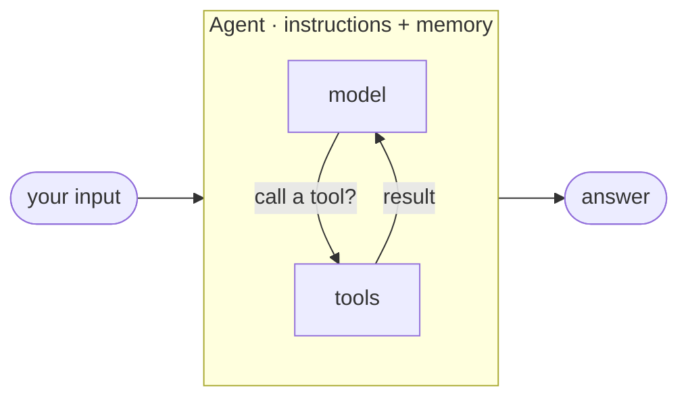

# Learning the Microsoft Agent Framework in Python

*Why I learned the whole framework by writing one runnable lesson per concept, against Azure AI Foundry, instead of reading the docs top to bottom.*

---

## The problem with reading the docs

The Microsoft Agent Framework docs are good. But reading them front to back left me with a map of *names* — agents, tools, sessions, middleware, workflows, orchestrations, hosting — and no muscle memory for how they fit together. So I did the thing that actually works for me: I built one small, runnable lesson for every concept, in the order the concepts build on each other, and only moved on once the code ran and a test passed.

This series is that curriculum, retold. Each post is grounded in a real lesson: the code, a message-flow diagram, and a test that proves it.

## The shape of the framework

Strip it down and the framework is two primitives plus the plumbing around them.

**An agent** is a chat client + instructions + optional tools, run in a loop: it reasons, maybe calls a tool, and repeats until it answers.

**A workflow** is a graph of executors (agents or plain functions) connected by edges, where messages flow along the edges and *you* decide the path — not the model.



Everything else — tools, memory, middleware, providers, orchestrations, hosting — is a capability you bolt onto one of those two shapes. The rule of thumb I kept coming back to:

| Use an **agent** when | Use a **workflow** when |
|-----------------------|-------------------------|
| the task is open-ended | the process has defined steps |
| one model call (with tools) suffices | multiple agents must coordinate |
| the model should decide the steps | you must control the path |

## One provider, no API keys

Every lesson targets **Azure AI Foundry** with **credential-based auth** — no stored keys. In Python that means a `FoundryChatClient` reading its config from the environment, authenticated by `AzureCliCredential` off your `az login` session:

```python
from agent_framework import Agent
from agent_framework.foundry import FoundryChatClient
from azure.identity import AzureCliCredential

agent = Agent(
    chat_client=FoundryChatClient(credential=AzureCliCredential()),
    instructions="You are a concise assistant.",
)
result = await agent.run("Say hello in one line.")
```

Pinning to one provider was deliberate. Swapping backends is a config knob; the *learning* is in the agent and workflow APIs, and those stay identical no matter which client you plug in. (The one exception is Track 7, where providers are the point.)

## Why "build it" beats "read it"

Three things reading never gave me:

- **The API you actually get.** Docs describe the intended surface; the installed SDK is the real one. Every lesson is verified against the installed `agent-framework`, not just the prose — that gap is exactly where I burned time before.
- **Message flow you can see.** Each lesson ships a Mermaid sequence diagram of how messages really move — user → middleware → model → tools → workflow nodes. Drawing it forced me to understand it.
- **A test that fails when I'm wrong.** Model-free lessons run and assert on behavior; model-dependent ones build the agent offline and introspect its wiring, with the live call gated behind a flag. Roughly one lesson in eight needs no Azure account at all.

## The 12-track journey

The curriculum is topologically sorted — no lesson depends on one that comes later. You start with a single agent and end with a full multi-agent app:

1. **Your first agent** — client + instructions → run, streaming and not.
2. **Tooling** — `@tool` functions, approvals, hosted tools, MCP, RAG.
3. **Conversation & memory** — sessions, storage, compaction, context providers.
4. **Shaping a run** — structured outputs, multimodal input, the run pipeline.
5. **Middleware** — intercept runs and model calls; guardrails and overrides.
6. **Observability, safety, providers** — OpenTelemetry, prompt-injection defense, custom providers.
7. **Workflow mechanics** — executors, edges, checkpoints (all model-free).
8. **Workflows with agents** — the `WorkflowBuilder` graph with agent nodes.
9. **Orchestrations** — sequential, concurrent, handoff, group-chat, magentic.
10. **Advanced workflows** — sub-workflows, execution modes, resettable executors.
11. **Hosting** — DevUI, A2A, durable hosting on Azure Functions.
12. **Capstone** — a grounded, cited document-Q&A app built from every concept above.

That's the arc this series walks, one post per track. My promise for each: real code you can run, a diagram of what's happening, and the thing that tripped me up so it doesn't trip you.

Next post: the smallest possible thing that works — a client, instructions, and one `run()` call.

---

Next: [Your First Agent — MAF in Python](/blog/posts/maf-python-02-your-first-agent.html)
