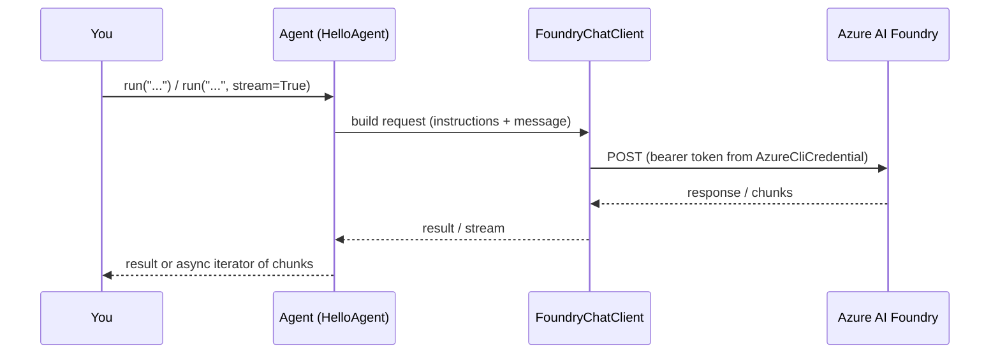

# Your First Agent — MAF in Python

*The minimal loop: a Foundry chat client, an Agent with instructions, run non-streaming and streaming — and what actually comes back.*

---

## The whole loop is three things

After the setup post, I wanted the smallest thing that still counts as an agent. In the Microsoft Agent Framework that turns out to be exactly three moving parts: a **client** (a connection to a deployed model), an **Agent** (instructions wrapped around that client), and a **run** (you hand it a message, it hands back a response). Everything later in this series — tools, memory, workflows — is this same loop with more bolted on.

Here is the entire first lesson, minus the ceremony:

```python
from agent_framework import Agent
from agent_framework.foundry import FoundryChatClient
from azure.identity import AzureCliCredential

client = FoundryChatClient(
    project_endpoint=os.environ["FOUNDRY_PROJECT_ENDPOINT"],
    model=os.environ["FOUNDRY_MODEL"],
    credential=AzureCliCredential(),
)
agent = Agent(client=client, name="HelloAgent", instructions="You are a terse travel guide.")
```

## The client is your Foundry connection

`FoundryChatClient` is the Foundry-specific chat client. It needs three things: the **project endpoint**, the **model deployment name**, and a **credential**. I pass `AzureCliCredential()` — no API keys anywhere. That credential reuses my `az login` session and mints a bearer token when the client makes its first call. Nothing hits the network at construction time, which is why the client object comes back instantly even if you're offline.

Reading endpoint and model from the environment (I keep them in a `.env` and `load_dotenv()` them) is deliberate — the same code runs against dev and prod deployments by swapping two variables.

## The instructions *are* the agent

This is the part that took me a beat to internalize. `Agent(client=..., name=..., instructions=...)` — the instructions string is the entire personality. There's no separate config file, no prompt template class. This one string sets persona, tone, and guardrails:

```python
instructions = (
    "You are a terse, knowledgeable travel guide. "
    "Answer in at most two sentences and never use bullet points. "
    "If asked for medical, legal, or financial advice, decline and suggest a professional."
)
```

Change that string, re-run, and the behavior shifts immediately. I factored construction into a `build_agent()` function so I could build the agent and inspect it without spending a token — handy for tests.

## Running it two ways

The same agent runs in two modes. Non-streaming gives you the finished answer in one await:

```python
result = await agent.run("What is the capital of France?")
print(result)   # the full response, all at once
```

Streaming yields chunks as the model produces them — you set `stream=True` and iterate:

```python
async for chunk in agent.run("Tell me a fun fact.", stream=True):
    if chunk.text:
        print(chunk.text, end="", flush=True)
```

Same method, same agent — the only difference is `stream=True` flipping `run()` from an awaitable into an async iterator. In the streaming loop I guard on `chunk.text` because not every chunk carries text; some carry metadata or tool-call deltas you'll care about in later posts.



## What the run result actually contains

Printing `result` gives you the text, but the result is more than a string. It carries the assistant's message(s), so you can inspect roles and content parts, and it's the object you'll later mine for tool calls and usage. For now the useful mental model: **non-streaming = one result object; streaming = a sequence of update chunks that, concatenated, equal that same text.** The streamed `chunk.text` pieces sum to what non-streaming would have handed you in one go.

That's the loop. A client you can point anywhere, an instruction string that is the agent, and a `run()` you consume whole or piece by piece. Next I give this agent a function it can actually call.

---

Next: [Giving an Agent Tools — MAF in Python](/blog/posts/maf-python-03-giving-agents-tools.html)
