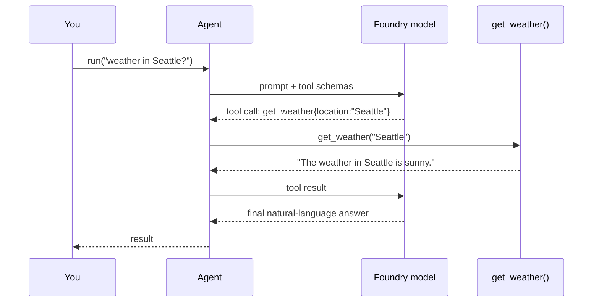

# Giving an Agent Tools — MAF in Python

*Turn a plain Python function into something the model can call, and watch the tool-call loop close itself.*

---

This is post 3 of 12 in **Learning the Microsoft Agent Framework — Python**, where I learn the framework by building one runnable lesson per concept. The first two posts got an agent talking to Azure AI Foundry. Talking is nice, but an agent that can only talk is stuck answering from memory. The moment I gave mine a *tool*, it could go fetch a fact, do a conversion, or hit an API mid-answer.

The good news: a tool is just a Python function. You describe it, register it, and the framework does the rest.

## A tool is a decorated function

In MAF, you mark a function with `@tool` and lean on type annotations to describe the arguments. Here is the weather tool from my lesson:

```python
from typing import Annotated
from agent_framework import tool
from pydantic import Field

@tool(approval_mode="never_require")
def get_weather(
    location: Annotated[str, Field(description="The location to get the weather for.")],
) -> str:
    """Get the current weather for a given location."""
    conditions = ["sunny", "cloudy", "rainy", "stormy"]
    return f"The weather in {location} is {conditions[randint(0, 3)]}."
```

Three things here are load-bearing — and all three are what the model actually *sees*:

- **The docstring** tells the model *what the tool does*, so it can decide when to call it.
- **The `Annotated` `Field(description=...)`** describes each argument, so the model knows what to fill in.
- **The return string** gets fed back into the conversation so the model can phrase a final answer.

The framework reads the annotations and docstring, builds a JSON schema, and hands that schema to the model. You never write the schema yourself.

`approval_mode="never_require"` runs the tool without pausing to ask. For a side-effecting tool in production you'd use `"always_require"` and add a human-in-the-loop — a later lesson covers tool approval.

## Registering tools on the agent

Tools reach the agent through the `tools=` list. Nothing fancy:

```python
from agent_framework import Agent
from agent_framework.foundry import FoundryChatClient
from azure.identity import AzureCliCredential

client = FoundryChatClient(
    project_endpoint=os.environ["FOUNDRY_PROJECT_ENDPOINT"],
    model=os.environ["FOUNDRY_MODEL"],
    credential=AzureCliCredential(),
)
agent = Agent(
    client=client,
    name="ToolAgent",
    instructions="You are a helpful assistant. Use your tools when they fit.",
    tools=[get_weather, convert_currency],
)
```

Same credential-based Foundry auth from the earlier posts — `AzureCliCredential`, no API keys. The only new thing is a populated `tools` list.

## Multiple tools, and the model picks

I registered a second tool, `convert_currency(amount, from_ccy, to_ccy)`, with the same three ingredients: a docstring, `Field` descriptions per argument, and a human-readable return string. Then I asked two different questions:

```python
result = await agent.run("What's the weather like in Seattle?")
print(result)   # -> triggers get_weather

result = await agent.run("How much is 250 US dollars in rupees?")
print(result)   # -> triggers convert_currency
```

I never told the agent which tool to use. The model reads the wording, matches it to a tool's docstring and parameters, and picks. That's the whole point of describing tools well — the description *is* the routing logic.

## The tool-call loop

What actually happens on `agent.run(...)` is a small loop the framework runs for you:



The model doesn't run your code — it *asks* for a call. The framework runs the function, feeds the result back, and lets the model turn that raw string into a sentence. If the model wanted several tools, the loop just repeats until it has enough to answer.

## What tripped me up

The mistake that cost me time: a vague docstring. When I wrote `"""Convert currency."""` the model sometimes guessed wrong currency codes. Spelling out `"Convert an amount between USD, EUR, GBP and INR"` and describing each argument fixed it. The docstring and `Field` descriptions aren't documentation for humans — they're the prompt the model reasons over. Write them like you're briefing the model, because you are.

---

Next: [Conversation and Memory — MAF in Python](/blog/posts/maf-python-04-conversation-and-memory.html)
