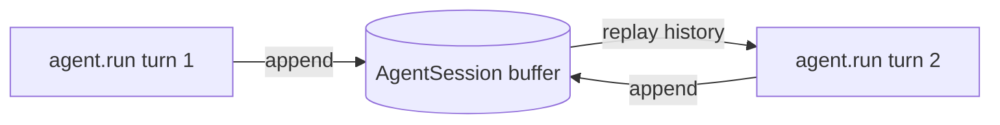

# Conversation and Memory — MAF in Python

*How a stateless agent remembers: sessions carry one conversation, context providers carry knowledge across all of them.*

---

The first thing that tripped me up learning the Microsoft Agent Framework was assuming an `Agent` remembered what I told it. It doesn't. An `Agent` is stateless — `agent.run("A")` and then `agent.run("B")` are two unrelated calls, and the model never sees "A" while answering "B". Once I internalised that, the whole memory story fell into place: there are two different objects doing two different jobs.

## The amnesia baseline

Here is the proof, straight from the lesson I built. Two runs, no shared state:

```python
await agent.run("My name is Pratik and I bank with HDFC.")
r = await agent.run("What bank do I use?")
print(r)  # it does NOT know — it never saw turn 1
```

The second call has amnesia. That's not a bug — it's the contract. The agent stays stateless so the *same* agent can serve many users at once. What carries history is a separate thing.

## Sessions: one conversation

An `AgentSession` is an in-memory conversation buffer. You create one and thread it through every run:

```python
session = agent.create_session()
await agent.run("My name is Pratik and I bank with HDFC.", session=session)
r = await agent.run(
    "Draft a one-line message to my bank's support desk, signed with my name.",
    session=session,
)
```

Now turn 2 can see turn 1 — it has both facts (name *and* bank) because each run appends to the session buffer and the next run replays it. The agent didn't change; the session is the memory. One session per conversation is the pattern: it's why one stateless agent can hold thousands of independent chats.



## Context providers: memory across conversations

A session is one conversation. But real assistants remember things *across* conversations — "last week you told me you bank with HDFC." That durable knowledge can't live in a session, because a session is a single chat. It lives in a `ContextProvider`.

A provider is an object the agent consults on every run, regardless of which session is active. It has two keyword-only hooks:

```python
class ProfileMemory(ContextProvider):
    def __init__(self) -> None:
        super().__init__(source_id="profile_memory")  # required
        self.facts: list[str] = []

    async def before_run(self, *, agent, session, context, state) -> None:
        if self.facts:
            note = "Known facts about the user: " + "; ".join(self.facts) + "."
            context.extend_instructions(self.source_id, note)

    async def after_run(self, *, agent, session, context, state) -> None:
        pass  # in production, extract facts with an LLM call or tool here
```

`before_run` injects; `after_run` learns. The key is `context.extend_instructions(source_id, text)`, which slips a note into the system prompt for *this* run. Because the provider instance outlives any session, what it injects survives when you start a brand-new session — that is the entire point of memory.

```python
agent = build_agent(memory)  # context_providers=[memory]
memory.remember("name is Pratik")
memory.remember("banks with HDFC")

s1 = agent.create_session()
await agent.run("What bank should I contact?", session=s1)

s2 = agent.create_session()   # a DIFFERENT session, no shared history
await agent.run("Remind me who you're helping.", session=s2)  # still knows
```

Session `s2` shares nothing with `s1`, yet the agent still knows the user — because the facts live in the provider, not the session.

## Persistence between runs

Sessions are in-memory by default, so they vanish on exit. To survive a process restart, stack a history provider that persists the transcript:

```python
context_providers=[FileHistoryProvider("./sessions"), ToneAndTally()]
```

`InMemoryHistoryProvider` is the default (lost on exit); `FileHistoryProvider` writes one JSON-Lines file per session under `./sessions/`. Re-run the program with the same session id and the earlier turns are already on disk. Providers stack — the file provider persists history while another shapes tone — and each owns a distinct `source_id`.

## The mental model

- **Agent** — stateless; safe to share across users.
- **Session** — one conversation's history, in memory by default.
- **ContextProvider** — knowledge and behaviour that spans conversations; `before_run` injects, `after_run` learns.
- **History provider** — a context provider whose job is persisting the transcript (`FileHistoryProvider` for durability).

Keep those four straight and multi-turn state stops being mysterious. Next I'll look at how to shape a single run — instructions, tools, and output — from the outside.

---

Next: [Shaping a Run — MAF in Python](/blog/posts/maf-python-05-shaping-a-run.html)
