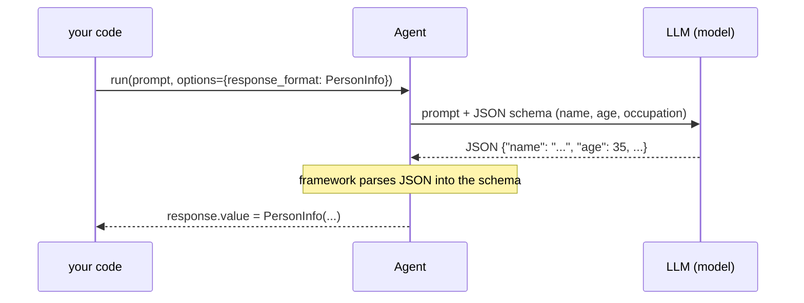

# Shaping a Run — MAF in Python

*Typed results from `response_format`, consuming a stream event by event, and sending an image alongside text.*

---

## Three ways to shape what goes in and comes out

The first few posts ran an agent and read `result.text`. That is fine until you want the answer as *data*, want to show tokens as they arrive, or want the model to look at a picture. In the Microsoft Agent Framework these are three small dials on the same `run()` call — no new agent type, no separate API. This lesson walks all three: structured output, streaming, and multimodal input.

## Structured output: read `.value`, not `.text`

By default an agent returns prose. To get typed data, you define the shape and pass it as `response_format` inside the per-run `options` dict. The shape can be a Pydantic model or a raw JSON-schema dict.

```python
from pydantic import BaseModel

class PersonInfo(BaseModel):
    name: str | None = None
    age: int | None = None
    occupation: str | None = None

response = await agent.run(PROMPT, options={"response_format": PersonInfo})
p = response.value          # a PersonInfo instance, typed
print(p.name, p.age, p.occupation)
```

The one thing that tripped me up: the parsed object lands on `response.value`, **not** `response.text`. `.text` still holds the raw JSON string; `.value` is `None` if parsing failed — so guard on it. Pass a plain dict schema instead of the model and `.value` comes back as parsed JSON (a `dict`), not an instance. Bare primitives and lists aren't supported directly — wrap them in an object.



## Streaming: iterate, then finalize

Streaming is not a different method — it is `run(..., stream=True)`, which turns the awaitable into a `ResponseStream` you async-iterate. Each chunk is an update; print `update.text` as it arrives, then call `get_final_response()` for the aggregated `AgentResponse`.

```python
stream = agent.run(PROMPT, stream=True, options={"response_format": PersonInfo})
async for update in stream:
    if update.text:
        print(update.text, end="", flush=True)

final = await stream.get_final_response()
p = final.value             # the finalizer ran the same parse step
```

Two things worth knowing. Not every chunk carries text — some carry metadata or tool-call deltas — so I guard on `update.text`. And `get_final_response()` after you've iterated **reuses** the collected updates; it does not re-run the model. The structured-output finalizer is what parses `.value` for you, so streaming and typed output compose cleanly.

## Multimodal: a turn is a Message of Content parts

Every prompt so far was a plain `str`. Under the hood a user turn is a `Message` whose `contents` is a list of `Content` parts — and text is *just one kind of part*. To ask about an image, mix a text part and an image part in that list:

```python
from agent_framework import Content, Message

url_message = Message(
    role="user",
    contents=[
        Content.from_text(text="What do you see in this image?"),
        Content.from_uri(uri=IMAGE_URL, media_type="image/jpeg"),
    ],
)
result = await agent.run(url_message)
print(result.text)
```

`Content.from_uri(...)` points at a hosted image; `Content.from_data(data=<bytes>, media_type=...)` embeds local bytes instead — read the file in binary (`open(path, "rb")`) and hand over the raw bytes, not a path. `media_type` is a MIME string (`"image/jpeg"`, `"image/png"`), and `from_data` requires it. The catch: the deployed `FOUNDRY_MODEL` must be vision-capable (e.g. `gpt-4o`) or the image part is quietly ignored.

## Why these three belong together

They are the same idea from three angles: `run()` takes richer *input* (a multi-part Message) and produces richer *output* (a typed `.value`), delivered either all at once or as a stream. Once you see that `options=` shapes the request and the response object carries both `.text` and `.value`, you stop reaching for regex and string-splitting and start treating the model like a typed function that can also read pictures. Next up is middleware — wrapping every run with logging, retries, and guardrails.

---

Next: [Middleware — MAF in Python](/blog/posts/maf-python-06-middleware.html)
