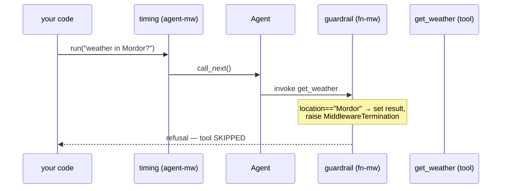

# Middleware — MAF in Python

*Wrapping an agent run with async seams that log, time, guard, and short-circuit — without touching the agent's logic.*

---

This is post 6 of 12 in **Learning the Microsoft Agent Framework — Python**, where I learn the framework by building one runnable lesson per concept. Tools gave the agent hands; memory gave it a past. Middleware is the concept that gave me *control over the run itself* — a place to log, time, retry, or refuse, sitting between my code and the agent without editing the agent.

## Three seams, one shape

A middleware in MAF is just `async def mw(context, call_next)`. There are three kinds, distinguished by a decorator and the context they receive:

- `@agent_middleware` — wraps the **whole run**; context is `AgentContext`.
- `@chat_middleware` — wraps each **model call**; context is `ChatContext`.
- `@function_middleware` — wraps each **tool call**; context is `FunctionInvocationContext`.

Two rules tripped me up until I read the SDK closely. First, `call_next` takes **no arguments** and returns `None` — all state rides on `context`. Second, there is no `context.terminate`; to stop early you set `context.result` and `raise MiddlewareTermination(result=...)`.

## A timing middleware wraps the whole run

The simplest useful case is observation. This one prints on the way in, calls the rest of the pipeline, then prints on the way out — the classic "before / after" sandwich:

```python
@agent_middleware
async def timing(context: AgentContext, call_next) -> None:
    print(f"[agent-mw] run starting with {len(context.messages)} message(s)")
    await call_next()  # run the rest of the pipeline + the agent
    print("[agent-mw] run finished")
```

Swap the prints for `logging`, a `time.perf_counter()` delta, or a retry loop around `call_next()`, and you have logging, timing, and retries with the same skeleton. The agent never knows it's wrapped.

## A guardrail middleware short-circuits a tool call

The more interesting move is *not* calling `call_next`. A `@function_middleware` sees each tool invocation and can refuse it before the tool body ever runs:

```python
@function_middleware
async def block_dangerous_locations(context: FunctionInvocationContext, call_next) -> None:
    if context.function.name == "get_weather" and context.arguments.get("location") == "Mordor":
        context.result = "Refused: weather service does not cover Mordor."
        raise MiddlewareTermination(result=context.result)  # tool never runs
    await call_next()
```

On a normal location it calls `call_next()` and the tool proceeds. On "Mordor" it sets `context.result` and raises `MiddlewareTermination` — the `get_weather` body is skipped entirely and the refusal becomes the answer. That short-circuit is the whole point of a guardrail: cheaper than running the tool and safer than trusting the model.

## Composing them on one agent

Both kinds attach to a single `middleware=[...]` list — the framework sorts them by type, so you don't order agent-vs-function seams yourself:

```python
agent = Agent(
    client=client,
    name="GuardedAgent",
    instructions="You are a helpful weather assistant. Use your tools.",
    tools=[get_weather],
    middleware=[timing, block_dangerous_locations],  # mix agent + function middleware
)
```

I factor this into a `build_agent()` helper so the offline test can construct the exact wired agent — no model call — and assert `agent.middleware` contains both `timing` and `block_dangerous_locations` by name. Construction is lazy, so verifying the wiring costs nothing.



## Why this shape earns its keep

Middleware is where cross-cutting concerns live so they don't leak into every agent. One `timing` decorator instruments every run; one guardrail protects every tool call; a `@chat_middleware` can rewrite the prompt before the model sees it. Because each is a plain async function over a shared `context`, they compose by listing — and because construction is lazy, you can test the whole stack is wired before spending a single token.

The run gave me a place to stand *around* the agent. Next I open the box further: telemetry, safety filters, and swapping the provider underneath.

---

Next: [Observability, Safety, and Providers — MAF in Python](/blog/posts/maf-python-07-observability-safety-providers.html)
