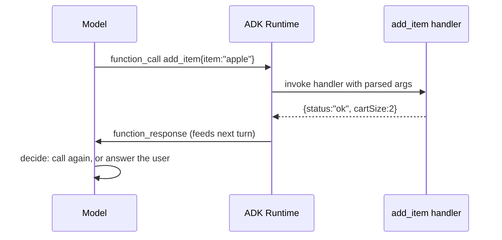

# Tools in ADK: Turning Functions into Agent Capabilities

*How a plain function becomes a callable tool, how ToolContext reaches session state, and how long-running tools pause a run for a human.*

---

An agent that can only talk is a chatbot. An agent that can *act* — check a price, add to a cart, request a refund — needs **tools**. In Google's Agent Development Kit (ADK), a tool is the bridge between the model's decision ("I should add an apple") and real code that runs. The elegant part: in the common case you don't build a tool object at all. You write an ordinary function, hand it to the agent, and ADK derives the tool's name, description, and JSON schema from the function's own signature and docstring. This post walks the tool ecosystem, then drills into the three features you reach for constantly: **function tools**, **`ToolContext`** (reaching session state), and **long-running tools** (pausing for a human).

## A function is already a tool

In Python you pass the function directly. ADK reads the name, the docstring (as the tool description and per-argument docs), and the type hints (as the schema the model sees).

```python
from google.adk.agents import Agent

def add_to_cart(cart: list[str], item: str) -> list[str]:
    return [*cart, item]

def view_cart() -> dict:
    """Return the current cart contents and total price."""
    ...

root_agent = Agent(
    name="cart_agent",
    model="gemini-flash-latest",
    instruction="Use add_item to add items and view_cart to show the cart.",
    tools=[view_cart],  # the function IS the tool
)
```

The docstring is not decoration — it is the contract the model reads to decide *when* and *how* to call the tool. A vague docstring produces bad tool selection; a precise `Args:` section produces well-formed arguments. Treat it like an API spec.

Go can't introspect a docstring at runtime, so it makes the schema explicit. You register a handler and give it an input struct; the struct's JSON tags become the model-visible parameters, and you supply the name and description in a `Config`:

```go
import "google.golang.org/adk/v2/tool/functiontool"

type itemInput struct {
    Item string `json:"item"`
}
type cartOutput struct {
    Status   string `json:"status"`
    CartSize int    `json:"cartSize,omitempty"`
}

func addItem(ctx agent.Context, in itemInput) (cartOutput, error) {
    // ... business logic ...
    return cartOutput{Status: "ok", CartSize: 2}, nil
}

addTool, err := functiontool.New(functiontool.Config{
    Name:        "add_item",
    Description: "Add an item to the shopping cart.",
}, addItem)
```

Same idea, two idioms: Python infers the schema from reflection over the signature; Go declares it via a typed struct plus a `Config`.

## How a tool call actually flows

The model never runs your code directly. The loop is: the model emits a *function call* (tool name + arguments as JSON), the ADK runtime dispatches it to your handler, your handler returns a value, and that value is serialized back into the conversation as a *function response* the model reads on its next turn.



The model decides to call a tool the same way it decides anything — from context. Your job is to make the decision easy: good names, tight descriptions, and return values that carry the information the model needs to continue (return `{"status": "ok", "cart_size": 2}`, not a bare `True`).

## ToolContext: reaching session state

A tool isn't limited to its arguments. It can receive a **context** that exposes the session's `state` — a per-session key/value store — so a tool can remember things across turns: a cart, a counter, user preferences.

In Python you opt in by declaring a `tool_context: ToolContext` parameter. ADK injects it and — importantly — **strips it from the schema**, so the model never sees it as an argument:

```python
from google.adk.tools import ToolContext

def add_item(item: str, tool_context: ToolContext) -> dict:
    """Add an item to the user's shopping cart.

    Args:
        item: The item to add (e.g. "apple").
    """
    cart = tool_context.state.get("cart", [])
    cart = [*cart, item]
    tool_context.state["cart"] = cart   # write-back persists into session state
    return {"status": "ok", "cart_size": len(cart)}
```

Go always passes the context as the handler's *first* parameter (`ctx agent.Context`); the input struct is the *second* parameter and is the only thing the model sees. State is read and written through `ctx.State()`:

```go
func addItem(ctx agent.Context, in itemInput) (cartOutput, error) {
    var cart []string
    if v, err := ctx.State().Get("cart"); err == nil {
        cart, _ = v.([]string)
    }
    cart = append(cart, in.Item)
    if err := ctx.State().Set("cart", cart); err != nil {
        return cartOutput{}, err
    }
    return cartOutput{Status: "ok", CartSize: len(cart)}, nil
}
```

**Mental model:** arguments are what the *model* supplies for this call; state is what *your app* remembers between calls. `add_item` writes the cart; a later `view_cart` reads it back — no argument passing, because both share the same session state.

## Long-running tools: pausing for a human

Some actions shouldn't complete without approval — a refund, a purchase, a destructive change. A **long-running tool** returns *before* the work is finished: it emits a "pending" marker, the runtime records the pending invocation, and the run pauses until a result (an async backend's answer, or a human's approval) arrives to resume it.

Python wraps the function so ADK knows it may not complete synchronously:

```python
from google.adk.tools import LongRunningFunctionTool

def request_refund(amount: float, tool_context: ToolContext) -> dict:
    """Request a refund; a human must approve before it completes."""
    return {
        "status": "pending_approval",
        "amount": amount,
        "message": f"Refund of ${amount:.2f} is awaiting human approval.",
    }

refund_tool = LongRunningFunctionTool(func=request_refund)
```

Go flips a flag on the `Config` instead. For the human-in-the-loop variant it exposes `RequireConfirmation`, which pauses the run for an explicit approval before the tool completes:

```go
refundTool, err := functiontool.New(functiontool.Config{
    Name:                "request_refund",
    Description:         "Request a refund (needs human approval).",
    RequireConfirmation: true, // pauses the run for a human OK
}, requestRefund)
```

Human-in-the-loop and "wait for an async backend" ride the *same* long-running machinery — the only difference is *who* completes the pending call: a person versus a service.

## The rest of the ecosystem

Function tools are the workhorse, but ADK ships more: **built-in tools** like `google_search` and `url_context` (both SDKs) that ground answers in live web results; **agent-as-tool**, where another agent becomes a callable tool; and, in Python, richer families — `OpenAPIToolset` (turn any REST spec into tools), Google Cloud data toolsets like `BigQueryToolset` (with a write-mode safety gate), interactive OAuth2 tools, computer-use, and MCP. A Go gotcha worth knowing: the Gemini API won't mix built-in `GoogleSearch` with custom function tools in one agent — isolate each kind in its own sub-agent.

Start with function tools. Nine times out of ten, a plain function with a good docstring is the whole answer.

**Next in the series:** Sessions and state — the store these tools read and write, its scopes, and how it persists.
