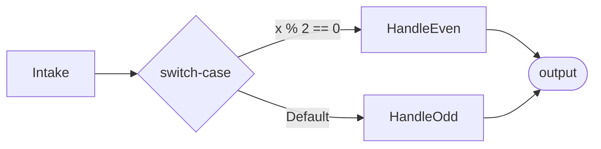

# Workflow Mechanics — MAF in Python

*The graph model underneath every multi-agent app: executors as nodes, edges as data flow, and typed events streaming out as it runs.*

---

Post 8 of 12 in *Learning the Microsoft Agent Framework — Python*.

Up to now every lesson hardened **one** agent. A workflow is the next layer up: it orchestrates *many* executors — plain functions or whole agents — as a **directed graph**. A message enters, flows along edges, and each executor transforms or routes it. The best way I found to learn it was to start with **no model at all** — pure functions — so the orchestration mechanics stand on their own with zero credentials.

## Executors are nodes, edges are data flow

An executor is either a `class Executor` with an `@handler` method, or an `@executor` async function. Its handler always takes the message plus a typed `WorkflowContext`:

```python
from agent_framework import Executor, WorkflowContext, handler
from typing_extensions import Never

class Intake(Executor):
    @handler
    async def run(self, n: int, ctx: WorkflowContext[int]) -> None:
        await ctx.send_message(n)          # forwards n along its outgoing edges

class HandleEven(Executor):
    @handler
    async def run(self, n: int, ctx: WorkflowContext[Never, str]) -> None:
        await ctx.yield_output(f"{n} is even")   # terminal: yields, sends nothing
```

The type parameters carry intent. `WorkflowContext[int]` means "this node will `send_message(int)`"; `WorkflowContext[Never, str]` means "terminal — it only `yield_output(str)`." That's not decoration: the builder uses those types to validate the graph before it ever runs.

## The builder wires the graph

`WorkflowBuilder` describes the shape, not the execution. The start node is a **constructor kwarg** — there is no `set_start_executor()` in this build:

```python
from agent_framework import Case, Default, WorkflowBuilder

workflow = (
    WorkflowBuilder(start_executor=intake)
    .add_switch_case_edge_group(intake, [
        Case(condition=lambda x: x % 2 == 0, target=even),
        Default(target=odd),
    ])
    .build()
)
```

`add_edge(src, dst)` is the plain directed edge. `add_switch_case_edge_group` gives you **data-dependent routing** — cases are evaluated in order, first match wins, else `Default`, and only one branch runs. There's also `add_fan_out_edges` → `add_fan_in_edges` for parallelism: fan-in hands the target a **`list`** of all sources' messages, once, after every branch completes.



## Running: block, or stream typed events

`await workflow.run(x)` returns a `WorkflowRunResult`; `.get_outputs()` is the list of yielded outputs. But the more interesting mode is streaming:

```python
async for event in workflow.run(x, stream=True):
    if event.type == "executor_completed":
        print("done:", event.executor_id)
    elif event.type == "output":
        print("output:", event.data)
```

What tripped me up: there are **no** per-kind event classes and **no** `run_stream()`. You pass `stream=True` and branch on `event.type` — `"executor_completed"`, `"output"`, and friends. Each executor reports as it finishes, so you watch the graph light up node by node rather than waiting on one blocking answer.

## Functions first, agents later

Everything above is model-free — `01_control_flow.py` routes evens and odds with zero credentials. That's deliberate. Once the wiring is second nature, dropping an *agent* into the graph is anticlimactic: `WorkflowBuilder` auto-wraps any agent in an `AgentExecutor`, so a `FoundryChatClient`-backed writer sits on exactly the same `add_edge` chain as the pure functions. Same edges, same events — the only new thing is that some nodes now cost a model call. That's the whole point of learning the mechanics with functions first: the graph doesn't care what a node *is*, only what it sends.

---

Next: [Workflows with Agents — MAF in Python](/blog/posts/maf-python-09-workflows-with-agents.html)
