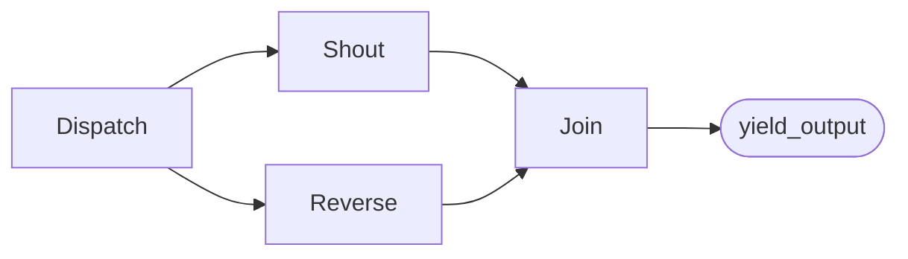

# Workflows with Agents — MAF in Python

*Agents as graph nodes: switch-case routing, fan-out/fan-in, and mixing plain functions with agent steps in one workflow.*

---

Up to now every agent in this series ran on its own. But real systems have shape — a draft goes to a reviewer, a request is *routed* by its content, three analyses run at once and merge. The Microsoft Agent Framework calls that shape a **workflow**: a directed graph of **executors** wired by **edges**. What surprised me when I built these lessons is how uniform the graph is — an agent and a plain function are *both* just executors, so you mix them freely.

## An agent is an executor

The smallest interesting workflow is two agents in a line. No `Executor` subclass — the agents *are* the nodes:

```python
from agent_framework import Agent, WorkflowBuilder

writer = Agent(client=client, name="Writer", instructions="Draft content.")
reviewer = Agent(client=client, name="Reviewer", instructions="Critique it, concisely.")

workflow = (
    WorkflowBuilder(start_executor=writer)
    .add_edge(writer, reviewer)
    .build()
)
```

`start_executor=writer` names the entry node, `.add_edge(writer, reviewer)` wires the single hop, `.build()` returns the runnable workflow. Run it streamed and you get `WorkflowEvents`; keep the `output` ones whose `.data` is an `AgentResponseUpdate`, and group consecutive chunks by `.author_name` to reconstruct each agent's message:

```python
async for event in workflow.run(prompt, stream=True):
    if event.type == "output" and isinstance(event.data, AgentResponseUpdate):
        print(event.data.text, end="")  # .author_name tells you which agent
```

## Conditional edges: routing by data

A workflow isn't always a straight line — often the *next* executor depends on the *data*. That's a **switch-case edge group**: from one source, the message flows to the first `Case` whose predicate is true, else the `Default`.

```python
from agent_framework import Case, Default

builder.add_switch_case_edge_group(
    intake,
    [
        Case(condition=lambda x: x % 2 == 0, target=even),
        Default(target=odd),
    ],
)
```

The framework evaluates cases **in order** and routes to the **first** match — only one branch runs. This is the classifier-then-dispatch pattern: an agent (or a plain function) classifies the input, and the switch sends it down exactly one lane. The predicate is ordinary Python, so it can read any field of the message a node emitted.

## Concurrency: fan-out and fan-in

The real reason to reach for a graph over a chain is to run work **concurrently** and then merge. Two edge helpers do it:

```python
builder.add_fan_out_edges(dispatch, [shout, reverse])  # broadcast SAME msg to all
builder.add_fan_in_edges([shout, reverse], join)        # join runs once, gets a LIST
```

`add_fan_out_edges` broadcasts the *same* message to every target, so the workers run as parallel branches — wall-clock is the slowest worker, not the sum. `add_fan_in_edges` makes the join a synchronised barrier: it does **not** run per-message; the framework buffers every source's output and invokes the join **once** with a `list[...]` of all results.

```python
class Join(Executor):
    @handler
    async def run(self, results: list[str], ctx: WorkflowContext[Never, str]) -> None:
        await ctx.yield_output(" | ".join(sorted(results)))
```

Sort inside the join if you need a deterministic order — workers may finish in any order. This is the map-reduce skeleton: fan out to mappers, barrier fan-in to a reducer that sees the whole list at once.



## Mixing functions and agents

Here's the payoff of the uniform model: `Intake`, `Dispatch`, and `Join` above are plain `Executor` subclasses doing pure Python — no model, no credentials, so they run offline in tests. `writer` and `reviewer` are agents that call Foundry. They sit in the **same** graph on the **same** edges. That means you push deterministic glue (validation, routing keys, aggregation) into cheap function nodes and spend model calls only where you actually need reasoning.

An `Executor`'s handler ends one of two ways: `ctx.send_message(x)` pushes `x` downstream to the next node, or `ctx.yield_output(x)` makes `x` the workflow's result. The `WorkflowContext[Send, Yield]` type parameters make that contract explicit — `WorkflowContext[Never, str]` is a terminal node that yields a `str` and sends nothing onward.

## The mental model

- **Executor** — any node; an agent or a plain function, wired identically.
- **`add_edge`** — a direct hop from one node to the next.
- **Switch-case group** — data-dependent routing; first matching `Case` wins, else `Default`.
- **Fan-out / fan-in** — broadcast to parallel workers, then a barrier join that fires once with the full list.
- **`send_message` vs `yield_output`** — pass work downstream vs. produce the workflow's result.

Once you see agents as executors, orchestration stops being a separate framework — it's the same graph, just with model calls at some nodes. Next I'll step up to the named orchestration patterns built on top of it.

---

Next: [Orchestration Patterns — MAF in Python](/blog/posts/maf-python-10-orchestrations.html)
