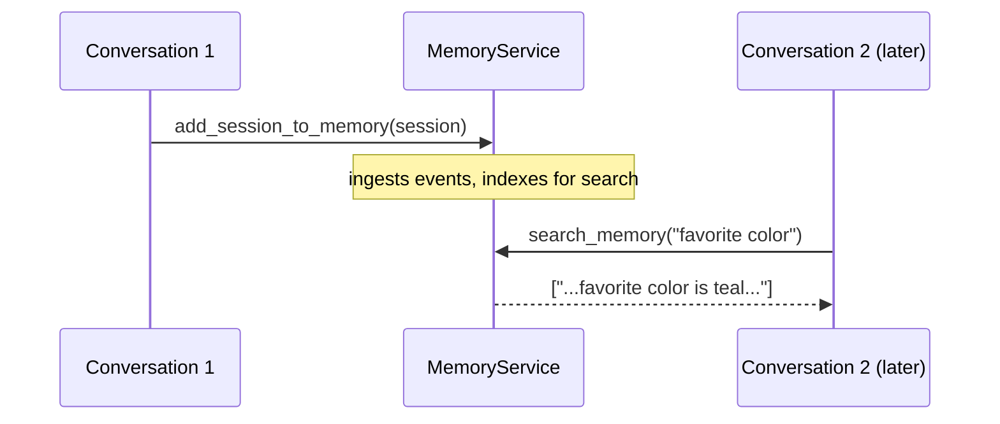

# Memory in ADK: Remembering a User Across Conversations

*State remembers things inside one chat; Memory is the searchable archive that lets an agent recall what you told it weeks ago.*

---

The previous post covered `state` — the key-value bag an agent carries through a single conversation. But close the chat, start a fresh one tomorrow, and that state is gone (or, at most, a handful of `user:`-scoped keys survive). Real assistants need more: when you say "book the same restaurant as last time," the agent has to reach back into a conversation that ended days ago. In Google's Agent Development Kit (ADK), that long-term recall is a distinct subsystem called **Memory**, and keeping it separate from state is one of the cleaner design decisions in the framework.

## Memory vs. state — the distinction that matters

These are two different tools for two different jobs. Get the mental model right and the rest follows.

| | State | Memory |
|--|-------|--------|
| Lifetime | one session (or `user:`/`app:` scoped) | indefinite, across all sessions |
| Access | direct key lookup (`state["user:name"]`) | **search** by relevance to a query |
| Shape | small, exact, addressed by key | large, fuzzy, searchable archive |
| Analogy | working memory / variables | long-term memory / a searchable notebook |

Use state for "the user's name is Ada" — a small fact you know the key for. Use memory for "somewhere in our forty past chats, did they mention a deadline?" — where you don't know the key, you only have a *query*. State is a variable; memory is a search index over everything that has ever been said.

## The two verbs

A `MemoryService` has exactly two operations, and every backend implements the same two:



1. **Ingest** — `add_session_to_memory(session)` takes a *finished* conversation and pushes its events into the store, where they get indexed.
2. **Retrieve** — `search_memory(query)` returns the snippets most relevant to a query string.

That is the whole surface area. Here it is in Python, ingesting a fact in one session and recalling it from another — no LLM, no API key, no network:

```python
from google.adk.events import Event
from google.adk.memory import InMemoryMemoryService
from google.adk.sessions import InMemorySessionService
from google.genai import types

APP, USER = "assistant", "ada"
FACT = "My favorite color is teal and I love hiking on weekends."

sessions = InMemorySessionService()
memory = InMemoryMemoryService()

# Conversation #1 — the user says something worth remembering.
s = await sessions.create_session(app_name=APP, user_id=USER)
await sessions.append_event(
    s, Event(author="user",
             content=types.Content(role="user", parts=[types.Part(text=FACT)])),
)
s = await sessions.get_session(app_name=APP, user_id=USER, session_id=s.id)

# Ingest the finished conversation into long-term memory.
await memory.add_session_to_memory(s)

# Later, from a fresh session — search it.
hit = await memory.search_memory(app_name=APP, user_id=USER, query="favorite color")
miss = await memory.search_memory(app_name=APP, user_id=USER, query="quantum physics recipe")
print(len(hit.memories), len(miss.memories))  # -> 1 0
```

The relevant query recalls the stored fact; the unrelated one returns nothing.

## The same shape in Go

Go's memory package mirrors the two verbs. The differences are idiomatic, not conceptual: Python is `await`-based and takes keyword arguments, while Go is synchronous and bundles arguments into a `SearchRequest` struct.

```go
import (
    "google.golang.org/adk/v2/memory"
    "google.golang.org/adk/v2/session"
    "google.golang.org/genai"
)

sessions := session.InMemoryService()
mem := memory.InMemoryService()

c, _ := sessions.Create(ctx, &session.CreateRequest{AppName: appName, UserID: userID})
ev := session.NewEvent(ctx, "inv-1")
ev.Author = "user"
ev.LLMResponse.Content = &genai.Content{Role: "user", Parts: []*genai.Part{{Text: fact}}}
sessions.AppendEvent(ctx, c.Session, ev)
g, _ := sessions.Get(ctx, &session.GetRequest{AppName: appName, UserID: userID, SessionID: c.Session.ID()})

// Ingest, then search from "later".
mem.AddSessionToMemory(ctx, g.Session)
hit, _ := mem.SearchMemory(ctx, &memory.SearchRequest{Query: "favorite color", UserID: userID, AppName: appName})
miss, _ := mem.SearchMemory(ctx, &memory.SearchRequest{Query: "quantum physics recipe", UserID: userID, AppName: appName})
// len(hit.Memories) == 1, len(miss.Memories) == 0
```

The API mapping is a near one-to-one table: `add_session_to_memory` ↔ `AddSessionToMemory`, `search_memory` ↔ `SearchMemory`, `SearchMemoryResponse{memories}` ↔ `*SearchResponse{Memories}`.

## Letting the agent recall on its own

Calling `search_memory` by hand — as the demos above do — is the out-of-band path, useful for background jobs and tests. In a live agent you usually don't want to decide *when* to search; you want the model to decide. So you give the agent a **`load_memory`** tool. When the user asks "what did I tell you I liked?", the model calls `load_memory("things the user likes")`, gets snippets back, and answers from them. (`preload_memory` is a variant that injects relevant memories automatically before each turn.) In Go, the same capability is reachable from a running agent's context as `ctx.SearchMemory(ctx, query)` inside a tool.

Most production apps run both paths: a background job ingests each finished session into memory, and the live agent carries `load_memory` so it can recall them mid-conversation.

## Backends: keyword now, semantic later

The API you call never changes — only recall *quality* does, depending on the service you construct.

| Backend | Python | Go | Recall |
|---------|--------|-----|--------|
| In-memory | `InMemoryMemoryService()` | `memory.InMemoryService()` | keyword match; dev/tests |
| Vertex AI Memory Bank | `VertexAiMemoryBankService(...)` | Vertex memory service | managed, semantic |
| Vertex AI RAG | `VertexAiRagMemoryService(...)` | RAG service | semantic over a corpus |

The in-memory backend does **keyword** matching, which is exactly why the demo's "favorite color" query overlaps the stored "favorite color is teal" and the unrelated query misses. Production backends do **semantic** (embedding) search, so "what do I enjoy?" would surface "I love hiking" despite sharing no words. Swap the constructor; leave the rest of your agent untouched.

And the layer is not a lock-in. `MemoryService` is an interface — subclass `BaseMemoryService` in Python (implement the two methods) or satisfy `memory.Service` in Go — so you can back memory with any external vector database (Pinecone, Milvus, Qdrant, Chroma, Weaviate) by embedding on ingest and similarity-searching on recall. The two verbs stay constant; only the store behind them differs.

**When to reach for memory:** the moment your agent needs to know something that happened in a *different* conversation. If a `user:`-scoped state key would do — a name, a preference, a plan you can address by key — use state; it's exact and cheap. Once you need to *search* an open-ended history rather than look up a known key, that's memory's job.

You can learn and test the whole thing offline with the in-memory backend, then graduate to Vertex Memory Bank for real semantic recall without rewriting a line of agent logic.

Next in the series: **Artifacts** — storing the binary blobs (files, images, PDFs) an agent produces or consumes.
