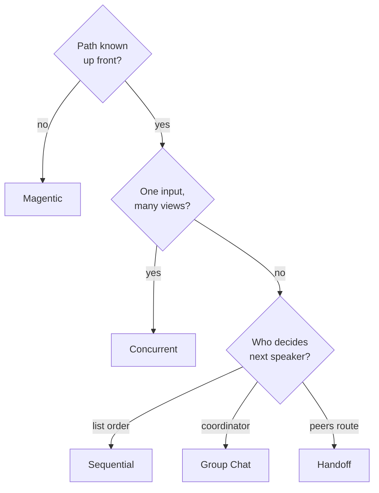

# Orchestration Patterns — MAF in Python

*Five prebuilt multi-agent shapes — Sequential, Concurrent, Group Chat, Handoff, Magentic — and when each beats hand-wiring a graph.*

---

Last time I built workflows by hand: `WorkflowBuilder`, executors, edges. That gives you total control, but most multi-agent problems fall into a handful of recurring shapes. The Microsoft Agent Framework ships those shapes as **orchestrations** — builders in `agent_framework.orchestrations` that wire the graph for you. I built one runnable lesson per pattern, and the exercise clarified exactly when to reach for a prebuilt one versus dropping down to raw `WorkflowBuilder`.

Every builder takes a list of participants (agents or executors) and returns an ordinary workflow you `.run()`. The difference between them is *who decides what runs next*.

## Sequential — a pipeline

Each agent runs in turn and passes its output to the next. Draft then review, extract then summarize, translate then proofread.

```python
from agent_framework.orchestrations import SequentialBuilder

workflow = SequentialBuilder(participants=[writer, reviewer]).build()
events = await workflow.run("Write a tagline for a budget eBike.")
final = events.get_outputs()[0]   # AgentResponse: only the LAST agent's messages
```

List order *is* execution order. By default each agent sees the full prior conversation; pass `chain_only_agent_responses=True` so each one consumes only the previous agent's reply — handy for translation chains.

## Concurrent — fan-out / fan-in

All participants see the **same** prompt in parallel; a built-in aggregator fans their answers back in. Latency is `max(agent)`, not the sum. This fits ensemble reasoning and voting — a researcher, a marketer, and a legal reviewer all weighing one launch.

```python
from agent_framework.orchestrations import ConcurrentBuilder

workflow = ConcurrentBuilder(participants=[researcher, marketer, legal]).build()
outputs = (await workflow.run(prompt)).get_outputs()[0].messages  # one msg per agent
```

The default aggregator emits one assistant message per participant (read `msg.author_name`). Override fan-in with `.with_aggregator(callback)` to route all outputs through a summarizer agent instead.

## Group Chat — an orchestrator picks who speaks

A coordinator sits in a star topology and, round by round, decides who speaks next. Agents share the full history and refine each other's work over multiple rounds.

```python
from agent_framework.orchestrations import GroupChatBuilder

workflow = GroupChatBuilder(
    participants=[researcher, writer],
    termination_condition=lambda conv: len(conv) >= 4,   # always set a hard cap
    selection_func=round_robin_selector,                  # or orchestrator_agent=...
).build()
```

Speaker selection is fixed at construction: a `selection_func` over `GroupChatState`, an intelligent `orchestrator_agent`, or a fully custom orchestrator. Always set a `termination_condition` so the run ends.

## Handoff — no central boss

Any agent can transfer the whole conversation to a better-suited peer via an auto-injected handoff tool call. There's no orchestrator; control passes agent-to-agent. Think support triage routing to order / return / refund specialists.

```python
from agent_framework.orchestrations import HandoffBuilder

workflow = (HandoffBuilder(name="support", participants=[triage, order, refund])
    .with_start_agent(triage)
    .add_handoff(triage, [order])
    .with_autonomous_mode(turn_limits={triage.name: 3})   # else it's interactive
    .build())
```

Handoff is inherently interactive: if an agent answers instead of handing off, the workflow emits a `request_info` event and waits for a human. `.with_autonomous_mode()` auto-replies so it runs unattended.

## Magentic — a manager plans dynamically

For open-ended tasks where the path isn't known up front. A **manager** agent plans, keeps a shared task ledger, and picks the next specialist each round. Ordering is chosen dynamically, not fixed in a graph.

```python
from agent_framework.orchestrations import MagenticBuilder

workflow = MagenticBuilder(
    participants=[researcher, coder],
    manager_agent=manager,
    max_round_count=10, max_stall_count=3, max_reset_count=2,
).build()
```

Descriptions matter here — the manager reads each agent's `description` to decide who acts next. Safety limits (`max_stall_count`, `max_reset_count`) bound the inner loop before an auto-replan.

## Choosing one



The rule I settled on: reach for an orchestration when your problem *is* one of these shapes — you get correct fan-in, termination, and history-broadcasting for free. Drop to raw `WorkflowBuilder` only when your control flow is genuinely bespoke (conditional edges, custom state, non-agent executors mid-graph). Orchestrations are the 90% case; the graph is the escape hatch.

---

Next: [Advanced Workflows — MAF in Python](/blog/posts/maf-python-11-advanced-workflows.html)
