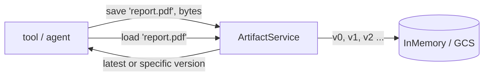

# Artifacts: Where ADK Agents Put Their Files

*Session state is for small text and JSON. When your agent produces a PNG, a PDF, or a WAV, it belongs in the artifact store — binary-native, versioned, and out of the session record.*

---

Session state (Module 05) and memory (Module 06) both store *text and structured values* — the kind of thing you can happily JSON-serialize and diff on every turn. But agents don't only produce text. They generate charts, render PDFs, transcribe audio, and consume files a user uploads. Base64-ing a 2 MB PNG into `state["chart"]` technically works, and it is exactly the mistake ADK's **artifact** system exists to prevent. This is Post 8 of *Google ADK, Concept by Concept*.

## What an artifact is

An artifact is a **named, automatically-versioned binary blob**: raw bytes plus a MIME type, addressed by filename. It is a `Part` — the same content wrapper the model uses — carrying inline data rather than text. The `ArtifactService` stores it in a purpose-built blob store that, in production, is backed by object storage (Google Cloud Storage) rather than the session record.

Three properties distinguish artifacts from state:

- **Binary-native** — bytes plus a MIME type, not JSON. The MIME type is load-bearing: it's how the dev UI and downstream consumers know whether the bytes are `image/png`, `application/pdf`, or `audio/wav`.
- **Versioned** — every save of the same filename creates a *new* version; old versions remain readable.
- **Externally backed** — big blobs stay out of the session record, which keeps state small and fast to diff on every turn.



## The four operations

The service surface is small: **save**, **load**, **list keys**, **delete**. Save returns the new version number; load without a version returns the latest.

Here is the full save-version-list-load cycle against the in-memory service in Python. Note that a `Part` wraps a `Blob` of bytes plus MIME type:

```python
from google.adk.artifacts import InMemoryArtifactService
from google.genai import types

APP, USER, SESSION = "reporter", "ada", "s1"

def part(text: str) -> types.Part:
    return types.Part(inline_data=types.Blob(mime_type="text/plain", data=text.encode()))

svc = InMemoryArtifactService()

# Two saves of the SAME filename → two versions, not an overwrite.
v0 = await svc.save_artifact(
    app_name=APP, user_id=USER, session_id=SESSION,
    filename="report.txt", artifact=part("version one"),
)
v1 = await svc.save_artifact(
    app_name=APP, user_id=USER, session_id=SESSION,
    filename="report.txt", artifact=part("version two"),
)

keys = await svc.list_artifact_keys(app_name=APP, user_id=USER, session_id=SESSION)

latest = await svc.load_artifact(app_name=APP, user_id=USER, session_id=SESSION,
                                 filename="report.txt")                 # → "version two"
first  = await svc.load_artifact(app_name=APP, user_id=USER, session_id=SESSION,
                                 filename="report.txt", version=v0)     # → "version one"
```

Python returns the version as a bare `int` and takes keyword arguments. Go wraps everything in request/response structs — the same operations, a more explicit signature:

```go
import (
    "google.golang.org/adk/v2/artifact"
    "google.golang.org/genai"
)

func textPart(s string) *genai.Part {
    return &genai.Part{InlineData: &genai.Blob{MIMEType: "text/plain", Data: []byte(s)}}
}

svc := artifact.InMemoryService()
a, u, s := "reporter", "ada", "s1"

r0, _ := svc.Save(ctx, &artifact.SaveRequest{
    AppName: a, UserID: u, SessionID: s, FileName: "report.txt", Part: textPart("version one")})
r1, _ := svc.Save(ctx, &artifact.SaveRequest{
    AppName: a, UserID: u, SessionID: s, FileName: "report.txt", Part: textPart("version two")})

list, _ := svc.List(ctx, &artifact.ListRequest{AppName: a, UserID: u, SessionID: s})

// Load with no Version → latest.
latest, _ := svc.Load(ctx, &artifact.LoadRequest{
    AppName: a, UserID: u, SessionID: s, FileName: "report.txt"})
// Load an explicit older version.
first, _ := svc.Load(ctx, &artifact.LoadRequest{
    AppName: a, UserID: u, SessionID: s, FileName: "report.txt", Version: r0.Version})
```

## Versioning, with one cross-SDK gotcha

Saving `"report.txt"` twice does not overwrite — each save yields a higher version and old ones survive. **The numbering base differs by SDK.** Python's in-memory service is 0-based (`v0`, then `v1`); Go's `adk/v2` in-memory service is 1-based (`v1`, then `v2`). If you assert "the first version is 0" in a cross-language test suite, only one side will pass. Load without a version to get the latest; pass the integer an earlier save returned to fetch an exact older revision.

## Inside a tool: the context shorthand

You rarely construct a service by hand in real code. Tools and agents reach the artifact store through their context, which fills in app / user / session IDs for you:

```python
# Python — inside a tool
async def render_chart(tool_context) -> dict:
    png_bytes = build_chart()  # your code
    part = types.Part(inline_data=types.Blob(mime_type="image/png", data=png_bytes))
    version = await tool_context.save_artifact("chart.png", part)
    return {"saved": "chart.png", "version": version}
```

```go
// Go — inside a tool, via the ctx.Artifacts() accessor
resp, err := ctx.Artifacts().Save(ctx, &artifact.SaveRequest{
    FileName: "chart.png",
    Part:     &genai.Part{InlineData: &genai.Blob{MIMEType: "image/png", Data: pngBytes}},
})
```

**User-scoped artifacts:** prefix the filename with `user:` (e.g. `user:avatar.png`) and it's shared across *all* of that user's sessions instead of living in the one that created it — the same scoping trick state uses.

## Imperative load vs. letting the model decide

`ctx.load_artifact("report.txt")` is **imperative**: *your* code decides to pull a blob back. ADK also ships a model-invokable built-in, **`load_artifacts`**, that hands that decision to the model — the artifact twin of the `load_memory` tool from Module 06. Give the agent the tool and *it* pulls a saved file back by filename when the conversation needs it ("summarize the report I generated"):

```python
from google.adk.agents import Agent
from google.adk.tools import load_artifacts   # a LoadArtifactsTool, name "load_artifacts"

agent = Agent(
    name="artifacts_agent",
    model="gemini-flash-latest",
    instruction="When the user refers to a file you saved earlier, call load_artifacts "
                "with its filename, then answer from the loaded bytes.",
    tools=[load_artifacts],
)
```

In Go the equivalent lives at `google.golang.org/adk/v2/tool/loadartifactstool`; `loadartifactstool.New()` returns a `tool.Tool` also named `load_artifacts`. At run time either variant advertises the session's artifact keys to the model and, when called, loads the requested file's bytes into the conversation as a `Part`.

## Mental model

State is the whiteboard the agent writes small notes on every turn; artifacts are the filing cabinet where it keeps the actual documents. If a value is small, textual, and read every turn, it belongs in state. If it's a blob — image, PDF, audio, CSV — give it a filename and a MIME type and hand it to the `ArtifactService`. You get versioning and GCS-backed storage for free, and your session record stays lean.

The full public API surface, plus the `GcsArtifactService` backend for production, is documented at [google.github.io/adk-docs](https://google.github.io/adk-docs/).

**Next in the series:** Module 08 — Context, the objects (`ToolContext`, `CallbackContext`) through which tools reach state, artifacts, and memory.
