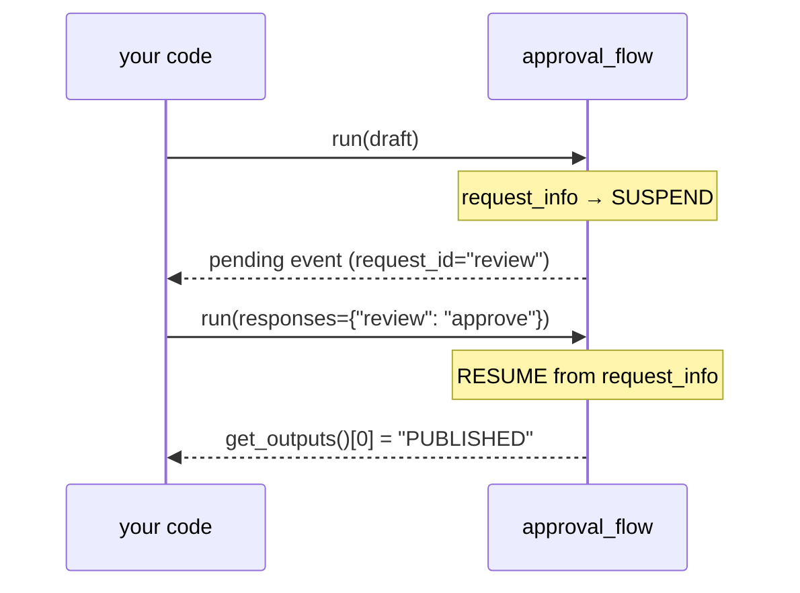

# Advanced Workflows — MAF in Python

*Durable workflows in Python: checkpoint and resume, pause for a human with request_info, and package a workflow as an agent.*

---

A workflow that only runs start-to-finish in one process is fragile. Real orchestrations need to survive a restart, stop to ask a person, and compose out of smaller pieces. The Python Agent Framework gives you all three without leaving the workflow model — the same `WorkflowBuilder` graph, just with a few extra hooks. These were the lessons where workflows stopped being toys for me.

## Checkpointing: snapshot every superstep

Pass a `CheckpointStorage` to the builder and the framework snapshots the whole workflow after **every superstep** — no per-executor bookkeeping required:

```python
storage = FileCheckpointStorage("./checkpoints")
wf = WorkflowBuilder(
    start_executor=step1,
    checkpoint_storage=storage,
    name="counter_flow",
).add_edge(step1, step2).build()

await wf.run(5)   # 5 → (5+1) → (6*10) → 60
```

A superstep is one synchronous wave of message delivery; the boundary between waves is where state (the pending messages plus each executor's state) is durable. `FileCheckpointStorage` writes one JSON file per snapshot; `InMemoryCheckpointStorage()` is the volatile alternative for tests. After the run I ask the store what it kept:

```python
cps = await storage.list_checkpoints(workflow_name="counter_flow")
# each has checkpoint_id, iteration_count, timestamp
```

Resuming is the payoff: `await wf.run(checkpoint_id=<id>)` rehydrates from that snapshot instead of starting over. What tripped me up: this is offline. No model, no credential — the graph is `(5+1)*10`, so the checkpoint round-trip is pure state persistence you can test without Azure.

## Human-in-the-loop: suspend and resume

The other kind of durability is stopping to ask a person. `ctx.request_info(...)` is the pivot — on the first run it **suspends** the workflow instead of returning:

```python
@workflow
async def approval_flow(draft: str, ctx: RunContext) -> str:
    decision = await ctx.request_info(
        {"draft": draft, "question": "Publish this?"},
        response_type=str,
        request_id="review",
    )
    if decision.strip().lower().startswith("approve"):
        return f"PUBLISHED ✅ — {draft}"
    return "REJECTED ❌ — sent back for edits."
```

The first `await approval_flow.run(draft)` produces **no output** — instead `result.get_request_info_events()` returns one pending event whose `.request_id` is `"review"` and whose `.data` is the payload the human sees. You get a decision, then resume with the *same* request id:

```python
result = await approval_flow.run(draft)
ev = result.get_request_info_events()[0]        # suspended here
answer = get_human_decision(ev.data)            # "approve" / "reject"
result = await approval_flow.run(responses={"review": answer})
print(result.get_outputs()[0])                  # PUBLISHED / REJECTED
```

Note there is no `draft` on resume — only the answer, keyed by `request_id`. Execution continues *from* `request_info`, which now returns the human's string. The answer genuinely steers the branch, which is the whole point of a gate.



## Sub-workflows and shared state

Composition is the third leg. A whole workflow can be packaged as an agent with `workflow.as_agent(name=...)` — the wrapper exposes an agent's `.run(...)` surface, coerces the input to `list[Message]`, feeds the start executor, and returns the yielded output as an `AgentRunResponse`. So a workflow drops in anywhere an agent is expected, and workflows nest inside workflows.

For passing data between nodes without threading it through every edge, use **keyed workflow state**: `ctx.set_state(key, value)` writes it, `ctx.get_state(key)` reads it. The writer sees its own write immediately; other executors see it the next superstep. In my drafter → counter → reporter pipeline the edges carry only tiny handoff tokens (`"draft-ready"`), while the actual draft text and word count live under state keys — readers guard for `None` and raise if a key is missing. It keeps big payloads off the edges.

## The mental model

- **Checkpointing** — hand the builder a `CheckpointStorage`; it snapshots each superstep, resume with `run(checkpoint_id=…)`.
- **`request_info`** — suspends the run; resume with `run(responses={id: answer})` keyed by the same request id.
- **`as_agent()`** — wrap a workflow so it quacks like an agent; the basis for sub-workflows.
- **`set_state` / `get_state`** — keyed shared state so edges stay thin.

Durability, human gates, and composition are all just the workflow graph with one extra affordance each. Next I'll wire a whole app around these primitives and ship it.

---

Next: [Hosting and the Capstone App — MAF in Python](/blog/posts/maf-python-12-hosting-and-capstone.html)
