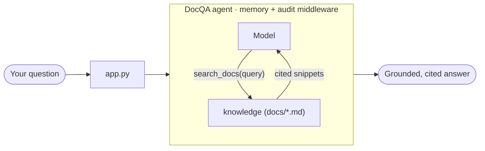

# Hosting and the Capstone App — MAF in Python

*Turning agents into a service you can run and expose, then a full DocQA app that ties the whole series together.*

---

Every lesson so far was a script you `uv run`. That is fine for learning, but a real product is something a human opens in a browser or another agent calls over the network. This finale covers **hosting** — DevUI, A2A, MCP, AG-UI — and then a **capstone app** that pulls all twelve tracks into one small, real thing.

## Hosting: from script to service

The hosting extras ship as separate packages so the core lessons stay light. Enable them once:

```bash
uv sync --extra hosting   # agent-framework-devui + agent-framework-a2a
```

**DevUI** is the fastest way to *see* an agent run. One call boots a local web chat with a live call inspector:

```python
from agent_framework.devui import serve

serve(entities=[agent])   # blocks, owns its own event loop — no asyncio.run()
```

The thing that tripped me up: `serve()` owns the loop, so `main()` is a plain `def`, not `async def`. Pass several agents or workflows in `entities=[...]` and you can switch between them in the UI.

## Exposing agents to other agents

**A2A** (Agent-to-Agent) is the wire protocol for agents calling agents. The package exports exactly three names, and there are two directions:

```python
from agent_framework.a2a import A2AAgent, A2AExecutor

remote = A2AAgent(name="remote-weather", url="http://localhost:9000")  # consume
# ...then mount A2AExecutor(local_agent) on uvicorn to expose your own
```

`A2AAgent(url=...)` lets you `await remote.run(...)` a remote agent as if it were local. `A2AExecutor(agent)` is the server-side adapter you mount on an ASGI server to publish it. There is no `A2ACardResolver` and no built-in `serve` in this build — the executor plus uvicorn *is* the server.

The other two integrations round out the surface:

- **MCP** — borrow tools from a Model Context Protocol server instead of writing them. The model calls remote tools it discovered over HTTP.
- **AG-UI** — expose an agent as a streaming HTTP endpoint. `add_agent_framework_fastapi_endpoint(app, agent, "/")` registers a `POST /` that accepts `{"messages": [...]}` and streams the reply back as SSE (`RUN_STARTED … TEXT_MESSAGE_CONTENT … RUN_FINISHED`).

## The capstone: DocQA

The capstone is one small, real product — **an assistant that answers questions about a set of documents**, grounded, cited, and refusing to guess when the answer isn't there. It never gets wider than *"answer questions about these docs,"* and every piece comes from a lesson you already met.



The agent answers **only** from what its `search_docs` tool retrieves:

```python
agent = Agent(
    client=_client(),                       # FoundryChatClient + AzureCliCredential
    name="DocQA",
    instructions=INSTRUCTIONS,              # "use ONLY search_docs; cite (file › section)"
    tools=[search_docs],                    # keyword retrieval over docs/*.md
    context_providers=[InMemoryHistoryProvider()],  # follow-ups remember context
    middleware=[audit],                     # audit every run
)
```

Every file maps to a track: the `search_docs` tool (tools track), grounding instructions (agents), `InMemoryHistoryProvider` (memory), `audit` middleware (middleware), and — with `--review` — a `SequentialBuilder` workflow where a second Reviewer agent checks that every claim carries a citation before it reaches you (workflows track). `app.py`'s `--serve` flag drops the whole thing into DevUI.

```bash
uv run app.py "How much does Nimbus Pro cost?"   # one question
uv run app.py --review "Can I export my notes?"  # answer, then a reviewer checks it
uv run app.py --serve                            # DevUI web chat
```

## The journey, in one line

That is the whole arc: a client + instructions became an agent; tools let it act; memory let it remember; workflows let several agents route between themselves; and hosting turned the result into something a human or another agent can reach. The trick behind "agentic" was never magic — an agent's output becomes control flow, and each track just made that one loop more capable.

What kept the whole series honest was building one runnable lesson per concept and verifying the wiring offline before ever touching a model. That is also how I found the upstream bugs I fixed — you cannot contribute to a framework you have only read about.

---

Next: [Learning the Microsoft Agent Framework in Go](/blog/posts/maf-go-01-learning-by-building.html)
