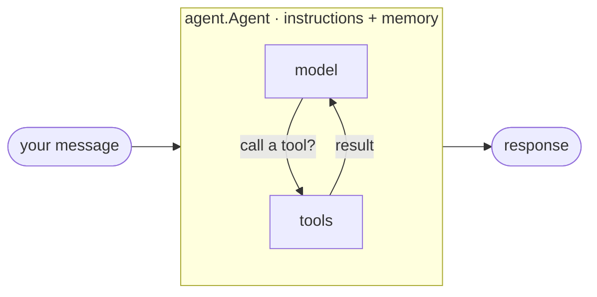

# Learning the Microsoft Agent Framework in Go

*Why I learned the whole framework in Go by writing one runnable lesson per concept, against Azure AI Foundry, instead of reading the docs top to bottom.*

---

## The problem with reading the docs

The Microsoft Agent Framework docs are good, and there's a real Go SDK behind them — `github.com/microsoft/agent-framework-go`. But reading concept pages left me with a map of *names* — agents, tools, sessions, middleware, workflows, orchestrations, hosting — and no feel for how they compose. So I built the Go counterpart of a curriculum I trust: one small, runnable lesson per concept, in the order they build on each other, each one green before I moved on. Along the way I hit rough edges in the SDK and sent fixes upstream.

This series retells that curriculum. Every post is grounded in a real lesson — the `main.go`, a message-flow card, and a test that proves it.

## The shape of the framework

Two primitives, plus plumbing.

**An agent** is a model with instructions and (optionally) tools, run in a loop: reason, maybe call a tool, repeat until it answers.

**A workflow** is a graph of executors — agents or plain functions — connected by edges, where messages flow along the edges and *you* define the path, not the model.



Everything else — tools, memory, middleware, providers, orchestrations, hosting — bolts onto one of those two shapes. The heuristic I kept using:

| Use an **agent** when | Use a **workflow** when |
|-----------------------|-------------------------|
| the task is open-ended | the process has defined steps |
| one model call (with tools) suffices | multiple agents must coordinate |
| the model should decide the steps | you must control the path |

## One provider, no API keys

For `00-setup` and `01-get-started`, every lesson targets **Azure AI Foundry** with **credential-based auth** — no stored keys. In Go that's the `foundryprovider` client authenticated by `DefaultAzureCredential`, which uses your `az login` session and reads config (`FOUNDRY_PROJECT_ENDPOINT`, `FOUNDRY_MODEL`) from the environment:

```go
cred, _ := azidentity.NewDefaultAzureCredential(nil)
client := foundryprovider.New(endpoint, model, cred)

joker := agent.New(client, agent.WithInstructions("Tell one short joke."))
resp, _ := joker.RunText(ctx, "Say hi.").Collect()
```

Pinning the foundation to one provider was deliberate: the model backend is a config knob, and the learning lives in the agent and workflow APIs, which don't change with the client. (Track 2's `providers/` lessons deliberately branch out — Anthropic, OpenAI, Gemini — because *providers* are the lesson there.)

## Why "build it" beats "read it"

Three things reading never gave me:

- **The API you actually get.** The Go SDK is iterator-first — `RunText` returns a `ResponseStream`; you `.Collect()` for one shot or `range` it for streaming. You only internalize that by writing it, and by hitting the compiler when you get it wrong.
- **Message flow you can see.** Each lesson ships a Mermaid card of how messages move: you → agent → provider → model → tools. Drawing it is understanding it.
- **A test that fails when I'm wrong.** Each lesson factors agent construction out of `main` so an offline **structural** test can build the same agent with a dummy credential and assert its wiring — no network. The live model call is opt-in behind `AF_LIVE=1`, so `go test ./...` stays green offline.

## The 12-track journey

The curriculum is dependency-ordered — no lesson needs one that comes later. You start with a single agent and end with a full multi-agent app:

1. **Your first agent** — provider + instructions → run, streaming and not.
2. **Tooling** — function tools, approvals, structured output, MCP.
3. **Conversation & memory** — sessions carry history across turns.
4. **Shaping a run** — the iterator API, images, dependency injection.
5. **Middleware** — wrap runs and model calls; logging and guardrails.
6. **Observability, safety, providers** — tracing, plus the multi-provider branch.
7. **Workflow mechanics** — the executor graph, edges, streaming events.
8. **Workflows with agents** — agents as executor nodes; the builder.
9. **Orchestrations** — concurrent fan-out/in, group chat, handoff.
10. **Advanced workflows** — sub-workflows, checkpoints, shared state, loops.
11. **Hosting** — serving agents, AG-UI client/server pairs.
12. **Capstone** — an end-to-end A2A app: Foundry agents served over JSON-RPC and wrapped as tools for a local orchestrator.

That's the arc this series walks, one post per track. My promise for each: real Go you can `go run`, a diagram of what's happening, and the thing that tripped me up so it doesn't trip you.

Next post: the smallest thing that compiles and runs — a provider, instructions, and one call.

---

Next: [Your First Agent — MAF in Go](/blog/posts/maf-go-02-your-first-agent.html)
