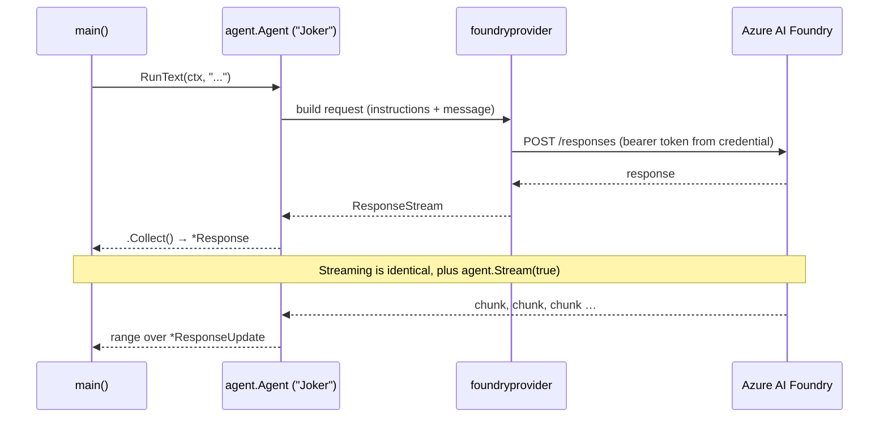

# Your First Agent — MAF in Go

*The minimal loop in Go: a Foundry provider, an Agent with instructions, run collected and streamed — and what RunText hands back.*

---

## The whole loop is three things

Coming from the Python side of this series, the Go shape felt familiar the moment I wrote it. You need three parts: a **provider** (which knows how to reach a deployed model), an **Agent** (instructions plus that provider), and a **run** (hand it text, get a response back). Tools, memory, and workflows all build on this same call.

The `foundryprovider` package collapses provider-plus-agent into one constructor:

```go
import (
    "github.com/microsoft/agent-framework-go/agent"
    "github.com/microsoft/agent-framework-go/provider/foundryprovider"
)

a := foundryprovider.NewAgent(
    endpoint,
    cred, // an azcore.TokenCredential
    foundryprovider.ModelDeployment(model),
    foundryprovider.AgentConfig{
        Instructions: "You are good at telling jokes.",
        Config:       agent.Config{Name: "Joker"},
    },
)
```

## The credential is your Foundry connection

Auth is credential-based — no API keys. I get the token credential from `azidentity.NewDefaultAzureCredential(nil)`, which walks Azure's credential chain and, on my machine, lands on my `az login` session. The important thing: that credential is **lazy**. Creating it does not contact Azure; the token isn't fetched until the agent makes its first request. So a successful `NewDefaultAzureCredential` means "configured," not "authenticated" — the real auth failure, if any, surfaces on the first `RunText`.

`ModelDeployment(model)` selects the model deployment, and `foundryprovider.NewAgent` wires the whole thing up. I factor construction into a `newJoker(endpoint, model, cred)` helper so the offline test can build the identical agent with a *fake* credential and a dummy endpoint, then assert its wiring — `a.Name() == "Joker"` — with no network at all.

## The instructions are the agent

`AgentConfig.Instructions` is the entire personality; `agent.Config{Name: "Joker"}` just names it for logs and traces. One string, no template files. Change it, rebuild, and the behavior changes.

## Running it two ways — one method

Here's the Go-specific ergonomic I like. `RunText` returns a `ResponseStream`, and you consume it in one of two ways from the *same* call.

Collected — drain the stream into one finished `*Response`:

```go
resp, err := a.RunText(ctx, "Tell me a joke about a pirate.").Collect()
demo.Print(resp, err)
```

Streamed — add `agent.Stream(true)` and range over the incremental `*ResponseUpdate`s. This is a Go 1.23+ range-over-function iterator (`iter.Seq2`), so there are no channels to manage:

```go
for update, err := range a.RunText(ctx, "Now one about a robot.", agent.Stream(true)) {
    demo.Print(update, err)
}
```

Both `*Response` and `*ResponseUpdate` implement `fmt.Stringer`, which is why a single `demo.Print` handles either. That's the elegant part: streaming isn't a different API, it's the same `RunText` consumed as an iterator instead of collected.



## What RunText hands back

`RunText` never blocks by itself — it returns a `ResponseStream` immediately. What you do next decides the shape:

- `.Collect()` drains every update and returns a single `*Response` (plus an `error`). This is your "give me the whole answer" path — the full assistant text, and later the place tool calls and usage live.
- Ranging with `agent.Stream(true)` yields `*ResponseUpdate` values as they arrive, each carrying a slice of the answer. Concatenate their text and you get exactly what `Collect` would have returned.

So the mental model matches the Python side: **collected = one `*Response`; streamed = a sequence of `*ResponseUpdate`s that sum to the same text.** One method, two consumption styles, and error handling that rides along on each value in the stream.

That's the minimal loop. A lazy credential, a provider that turns it into a live model, an instruction string that is the agent, and a `RunText` you either collect or range over. Next I hand this agent a Go function it can call.

---

Next: [Giving an Agent Tools — MAF in Go](/blog/posts/maf-go-03-giving-agents-tools.html)
