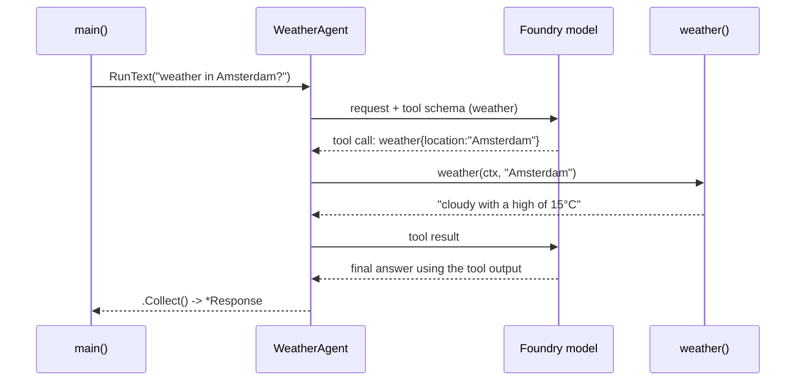

# Giving an Agent Tools — MAF in Go

*Wrap a typed Go function as a tool, let the model call it, and compose whole agents as tools.*

---

This is post 3 of 12 in **Learning the Microsoft Agent Framework — Go**, where I learn the framework by building one runnable lesson per concept. I contributed a few fixes upstream to `microsoft/agent-framework-go` along the way, and tools were the concept that made the framework click for me. An agent that only talks is limited; hand it a Go function and it can fetch data, do math, or hit an API mid-conversation. The model decides *when* to call; the framework runs your code and feeds the result back.

## A tool is a typed function

You don't write JSON schema. You write a normal, typed Go function and wrap it with `functool.MustNew`:

```go
import "github.com/microsoft/agent-framework-go/tool/functool"

func weather(_ context.Context, location string) (string, error) {
    return fmt.Sprintf("The weather in %s is cloudy with a high of 15°C.", location), nil
}

var weatherTool = functool.MustNew(functool.Config{
    Name:        "weather",
    Description: "Get the current weather for a given location",
}, weather)
```

`functool.MustNew` infers the JSON input schema *from the handler's parameter type*. Here the parameter is a `string`, so the model sees a `weather` tool that requires a `location`. The `Name` and `Description` in `functool.Config` are the tool's "documentation" — exactly what the model reads when deciding whether to call it.

I keep the handler a **named** function rather than an inline closure so my offline test can call `weather(ctx, "Amsterdam")` directly and assert the exact string — no model, no network.

## Wiring the tool onto the agent

The tool reaches the agent through one field, `Tools`, on `agent.Config`. Same Foundry provider and credential-based auth from the earlier posts:

```go
func newAgent(endpoint, model string, cred azcore.TokenCredential) *agent.Agent {
    return foundryprovider.NewAgent(
        endpoint,
        cred,
        foundryprovider.ModelDeployment(model),
        foundryprovider.AgentConfig{
            Instructions: "You are a helpful assistant.",
            Config: agent.Config{
                Name:  "WeatherAgent",
                Tools: []tool.Tool{weatherTool}, // the agent may call this on its own
            },
        },
    )
}
```

Then I run it — and tool calling works identically whether I `Collect()` the whole response or stream it:

```go
resp, err := a.RunText(ctx, "What is the weather like in Amsterdam?").Collect()
demo.Print(resp, err)

for update, err := range a.RunText(ctx, "What...?", agent.Stream(true)) {
    demo.Print(update, err)
}
```

## The tool-call loop



The framework marshals the model's JSON arguments into my `location` string, runs the function, and hands the return value back. The model never executes Go — it emits a request, and the loop repeats until it has what it needs to answer.

## As function tools: an agent *is* a tool

Here's the composition move that surprised me. A whole agent can be wrapped as a tool with `agenttool.New`, so one agent delegates to another with no routing code:

```go
import "github.com/microsoft/agent-framework-go/tool/agenttool"

// weatherAgent has Name "WeatherAgent" + its own weather() function tool.
assistant := foundryprovider.NewAgent(endpoint, cred,
    foundryprovider.ModelDeployment(model),
    foundryprovider.AgentConfig{
        Instructions: "You are a helpful assistant who responds in French.",
        Config: agent.Config{
            Name:  "Assistant",
            Tools: []tool.Tool{agenttool.New(weatherAgent, agenttool.Config{})},
        },
    })
```

`agenttool.New` adapts an `*agent.Agent` into an ordinary `tool.Tool`. Its `Name()` and `Description()` come from the *inner agent* — so the specialist's name and description become the schema the outer model sees. Ask the French-speaking orchestrator about the weather and it calls the `WeatherAgent` tool, which in turn calls the leaf `weather` function. Two levels of tool-calling, all the way down, with no dispatch logic of my own.

One detail the offline test pins: a plain function tool wraps its single argument as `Arg0`, but the agent-as-tool takes a `{"query": "..."}` object instead — its `Call` feeds `query` to the inner agent.

## What tripped me up

Coming from Python, I kept looking for a decorator. There isn't one — in Go the tool is a `functool.MustNew` value you put in a slice. Once that clicked, the pattern was clean: type your function well (the schema is inferred from it), name and describe it clearly (that's what the model reads), and drop it in `Config.Tools`.

---

Next: [Conversation and Memory — MAF in Go](/blog/posts/maf-go-04-conversation-and-memory.html)
