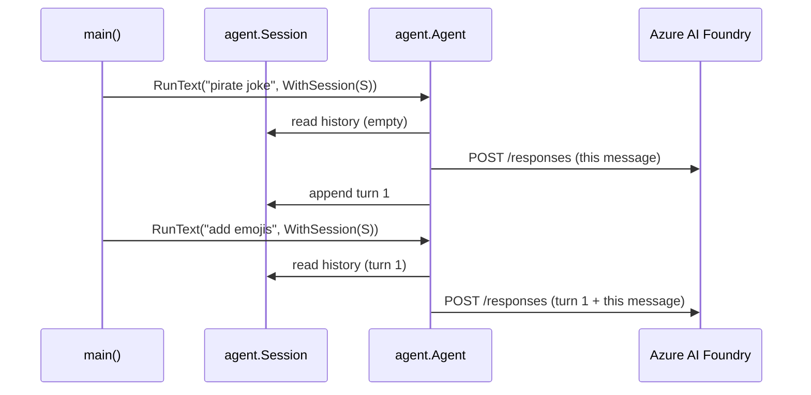

# Conversation and Memory — MAF in Go

*A Session threads history into each run; a ContextProvider carries memory across sessions — and because a Session is JSON, both survive a process restart.*

---

Porting the Microsoft Agent Framework Go examples, the lesson that clicked hardest was multi-turn state. On its own, every `RunText` call is stateless — the model sees only the one message you hand it. What turns a sequence of calls into a *conversation* is an `agent.Session`, and what turns a conversation into durable *memory* is a `ContextProvider`. They're separate, and keeping them separate is what makes the model scale.

## Sessions: threading history into a run

Create a session once and pass it to every call with `agent.WithSession`:

```go
session, err := a.CreateSession(ctx)
// ...
resp, _ := a.RunText(ctx, "Tell me a joke about a pirate.",
    agent.WithSession(session)).Collect()

resp, _ = a.RunText(ctx,
    "Now add some emojis to the joke and tell it in a parrot's voice.",
    agent.WithSession(session)).Collect()
```

Turn 2 says "*the* joke" and it works — because the same session is threaded through, the agent reads the earlier exchange out of the session and sends it as context. Drop `WithSession` from the second call and turn 2 forgets turn 1 entirely.

For the Foundry provider, `CreateSession` allocates a plain in-memory `*Session` with no network round-trip; the agent appends each turn's messages to it as a history provider.



## Context providers: two hooks around every run

A `ContextProvider` wires two lifecycle hooks under one source ID. `Provide` runs *before* the model call and injects instructions; `Store` runs *after* and persists what it learned. Crucially, that memory lives in the `Session`, not in a Go struct field:

```go
func newUserMemoryProvider() agent.ContextProvider {
    return agent.NewContextProvider(agent.ContextProviderConfig{
        SourceID: userMemorySourceID,
        Provide:  provideUserMemory,
        Store:    storeUserMemory,
    })
}
```

`Provide` reads the provider's slot out of the session and turns whatever is remembered into instructions — additively, returning an `Option`, never mutating the agent:

```go
func provideUserMemory(ctx context.Context, in agent.InvokingContext) (
    []*message.Message, []agent.Option, error) {
    session, _ := agent.GetOption(in.Options, agent.WithSession)
    state := getProviderState(session)
    var b strings.Builder
    if state.UserName != "" {
        fmt.Fprintf(&b, "The user's name is %s.\n", state.UserName)
    } else {
        b.WriteString("Ask the user for their name before answering.\n")
    }
    return nil, []agent.Option{agent.WithInstructions(b.String())}, nil
}
```

`Store` scans the request messages after a run, extracts a name or age, and writes state back with `session.Set(sourceID, state)` — so the *next* `Provide` sees it. The contract is additive: a provider contributes messages, options, or state; it never reaches in and overwrites the agent.

## Persistence: a Session is just JSON

Here's the part I like most about the Go SDK. A `Session` implements `MarshalJSON`/`UnmarshalJSON`, so memory survives a save/restore cycle with nothing more than `encoding/json`:

```go
data, _ := json.Marshal(session)          // state + provider IDs captured
var resumed agent.Session
json.Unmarshal(data, &resumed)            // a fresh Session, as a new process would start
resp, _ := a.RunText(ctx, "What is my name and age?",
    agent.WithSession(&resumed)).Collect() // still remembers
```

That's the whole persistence story: serialize the bytes, store them anywhere — a file in the lesson, a DB row or cache in production, keyed by conversation ID — then deserialize them into a fresh `Session` so a *different* process can continue the same chat. `step06_persisted_conversation` does exactly this: run a turn, `os.WriteFile` the session, load it back into a new value, and the agent retells the joke it "remembers."

Because memory is just data, you can also seed a brand-new session with saved state and skip the conversation entirely:

```go
newSession, _ := a.CreateSession(ctx)
newSession.Set(userMemorySourceID, state)  // remembered without ever chatting
```

## The mental model

- **Agent** — stateless; the same agent serves every conversation.
- **Session** — one conversation's history and provider state; in-memory, but JSON-serializable.
- **ContextProvider** — `Provide` injects before the run, `Store` learns after; its memory lives in the Session, keyed by `SourceID`.
- **Persistence** — marshal the Session, store the bytes, unmarshal into a fresh Session to resume across processes.

Two objects, one additive contract, and JSON for durability. Next I'll look at shaping a single run from the outside — instructions, tools, and structured output.

---

Next: [Shaping a Run — MAF in Go](/blog/posts/maf-go-05-shaping-a-run.html)
