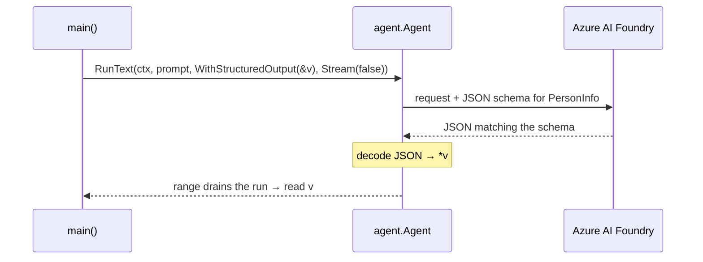

# Shaping a Run — MAF in Go

*Decoding typed structs from a run, draining a streamed response, and sending an image with `RunMessage`.*

---

## The same run, shaped three ways

Earlier steps called `RunText` and read the answer as prose. Real programs want *data*, want to show output as it streams, and sometimes want the model to look at an image. In the Go SDK for the Microsoft Agent Framework these are three options on the same run — no new agent, no separate client. This post covers structured output, streaming, and images, grounded in the `foundryprovider` steps I built.

## Structured output: the struct *is* the schema

Define the shape as a Go struct; the `json` tags become the field names in a generated JSON schema. The SDK exposes two altitudes for asking the model to fill it in.

```go
type PersonInfo struct {
    Name       string `json:"name"`
    Age        int    `json:"age"`
    Occupation string `json:"occupation"`
}

var v PersonInfo
opts := []agent.Option{agent.WithStructuredOutput(&v), agent.Stream(false)}
for _, err := range a.RunText(ctx, prompt, opts...) {
    if err != nil { return err }
}
// v is decoded once the loop ends
```

`agent.WithStructuredOutput(&v)` is a *per-run* option: hand it a pointer, drain the run, and the SDK has decoded the model's JSON straight into your value. I wrapped this in a generic `runFor[T]` so any output type works — it just appends the option and ranges to completion.

The second altitude wires the constraint into the agent itself:

```go
Config: agent.Config{
    Name: "HelpfulAssistant",
    RunOptions: []agent.Option{
        agent.WithResponseFormat(jsonformat.MustFor[PersonInfo]()),
    },
},
```

`jsonformat.MustFor[PersonInfo]()` reflects over the struct's tags to build the schema. Anything in `Config.RunOptions` is prepended to *every* run, so now every call returns JSON — but you own the decoding: collect the streamed text and `json.Unmarshal` it yourself.



## Streaming: range the run, or Collect it

A run in Go is an `iter.Seq2[*agent.ResponseUpdate, error]` — you `range` it. `agent.Stream(true)` yields incremental updates as the model produces them; `agent.Stream(false)` collects the whole response first. Both are the *same* `RunText` call.

```go
for update, err := range a.RunText(ctx, prompt, agent.Stream(true)) {
    if err != nil { return err }
    raw = append(raw, update.String()...)   // accumulate the JSON text
}
```

When you don't need per-chunk handling, `.Collect()` drains the sequence into one `*Response` for you — that's what the one-shot path uses. `update.String()` gives the text parts of a chunk, which is exactly what you append when the agent is streaming raw JSON under a response format.

## Images: build a Message, run with RunMessage

`RunText` only takes a plain string, so it can't carry an image. A multi-part turn is a `message.Message` built from `Content` parts, and you run it with `RunMessage`:

```go
msg := message.New(
    &message.TextContent{Text: "What do you see in this image?"},
    &message.DataContent{
        Name:      "walkway.jpg",
        Data:      base64.StdEncoding.EncodeToString(imageBytes),
        MediaType: "image/jpeg",
    },
)
resp, err := a.RunMessage(ctx, msg).Collect()
```

`DataContent` carries in-memory bytes: base64-encode the JPEG into `Data` and set `MediaType` so the model knows how to decode them. For an image already hosted somewhere, use `message.URIContent` instead — no bytes, just a link, and the model fetches it. In my lesson the image is baked in with `//go:embed assets/walkway.jpg` so the binary is self-contained. As with Python, the deployment must be vision-capable (e.g. `gpt-4o`).

## The through-line

Input and output are the two things you shape. Input gets richer through a multi-part `message.Message`; output gets richer through `WithStructuredOutput` / `WithResponseFormat` — delivered either all at once via `.Collect()` or chunk by chunk by ranging with `Stream(true)`. Once that clicks, a run stops being "text in, text out" and becomes a typed call that can also see. Next I wrap every run with middleware for logging and guardrails.

---

Next: [Middleware — MAF in Go](/blog/posts/maf-go-06-middleware.html)
