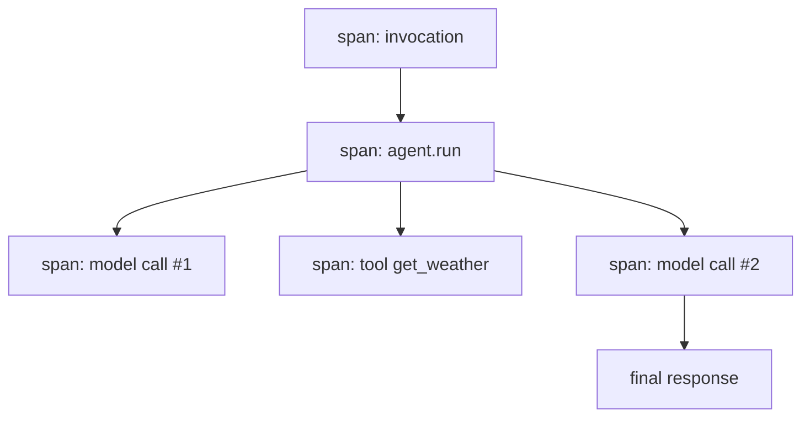

# Observability in ADK: Seeing Inside a Running Agent

*How OpenTelemetry traces, structured logs, and token metrics turn an agent's event stream into something you can debug in production.*

---

Once an agent leaves your laptop, "it works" stops being a statement you can make by staring at stdout. A request fans out into model calls and tool calls, some slow, some flaky, and the only honest way to know what happened is to instrument it. Google's Agent Development Kit (ADK) gives you three signals for this — **logs**, **traces**, and **metrics** — and the unifying insight is that all three are *functions of the agent's event stream*. Every step an agent takes surfaces as an event; observability is just deriving structured records from those events and shipping them somewhere you can query.

## Three signals, one event stream

| Signal | Answers | Where it comes from |
|--------|---------|---------------------|
| **Logs** | what happened, in order | one structured record per event / tool call / model call |
| **Traces** | how a request flowed and where time went | OpenTelemetry spans, nested invocation → agent → tool → model |
| **Metrics** | how much, how often | token usage, request counts, latencies |

If you internalize that logs, traces, and metrics are all *derivations of events*, you stop hand-rolling ad-hoc `print` statements and start emitting queryable records at well-defined hook points. An exporter does this continuously in production; locally you can do it offline against a captured event list to see the exact shape.

## Traces: the event stream as a span tree

Every invocation becomes a **trace**, and each agent run, tool call, and model call becomes a nested **span**. This is precisely the tree that the `adk web` trace panel — and Cloud Trace in production — render:



The good news is that **you don't write this instrumentation.** Both the Python and Go SDKs ship OpenTelemetry instrumentation baked in. Each invocation opens a root span; agents, tools, and model calls nest underneath automatically. Attach an OTEL exporter — Cloud Trace, or OTLP to Jaeger — and traces flow with **zero code changes**. When a request is slow, you open the trace and read the span durations: the fat span is your bottleneck, whether that's a lagging model call or a tool waiting on a downstream API.

By default spans record *structure and timing* but not message text. To capture the actual prompt/response content inside spans — invaluable for debugging a tool-call trajectory that went sideways — set one environment variable:

```bash
export OTEL_INSTRUMENTATION_GENAI_CAPTURE_MESSAGE_CONTENT=true
```

Leave it **off** when spans might capture sensitive data; it's an explicit opt-in for exactly that reason.

## Deriving a trace offline

To make the "signals are functions of events" idea concrete, you can run an agent, collect its events, and fold them into span-like records yourself — the same shape an exporter would ship, minus the network. In Python, a `build_trace` function walks the event list and a `metrics` function aggregates it. Both are pure, so they're trivially testable offline:

```python
from google.adk.events import Event

def build_trace(events: list[Event]) -> list[dict]:
    """Turn events into span-like records (what tracing would export)."""
    spans = []
    for e in events:
        if e.content and e.content.parts and e.content.parts[0].text:
            spans.append({
                "author": e.author,
                "chars": len(e.content.parts[0].text),
                "final": e.is_final_response(),
            })
    return spans

def metrics(trace: list[dict]) -> dict:
    return {
        "span_count": len(trace),
        "total_output_chars": sum(s["chars"] for s in trace),
        "final_responses": sum(1 for s in trace if s["final"]),
    }
```

The Go form is identical in spirit — the same fold over `[]*session.Event`, with the schema made explicit through a struct instead of a dict:

```go
type span struct {
    Author string
    Chars  int
    Final  bool
}

func buildTrace(events []*session.Event) []span {
    var spans []span
    for _, e := range events {
        if e.Content != nil && len(e.Content.Parts) > 0 && e.Content.Parts[0].Text != "" {
            spans = append(spans, span{
                Author: e.Author,
                Chars:  len(e.Content.Parts[0].Text),
                Final:  e.IsFinalResponse(),
            })
        }
    }
    return spans
}
```

Same logic, two idioms: Python reads events into dicts, Go into typed structs. In real deployment you never write this loop — OTEL does it for you — but writing it once makes the black box legible.

## Structured logs, not prose

Logging free-form strings is a trap. Grepping `"got weather for London"` doesn't answer "which tool fails most?" or "what's the p95 latency of `get_weather`?" Log **records** instead — `{tool, args, status, latency_ms}` — so those questions become queries. The natural place to emit them is the callback hooks: `after_model` and `after_tool` fire after each step, giving you the tool name, arguments, and outcome to record. In Python you attach them as callbacks (or a logging plugin); Go uses the equivalent structured-logging-plus-callback pattern.

```python
def log_tool(tool, args, tool_context, tool_response):
    logging.info("tool_call", extra={
        "tool": tool.name,
        "args": args,
        "status": tool_response.get("status", "ok"),
    })
# ... Agent(..., after_tool_callback=log_tool)
```

## Metrics worth capturing

Three families pay for themselves immediately:

- **Token usage** — model responses carry usage metadata (prompt / candidate / total tokens). Sum it per invocation for cost dashboards and alert on spikes before they hit the bill.
- **Latency** — span durations, per model call and per tool. The number you optimize against.
- **Counts and outcomes** — invocations, tool calls, errors, guardrail blocks, human-in-the-loop approvals: your reliability signals.

## Mental model & the managed shortcut

Think of it this way: **the event stream is the ground truth; logs, traces, and metrics are three lenses on it.** You never invent the data — you project it.

| | Python | Go |
|--|--------|-----|
| tracing | OpenTelemetry SDK + Cloud Trace / OTLP exporter | OpenTelemetry Go SDK + exporter |
| view locally | the `adk web` trace panel | OTEL console / exporter |
| logs | `logging` + `after_*` callbacks or a plugin | structured logging + callbacks |
| metrics | OTEL metrics + response usage metadata | OTEL metrics + usage metadata |

Self-hosting on Cloud Run or GKE is where you wire the OTEL exporter yourself. On **Vertex Agent Engine**, tracing, logging, and metrics are wired automatically: you get the trace tree, request logs, and token metrics without configuring a single exporter. Either way the discipline is the same — emit structured records at the callback hooks, watch the fat spans, and treat the event stream as the source of truth.

**Next in the series:** Safety and security — guardrails, identity, and keeping tools from doing something they shouldn't.
