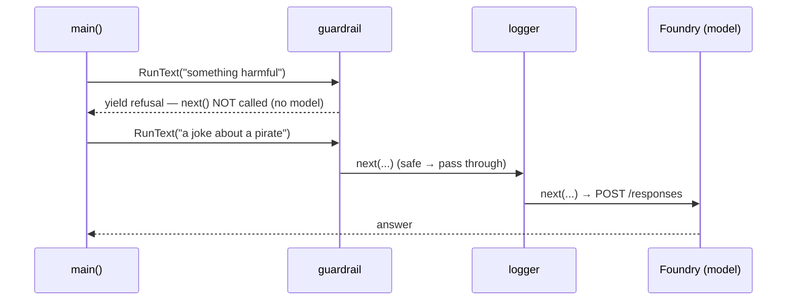

# Middleware — MAF in Go

*A guardrail that blocks a run before the model, chained ahead of a logger — and the upstream nil-update panic I fixed along the way.*

---

This is post 6 of 12 in **Learning the Microsoft Agent Framework — Go**, where I learn the framework by building one runnable lesson per concept — and where I hit the edge that turned into my first upstream fix. Tools let the agent act; sessions let it remember. Middleware is the seam *around* the run: the standard place for logging, tracing, and guardrails that never touch the agent's logic.

## A middleware is anything with a Run method

In Go there are no decorators, so a middleware is any value implementing `agent.Middleware` — a `Run` method that receives the next link in the chain, the context, the messages, and options, and returns the response stream. The Go 1.23 iterator shows up here directly: the return type is `iter.Seq2[*agent.ResponseUpdate, error]`.

```go
func (guardrailMiddleware) Run(
    next agent.RunFunc,
    ctx context.Context,
    messages []*message.Message,
    options ...agent.Option,
) iter.Seq2[*agent.ResponseUpdate, error] {
    for _, msg := range messages {
        if strings.Contains(strings.ToLower(msg.String()), "harmful") {
            return func(yield func(*agent.ResponseUpdate, error) bool) {
                yield(&agent.ResponseUpdate{
                    Role:     message.RoleAssistant,
                    Contents: message.Contents{&message.TextContent{Text: "I can't help with harmful requests."}},
                }, nil)
            }
        }
    }
    return next(ctx, messages, options...) // pass through
}
```

## Blocking vs. passing through is one branch

That method is the whole idea in one place. `return next(ctx, messages, options...)` is a **pass-through** — hand the rest of the chain back untouched. Returning an iterator that yields your own `*agent.ResponseUpdate` **short-circuits** the chain: the model is never called. The guardrail refuses a harmful message with a canned response, offline, with no network at all.

## Two ways to be a middleware

The guardrail is a struct implementing `Run` directly. When a middleware needs state, `agent.MiddlewareFunc` adapts a method value instead. Here a run counter logs the newest user message on the way in, then passes every update through unchanged:

```go
func (rc *runCounter) run(next agent.RunFunc, ctx context.Context,
    messages []*message.Message, options ...agent.Option) iter.Seq2[*agent.ResponseUpdate, error] {
    rc.n++
    fmt.Printf("===== Run %d =====\n", rc.n)
    return next(ctx, messages, options...) // transparent
}

func (rc *runCounter) Middleware() agent.Middleware { return agent.MiddlewareFunc(rc.run) }
```

## Order is wiring order

Both middlewares go into `agent.Config.Middlewares`, applied **outermost-first**. Wiring the guardrail before the logger means a blocked request stops at the guardrail — it never reaches the logger's downstream or the model:

```go
foundryprovider.AgentConfig{
    Instructions: "You are good at telling jokes.",
    Config: agent.Config{
        Name:        "Joker",
        Middlewares: []agent.Middleware{guardrailMiddleware{}, runLogger().Middleware()},
    },
}
```



## The upstream fix: a nil-update panic in tool-approval middleware

Middleware is exactly where I found my first real SDK edge. The tool-approval middleware — the seam that pauses a run for human sign-off — assumed every `*agent.ResponseUpdate` it received from `next` was non-nil. When an inner stream yielded a `nil` update (which a legitimate provider can do at a stream boundary), the middleware dereferenced it and panicked, taking down the whole run instead of skipping the empty update. I reproduced it against a fake `next` that yields `nil`, added the guard, and sent it upstream as [PR #472](https://github.com/microsoft/agent-framework-go/pull/472) to `microsoft/agent-framework-go`. Small fix, but it's the kind you only find by reading the middleware chain closely and driving it with a hostile `next` — which is exactly what the offline test does here.

## What the offline test proves

The test builds the agent with a **fake credential**, asserts both middlewares are wired in order, then drives each `Run` directly with a `next` that *fails the test if called* — so a harmful message must yield its refusal without ever invoking the model, and a safe one must pass a sentinel straight through. No Foundry, no tokens, just the wiring and the branch. That same "drive it with a fake `next`" discipline is how the nil-update panic became reproducible.

Middleware is the composable seam around every run. Next I open the box wider: telemetry, safety, and swapping the provider underneath.

---

Next: [Observability, Safety, and Providers — MAF in Go](/blog/posts/maf-go-07-observability-safety-providers.html)
