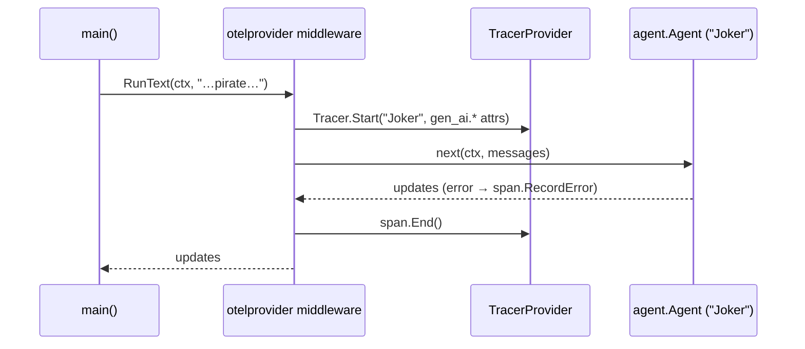

# Observability, Safety, and Providers — MAF in Go

*Wrap every run in an OpenTelemetry span, gate risky tool actions behind a permission handler, and swap model providers behind one agent.Agent.*

---

## Three operational concerns, one agent.Agent

The earlier Go posts got an agent running, gave it tools, and shaped its output. This one is about running it in production: seeing what happened (observability), controlling what a tool is allowed to do (safety), and swapping the model backend without rewriting the agent (providers). In the Go SDK all three reduce to the same primitives — `agent.Config`, middleware, and the provider constructor.

## Observability: tracing is just middleware

An agent run is a tree of operations, and the SDK ships OpenTelemetry instrumentation that turns each run into a **span**. The whole lesson is `otelprovider.NewMiddleware(...)` — it slots into `agent.Config.Middlewares` exactly like a logger:

```go
import (
    "github.com/microsoft/agent-framework-go/agent"
    "github.com/microsoft/agent-framework-go/provider/foundryprovider"
    "github.com/microsoft/agent-framework-go/provider/otelprovider"
)

a := foundryprovider.NewAgent(endpoint, cred,
    foundryprovider.ModelDeployment(model),
    foundryprovider.AgentConfig{
        Instructions: "You are good at telling jokes.",
        Config: agent.Config{
            Name:        "Joker",
            Middlewares: []agent.Middleware{otelprovider.NewMiddleware(otelprovider.MiddlewareConfig{})},
        },
    })
```

The middleware opens a span around each run, tags it with `gen_ai.*` attributes (agent name, provider, operation), records any error onto the span, and closes it when the run finishes. Spans go wherever the global TracerProvider points — the middleware calls `otel.Tracer(...)` under the hood, so whatever you register with `otel.SetTracerProvider(...)` receives every span. In production that's the OTel SDK aimed at Jaeger or OTLP.



Instrumentation is wiring, not a rewrite — the agent's core logic never changes, and a streaming run produces exactly one `invoke_agent` span just like a collected one.

## Safety: gate actions behind a permission handler

Go's clearest safety story is the GitHub Copilot provider, where the model lives behind the local `copilot` CLI and can run shell commands. Rather than trust it blindly, you attach a **permission handler** that gets called whenever the model wants to run a command, read a file, or hit a URL:

```go
a := copilotprovider.NewAgent(client, copilotprovider.AgentConfig{
    SessionConfig: &copilot.SessionConfig{
        OnPermissionRequest: promptPermission, // human approves each action
    },
    Config: agent.Config{Name: "GitHub Copilot Agent"},
})
```

The handler returns `&rpc.PermissionDecisionApproveOnce{}` to allow the action this once or `&rpc.PermissionDecisionReject{}` to block it. Keeping the decision logic in a small pure `decide(answer)` function makes it unit-testable without stdin — a human-in-the-loop guardrail you can actually verify.

## Providers: the same agent over any backend

A provider is just the thing that turns instructions plus a message into a model call. Swapping `foundryprovider` for another changes *nothing* about the `agent.Agent` you get back — same `RunText`, same `.Collect()`, same streaming. Only the constructor and credentials differ:

- **Anthropic** — `anthropicprovider.NewAgent(client, ...)`; `anthropic.NewClient()` reads `ANTHROPIC_API_KEY`. `a.ProviderName()` returns `"anthropic"`.
- **OpenAI** — `openaiprovider.NewAgent(client, ...)`; `openai.NewClient()` reads `OPENAI_API_KEY` (+ optional `OPENAI_BASE_URL`).
- **Gemini** — `geminiprovider.NewAgent(client, ...)` over a `*genai.Client` built with `genai.BackendGeminiAPI` and a `GEMINI_API_KEY`.
- **GitHub Copilot** — `copilotprovider`, backed by the local CLI, no bearer token.
- **Azure AI Foundry** — `foundryprovider.NewAgent(endpoint, DefaultAzureCredential(), ...)`, credential-based, the default across this series.

Working through these, I hit two real bugs and sent fixes upstream to `microsoft/agent-framework-go`: an empty-choices panic guard in the OpenAI provider ([PR #473](https://github.com/microsoft/agent-framework-go/pull/473)) — the provider dereferenced `choices[0]` when the API returned none — and a streamed-tool-call fix in the Anthropic provider ([PR #470](https://github.com/microsoft/agent-framework-go/pull/470)), where tool-call deltas weren't accumulated correctly across streaming updates. Reading the provider source closely is exactly how you find edges like these.

## Why these three belong together

Observability tells you *what happened*, safety controls *what an action is allowed to do*, and providers decide *which model runs it* — all over the same `agent.Agent`, none of it touching your core logic. Next we leave single agents behind for workflows.

---

Next: [Workflow Mechanics — MAF in Go](/blog/posts/maf-go-08-workflow-mechanics.html)
