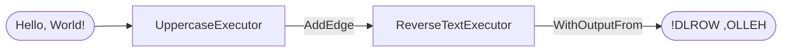

# Workflow Mechanics — MAF in Go

*The graph model underneath every multi-agent app: executors as nodes, edges as data flow, and typed events streaming out of `WatchStream` as it runs.*

---

Post 8 of 12 in *Learning the Microsoft Agent Framework — Go*.

The first two lessons hardened a single agent. A **workflow** is the layer above: a directed graph of *executors* joined by *edges*. A value enters at the start node, flows along the edges, and each executor transforms it. My first workflow had no model at all — two `string -> string` functions in a line — which is exactly the right way to see the mechanics without any Azure credential in the way.

## An executor is a function bound to an ID

For the simple case there's no interface to implement. `workflow.NewExecutor(id, fn).Bind()` turns a plain function into a graph node:

```go
uppercase := workflow.NewExecutor("UppercaseExecutor", func(input string) string {
    return strings.ToUpper(input)
}).Bind()

reverse := workflow.NewExecutor("ReverseTextExecutor", func(input string) string {
    runes := []rune(input)
    slices.Reverse(runes)
    return string(runes)
}).Bind()
```

Each node's output becomes the next node's input. That's the entire contract for a pipeline.

## The builder describes the graph, not the run

```go
wf, err := workflow.NewBuilder(uppercase).
    AddEdge(uppercase, reverse).
    WithOutputFrom(reverse).
    Build()
```

`NewBuilder(start)` fixes the entry node, `AddEdge(src, dst)` wires a directed edge, and `WithOutputFrom(node)` marks whose result is the workflow's output. `Build()` **validates** the whole graph and hands back a reusable `*workflow.Workflow`. For richer routing there's `AddSwitch`, which routes on a decision value — the writer/critic loop uses it to send approved work forward and unapproved work back to the writer, a genuine *cycle* in the graph.



## Streaming is event-typed

`RunStreaming` returns a run; `WatchStream(ctx)` yields an `iter.Seq2[workflow.Event, error]`. You `switch` on the concrete event type:

```go
run, _ := inproc.Default.RunStreaming(ctx, wf, "Hello, World!")
defer run.Close(ctx)

for evt, err := range run.WatchStream(ctx) {
    if err != nil { /* handle */ }
    switch e := evt.(type) {
    case workflow.ExecutorCompletedEvent:
        fmt.Printf("%s: %v\n", e.ExecutorID, e.Result)
    case workflow.OutputEvent:
        fmt.Printf("output: %v\n", e.Output)
    case workflow.ExecutorFailedEvent:
        log.Fatal(e.Error)
    }
}
```

`inproc.Default` runs every executor in this process, so this whole thing is deterministic and offline. `ExecutorCompletedEvent` fires per step; `OutputEvent` carries the final value from the node you marked with `WithOutputFrom`. Watching an executor *complete* versus being the *output* are two different things — a lesson that clicks the moment you move `WithOutputFrom` to a middle node and see the output change.

## An upstream fix in the route builder

While working through the switch-routing lessons I hit a real bug upstream and sent a fix: [**PR #489 (merged)**](https://github.com/microsoft/agent-framework-go/pull/489) to `microsoft/agent-framework-go`. The workflow route builder had a dead `reflect.Type` guard — a nil-type branch that could never be true — so a route registered against an invalid `PortableValue` handler was **silently accepted** at build time instead of rejected. The graph would `Build()` clean and then misroute (or drop the message) at run time, which is the worst kind of failure: no error where you're looking. The fix makes the guard actually compare the handler's type and return a build-time error, so `Build()` now fails loudly on a mismatched handler — exactly where you can fix it.

## Functions first, agents later

Everything above is model-free. Dropping an *agent* into the graph is then trivial: `agentworkflow.New(agent, cfg)` hosts a Foundry-backed agent as an executor, and it sits on the same `AddEdge` chain as the pure functions. The mixed-workflow lesson wires deterministic inverters, a `JailbreakDetector` agent, and a `ResponseAgent` into one builder — the graph doesn't care which nodes call a model. That's why learning the edges with plain functions pays off.

---

Next: [Workflows with Agents — MAF in Go](/blog/posts/maf-go-09-workflows-with-agents.html)
