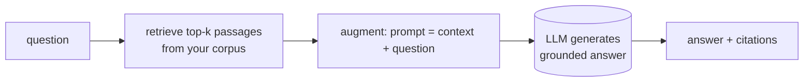

# Grounding & RAG in ADK: Answers Anchored in Real Data

*Post 18 of 26 in "Google ADK, Concept by Concept" — retrieval tools, grounding metadata, rendering citations, and the retrieve→augment→generate loop.*

---

An ungrounded LLM answers from frozen training data — fluently, and sometimes wrongly. **Grounding** ties each answer to an external source of truth so it's both current and *citable*. In ADK this shows up in two forms: **search grounding** (the live web, via a built-in tool) and **RAG** (retrieval-augmented generation over *your* documents). Both fight the same enemy — hallucination — by handing the model a source and asking it to answer from that source instead of memory.

## Two flavors of grounding

| Approach | Source of truth | Tool |
|----------|-----------------|------|
| **Search grounding** | the live web | `google_search` / `GoogleSearch` |
| **Enterprise search / RAG** | *your* documents | Vertex AI Search, RAG retrieval |

The rule of thumb: **public, current facts** (news, prices, "who won last night") → search grounding. **Private/enterprise knowledge** (internal docs, product manuals, a support KB) → RAG over your own corpus.

## Search grounding: one tool, two SDKs

Attach the built-in search tool and the model flips from "answer from memory" to "search, then answer, and tell me the sources." Crucially, the response comes back with **grounding metadata** — the passages and URLs the model actually used.

```python
# Python
from google.adk.agents import Agent
from google.adk.tools import google_search

agent = Agent(name="researcher", model="gemini-flash-latest", tools=[google_search])
# responses carry .grounding_metadata with the cited web sources
```

```go
// Go
import "google.golang.org/adk/v2/tool/geminitool"

llmagent.New(llmagent.Config{
    Name:  "researcher",
    Model: m,
    Tools: []tool.Tool{geminitool.GoogleSearch{}},
})
```

One Go-specific constraint worth internalizing: the Gemini API won't mix `GoogleSearch` with custom function tools in a single agent. Isolate search in its own sub-agent and coordinate from a root agent. (The Python side has the same underlying model behavior; the Go type system just makes you feel it sooner.)

## Grounding without attribution loses half the value

Metadata you don't show is metadata you might as well not have received. Both SDKs hang the sources off the response as a list of `grounding_chunks`, each with a `.web` carrying a `.title` and a `.uri`. The clean move is a **pure function** — metadata in, Markdown out, no I/O, no framework objects:

```python
# Python — pure: walk grounding_chunks -> a "Sources:" block ("" if none)
from google.genai import types

def render_citations(gm: types.GroundingMetadata | None) -> str:
    if not gm or not gm.grounding_chunks:
        return ""
    lines = []
    for chunk in gm.grounding_chunks:
        web = chunk.web
        if not web or not web.uri:
            continue
        title = web.title or web.uri
        lines.append(f"- [{title}]({web.uri})")
    return "Sources:\n" + "\n".join(lines) if lines else ""
```

```go
// Go — same walk over GroundingChunks, same Markdown
func RenderCitations(gm *genai.GroundingMetadata) string {
    if gm == nil || len(gm.GroundingChunks) == 0 {
        return ""
    }
    var lines []string
    for _, chunk := range gm.GroundingChunks {
        web := chunk.Web
        if web == nil || web.URI == "" {
            continue
        }
        title := web.Title
        if title == "" {
            title = web.URI
        }
        lines = append(lines, fmt.Sprintf("- [%s](%s)", title, web.URI))
    }
    if len(lines) == 0 {
        return ""
    }
    return "Sources:\n" + strings.Join(lines, "\n")
}
```

Then wire the render in as an **after-model callback** — the response-shaping hook — so citations ride along in the answer text before it leaves the agent:

```python
# Python
def add_citations(callback_context, llm_response):
    block = render_citations(llm_response.grounding_metadata)
    if not block or not llm_response.content or not llm_response.content.parts:
        return None                       # None -> keep the response untouched
    llm_response.content.parts.append(types.Part(text="\n\n" + block))
    return llm_response                    # returning it replaces the model's

Agent(..., tools=[google_search], after_model_callback=add_citations)
```

```go
// Go — wired via llmagent.Config.AfterModelCallbacks
func addCitations(_ agent.Context, resp *model.LLMResponse, respErr error) (*model.LLMResponse, error) {
    if respErr != nil || resp == nil {
        return nil, nil
    }
    block := RenderCitations(resp.GroundingMetadata)
    if block == "" || resp.Content == nil || len(resp.Content.Parts) == 0 {
        return nil, nil
    }
    resp.Content.Parts = append(resp.Content.Parts, &genai.Part{Text: "\n\n" + block})
    return resp, nil
}
```

**Mental model:** the pure render is the payoff. Because it touches no network and no API key, you test citations offline — hand it a synthetic `GroundingMetadata` with two fake sources, assert the exact Markdown, done. Real grounded answers are non-deterministic; citation formatting shouldn't be.

## RAG: retrieve → augment → generate

For *your* data, grounding means Retrieval-Augmented Generation. The loop is three steps, and the first two are plain code:



1. **Retrieve** the passages most relevant to the question.
2. **Augment** the prompt with them: *"answer using ONLY this context."*
3. **Generate** — the model answers from the passages, not its memory.

A minimal retriever scores passages by keyword overlap and keeps the top-k — deterministic, so it's easy to test:

```python
# Python
def retrieve(corpus: list[str], query: str, k: int = 2) -> list[str]:
    q = _tokens(query)
    scored = [(len(q & _tokens(doc)), doc) for doc in corpus]
    scored = [(s, d) for s, d in scored if s > 0]
    scored.sort(key=lambda sd: sd[0], reverse=True)
    return [d for _, d in scored[:k]]

def build_rag_prompt(query: str, passages: list[str]) -> str:
    context = "\n".join(f"- {p}" for p in passages)
    return (
        "Answer the question using ONLY the context below. "
        "If the context is insufficient, say you don't know.\n\n"
        f"Context:\n{context}\n\nQuestion: {query}"
    )
```

```go
// Go — identical logic: score by overlap, keep top-k, fold into the prompt
type scored struct {
    score int
    doc   string
}

func Retrieve(docs []string, query string, k int) []string {
    q := tokenSet(query)
    var hits []scored
    for _, d := range docs {
        if s := overlap(q, tokenSet(d)); s > 0 {
            hits = append(hits, scored{s, d})
        }
    }
    sort.SliceStable(hits, func(i, j int) bool { return hits[i].score > hits[j].score })
    var out []string
    for i := 0; i < len(hits) && i < k; i++ {
        out = append(out, hits[i].doc)
    }
    return out
}
```

That keyword retriever is the smallest honest version of RAG. Production swaps it for an **embedding** index that matches on meaning — so "how do I reset it?" retrieves "password recovery steps" without any shared keywords — but you call it the same way and fold the results into the prompt the same way.

## Managed grounding in production

You rarely hand-roll retrieval at scale. ADK gives you managed grounding whose API is the same shape as the offline retriever above — only the index quality changes:

- **`VertexAiSearchTool(data_store_id=...)`** grounds answers in a Vertex AI Search datastore (your website, docs, PDFs) with built-in ranking and citations.
- **RAG memory / retrieval** — a `VertexAiRagMemoryService` or RAG retrieval tool fetches from a managed corpus using semantic embedding search.

The core discipline never changes: give the model a source, ask it to answer *from* that source, and always render the metadata so the answer ships with its receipts. Full details on the built-in tools and grounding metadata live in the official ADK docs at <https://google.github.io/adk-docs/>.

**Next in the series:** Models — making the agent model-agnostic, swapping Gemini for Claude, Llama, or anything else behind the same interface.
