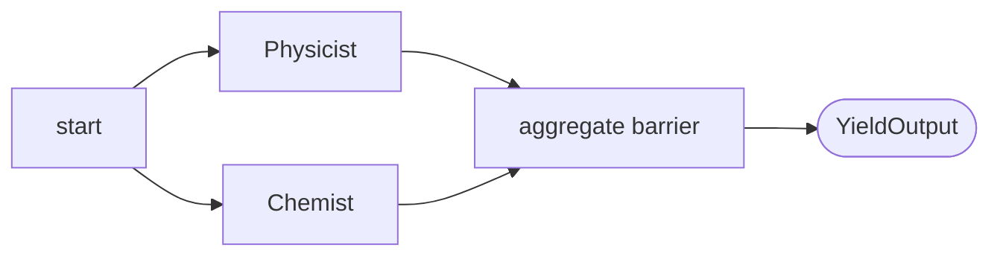

# Workflows with Agents — MAF in Go

*Agents as graph executors in Go: switch routing, fan-out/fan-in barriers, and mixing typed function nodes with agent nodes.*

---

Every agent so far in this series ran solo. Real systems need shape — a draft loops back to a reviewer, an email is *routed* by its classification, several experts answer at once and merge. In the Go Agent Framework that shape is a **workflow**: a `*workflow.Workflow` graph of **executors** joined by **edges**. The thing that made it click for me is that the graph doesn't care whether a node calls a model or is a pure Go function — both are executors, wired the same way, so you mix them freely.

## Building the graph

You start from a start executor and chain edges onto a builder:

```go
wf, err := workflow.NewBuilder(sloganWriter).
    AddEdge(sloganWriter, feedbackProvider).
    AddEdge(feedbackProvider, sloganWriter).   // a cycle is allowed
    WithOutputFrom(feedbackProvider).
    Build()
```

`NewBuilder(start)` names the entry node, `AddEdge(a, b)` wires `a → b`, and `WithOutputFrom(node)` marks whose `YieldOutput` becomes the workflow's result. A graph may contain cycles — termination is the executors' job, not the graph's. Building never touches Azure; agents authenticate lazily on their first `RunText`, which is why the offline tests build the exact same graph with a fake credential.

## Agents wrapped as executors

An agent node is a `workflow.Executor` whose handler runs the agent and emits a **typed** result. Structured output is the glue that makes the result routable:

```go
func writeSlogan(ctx *workflow.Context, ag *agent.Agent, prompt string) (SloganResult, error) {
    var result SloganResult
    _, err := ag.RunText(ctx, prompt, agent.WithStructuredOutput(&result)).Collect()
    return result, err
}
```

`AddHandlerRaw(msgType, outType, fn)` registers a handler keyed by the Go **type** of the incoming message. That's how one executor can react differently to a `string` prompt versus a returning `FeedbackResult` — two handlers, same node. The executor decides the fate of a run with `ctx.YieldOutput(x)` (ends the workflow, `x` is the result) or `ctx.SendMessage("", x)` (pushes `x` downstream — an empty target means "all outgoing edges").

## Conditional edges: switch routing

When the next node depends on the data, use the switch builder for mutually-exclusive branches:

```go
b.AddSwitch(detect).
    AddCase(func(msg any) bool { return msg.(DetectionResult).Decision == NotSpam }, assistant).
    AddCase(func(msg any) bool { return msg.(DetectionResult).Decision == Spam }, spam).
    WithDefault(uncertain).
    AddToBuilder(b)
```

A classifier node emits a `DetectionResult`; the switch's case predicates inspect it and deliver the message to exactly **one** downstream executor, falling through to `WithDefault` when nothing matches. `AddToBuilder(b)` commits the switch back onto the builder. This is the workflow analogue of `switch`/`case`/`default`, expressed as data flow.

## Concurrency: fan-out and fan-in barrier

The reason to build a graph instead of a chain is to run work in parallel and then merge:

```go
workflow.NewBuilder(start).
    AddFanOutEdge(start, []workflow.ExecutorBinding{physics, chemistry}).
    AddFanInBarrierEdge([]workflow.ExecutorBinding{physics, chemistry}, aggregate).
    WithOutputFrom(aggregate)
```

`AddFanOutEdge` broadcasts one source's message to *every* target, so the workers run concurrently. `AddFanInBarrierEdge` makes the aggregator wait until **all** its sources have fired — the barrier is what turns a race into a join. The aggregator accumulates messages, and on `OnMessageDeliveryFinishedFunc` joins them and calls `YieldOutput` once. Because it holds state across the turn, it's created with `BindNewExecutorFunc` so each run gets a fresh instance.



Chain two of these — fan-out to mappers, barrier to a shuffler, fan-out to reducers, barrier to completion — and you have map-reduce as a workflow. Messages on the edges stay tiny ("done, here's a path"); bulk data travels through shared state (`ctx.QueueStateUpdate` / `ctx.ReadState`) or files.

## Mixing function nodes with agent nodes

Here's the payoff of the uniform model. `detect`, `assistant`, and the physicist/chemist above are pure `workflow.NewExecutor(id, func(...))` closures — no model, no credential, so they run offline in tests. The `SloganWriter` and `FeedbackProvider` are agent-backed executors that call Foundry. They sit on the **same** edges in the **same** graph. Put deterministic glue (classification keys, routing, aggregation) in cheap function nodes and spend model calls only where reasoning is required.

## The mental model

- **Executor** — any node; a `NewExecutor` function or an agent-backed handler, wired identically.
- **`AddEdge` / `WithOutputFrom`** — direct hop; mark the node whose `YieldOutput` is the result.
- **Switch (`AddSwitch`/`AddCase`/`WithDefault`)** — data-dependent routing to one branch.
- **`AddFanOutEdge` / `AddFanInBarrierEdge`** — broadcast to parallel workers, then a barrier that fires once all sources fired.
- **`YieldOutput` vs `SendMessage`** — end the run vs. push work downstream.

Once agents are just executors, orchestration isn't a separate framework — it's the same graph with model calls at some nodes. Next I'll cover the named orchestration patterns built on top of it.

---

Next: [Orchestration Patterns — MAF in Go](/blog/posts/maf-go-10-orchestrations.html)
