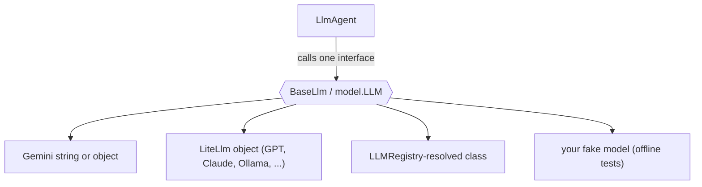

# Models in Google ADK: One Agent, Any Backend

*How ADK's model abstraction lets you swap Gemini for Claude, GPT, or Ollama without touching a line of agent code*

---

"Model-agnostic" is one of those phrases that sounds like marketing until you try to move a working agent from one provider to another and discover your tools, prompts, and control flow are all tangled up with a specific SDK. Google's [Agent Development Kit](https://google.github.io/adk-docs/) is built to avoid that. An ADK agent never talks to Gemini, or OpenAI, or Anthropic directly — it talks to a single **model interface**, and you decide what sits behind it. Change the backend, keep the agent.

## The abstraction

Every model route in ADK ends at one interface: `BaseLlm` in Python, `model.LLM` in Go. An `LlmAgent` holds a reference to that interface and calls exactly one method to generate a response. It has no idea — and no way to find out — which provider actually answered.

That interface is deliberately tiny. In Python you implement one async method that yields an `LlmResponse`; in Go you implement `Name()` plus a `GenerateContent` that returns an iterator of responses. Anything satisfying the contract is a valid model: a hosted frontier model, a local Ollama instance, or a hard-coded stub for tests.



## Three ways to specify a model (Python)

Python is the more flexible of the two languages. `LlmAgent(model=...)` accepts either a string or a ready-made `BaseLlm` object:

```python
from google.adk.agents import LlmAgent
from google.adk.models.lite_llm import LiteLlm   # needs google-adk[extensions]

# 1. A string -> the built-in Gemini path.
gemini = LlmAgent(name="a", model="gemini-flash-latest")

# 2. A model object -> any BaseLlm subclass. LiteLlm reaches 100+ providers.
gpt    = LlmAgent(name="b", model=LiteLlm(model="openai/gpt-4o"))
claude = LlmAgent(name="c", model=LiteLlm(model="anthropic/claude-sonnet-4-5"))
ollama = LlmAgent(name="d", model=LiteLlm(model="ollama_chat/llama3.1"))
```

The third route is the **`LLMRegistry`**: a string like `"gemini-flash-latest"` is matched against registered patterns and resolved to a model class. Gemini is registered out of the box, which is why the bare string works. Other providers register their own classes when their package is installed — so a Claude *string* needs the `anthropic` extra, whereas a `LiteLlm(...)` *object* sidesteps the registry entirely and just needs `litellm`. When in doubt, pass an object; it is the most explicit route.

A subtle but important point: constructing a `LiteLlm(...)` is **offline**. It wires up configuration but reaches no network. Only an actual generate call contacts the provider. That means you can build and validate an agent's wiring in a test without any credentials.

## The Go form

Go is uniform: `llmagent.Config.Model` is typed `model.LLM`, so you always pass a *value*. There is no bare-string shortcut and no `LLMRegistry` in the v2 module — you construct the model explicitly.

```go
import (
    "google.golang.org/adk/v2/agent/llmagent"
    "google.golang.org/adk/v2/model/gemini"
    "google.golang.org/genai"
)

m, err := gemini.NewModel(ctx, "gemini-flash-latest", &genai.ClientConfig{APIKey: key})
// ...
agent, err := llmagent.New(llmagent.Config{
    Name:  "swappable_agent",
    Model: m, // any model.LLM value; the agent code never changes
})
```

To target a non-Gemini provider in Go you wrap it in a type that satisfies `model.LLM`. The interface is small enough that this is genuinely easy rather than a chore.

## Proving it with a fake model

The cleanest way to *see* the abstraction is to implement it yourself. A model is just "something that returns a response," so you can write a fake one, plug it into a **real** agent, and run the whole pipeline offline — no key, no network.

```python
from typing import AsyncGenerator
from google.adk.models.base_llm import BaseLlm
from google.adk.models.llm_request import LlmRequest
from google.adk.models.llm_response import LlmResponse
from google.genai import types

class EchoModel(BaseLlm):
    reply: str = "echo"

    async def generate_content_async(
        self, llm_request: LlmRequest, stream: bool = False
    ) -> AsyncGenerator[LlmResponse, None]:
        yield LlmResponse(
            content=types.Content(role="model", parts=[types.Part(text=self.reply)])
        )

# A real LlmAgent, backed by the fake. It behaves exactly as if Gemini were behind it.
agent = LlmAgent(name="via_object", model=EchoModel(model="echo/v1", reply="hi"))
```

The Go equivalent is the same idea against the tiny two-method interface:

```go
type fakeModel struct{ name, reply string }

func (m fakeModel) Name() string { return m.name }

func (m fakeModel) GenerateContent(_ context.Context, _ *model.LLMRequest, _ bool) iter.Seq2[*model.LLMResponse, error] {
    return func(yield func(*model.LLMResponse, error) bool) {
        yield(&model.LLMResponse{
            Content: &genai.Content{Role: "model", Parts: []*genai.Part{{Text: m.reply}}},
        }, nil)
    }
}
```

Feed two different fakes to the *same* agent and you get two different answers — with the agent code untouched. That is model-agnosticism made concrete, and it is exactly how ADK's own agent tests drive an agent without a backend.

## When to actually switch

The abstraction earns its keep at three moments:

- **Cost and quality tuning.** Run the identical agent against `gemini-flash-latest` and a larger model, compare outputs and latency, and pick. No code change — just a different model value.
- **Provider portability.** Regulatory, pricing, or availability reasons force a provider change. With the model isolated behind one interface, that migration touches one line, not your whole codebase.
- **Deterministic tests.** A fake model makes agent behavior reproducible offline. Your CI never flakes on a rate limit or an API outage, and never burns tokens.

**Mental model:** treat the model like a database driver. Your application logic depends on the *interface*, not the vendor. You still choose a good default (Gemini, which ADK optimizes for), but the choice stays a swappable configuration detail rather than an architectural commitment.

*Next in the series: Plugins — cross-cutting hooks that wrap every agent, model, and tool call in one place.*
