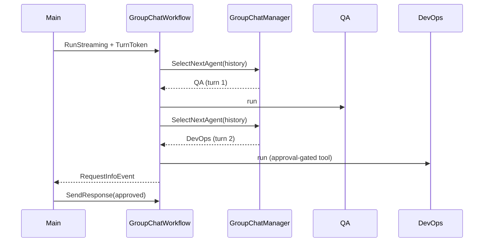
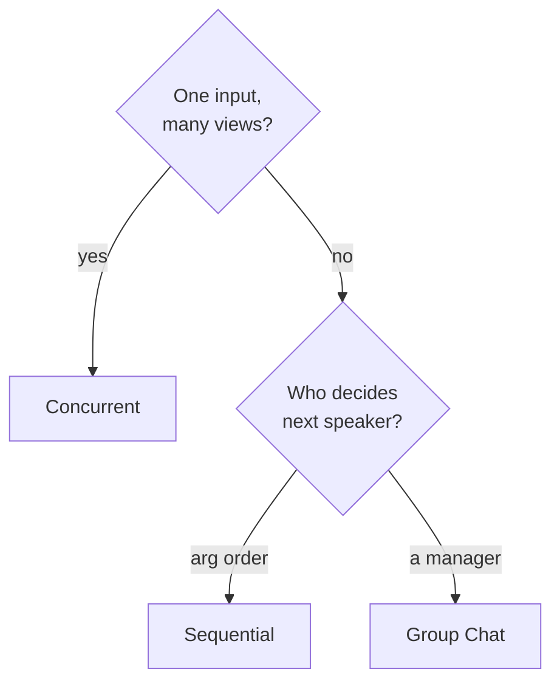

# Orchestration Patterns — MAF in Go

*The prebuilt orchestration builders in agent-framework-go — Sequential, Concurrent, Group Chat — plus wrapping a whole workflow as one agent.*

---

Last time I hand-wired workflows in Go: executors, edges, a `WorkflowBuilder`. That is the full-control path, but most multi-agent problems fall into a few recurring shapes. The Go SDK ships those as **orchestration builders** in `workflow/agentworkflow`: hand them a list of agents and they wire the graph for you. I built one runnable lesson per pattern and it sharpened exactly when a prebuilt builder beats a bespoke graph.

Go's surface is deliberately smaller than the Python side. Three builders cover the common shapes, and a fourth composition trick — *workflow as an agent* — lets you nest any of them.

## Sequential — a pipeline

Each agent runs in turn, output feeding the next. Draft then review, translate then proofread.

```go
import "github.com/microsoft/agent-framework-go/workflow/agentworkflow"

wf, err := agentworkflow.NewSequentialWorkflowBuilder(writer, reviewer).
    WithName("draft-review").
    Build()
```

Argument order *is* execution order. The whole thing is still a plain `*workflow.Workflow`, run the same way as any hand-built graph.

## Concurrent — fan-out / fan-in

The same input goes to every agent in parallel; their outputs aggregate into one batch. Latency is the slowest agent, not the sum. In my lesson a French agent and an English agent both answer one prompt at once:

```go
wf, err := agentworkflow.NewConcurrentWorkflowBuilder(french, english).
    WithName("bilingual-workflow").
    Build()
```

Swapping `NewSequentialWorkflowBuilder` for `NewConcurrentWorkflowBuilder` is a one-line change — the builders share a shape, so you can trade a pipeline for a fan-out without touching the surrounding code.

## Group Chat — a manager decides turns

A `GroupChatManager` sits in the middle and, round by round, picks who speaks next and when to stop. You pass a factory that returns the manager, plus the participants:

```go
wf, err := agentworkflow.NewGroupChatWorkflowBuilder(newManager, qa, devops).
    WithName("deployment-chat").
    Build()
```

The manager is three callbacks over the conversation history:

```go
&agentworkflow.GroupChatManager{
    SelectNextAgent: mgr.selectNextAgent,  // (ctx, history) -> *agent.Agent
    ShouldTerminate: mgr.shouldTerminate,  // (ctx, history, iterCount) -> bool
    Reset:           mgr.reset,
}
```

`SelectNextAgent` scripts turn order (QA runs tests, then DevOps deploys); `ShouldTerminate` ends the chat — always keep a hard iteration cap as a safety net. This is where human-in-the-loop lives too: gate a tool with `tool.ApprovalRequiredFunc` and the workflow pauses on a `RequestInfoEvent` mid-chat until `main()` sends approval back via `SendResponse`.



## Workflow as an agent — compose and nest

The composition trick that ties it together: host a whole workflow as a single `*agent.Agent`, so callers use it exactly like a leaf agent.

```go
wfAgent, err := agentworkflow.NewAgent(wf, agentworkflow.AgentConfig{
    IncludeOutputsInResponse: true,
    Config: agent.Config{Name: "BilingualWorkflowAgent"},
})
// from here: CreateSession, RunText, agent.Stream(true) — same API as any agent
```

`IncludeOutputsInResponse: true` is the crux — without it, only the inner agents' `ResponseUpdate`s surface and the workflow's terminal `OutputEvent` (the merged batch) is dropped. Because the result is an ordinary agent, you can feed it straight into *another* builder. That symmetry is the whole point: an orchestration becomes a reusable building block.

## Choosing one



The rule I settled on: reach for an orchestration builder when your problem *is* one of these shapes — you get fan-in, termination, and history-broadcasting for free, and can nest the result via `NewAgent`. Drop to a raw `WorkflowBuilder` graph only when the control flow is genuinely bespoke: conditional edges, custom state, non-agent executors mid-graph. And note the gap versus Python — the Go SDK doesn't yet ship dedicated `Handoff` or `Magentic` builders, so peer-routing and dynamic manager-planning are still hand-wired here. It's a good reminder that the two runtimes converge on the same concepts but not always on the same day.

---

Next: [Advanced Workflows — MAF in Go](/blog/posts/maf-go-11-advanced-workflows.html)
