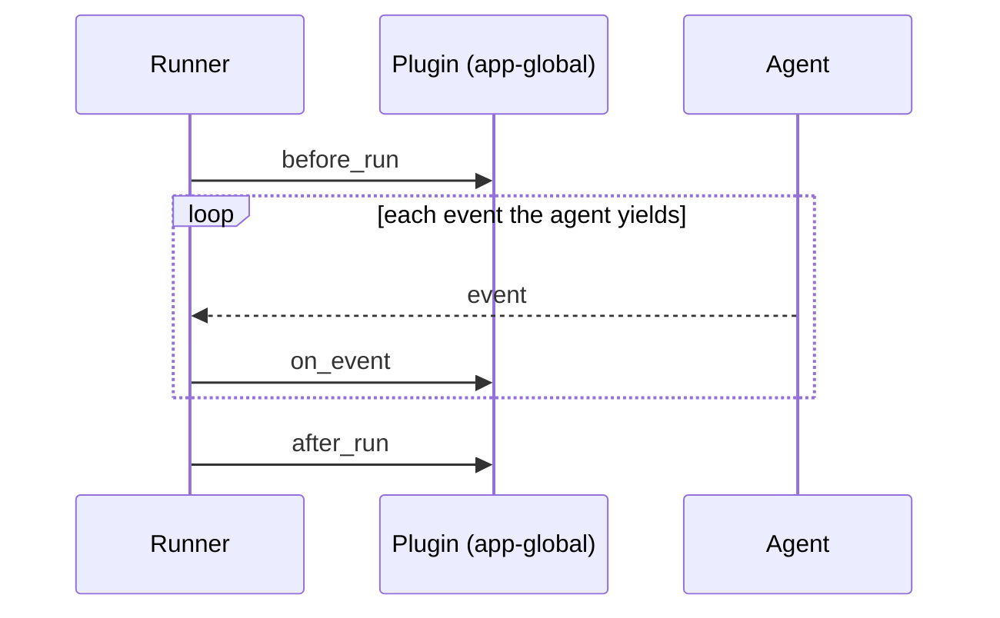

# Plugins in Google ADK: One Hook, Every Agent

*cross-cutting concerns registered once on the Runner instead of copied onto every agent*

---

In [Module 09](https://google.github.io/adk-docs/) you saw callbacks: six hooks around one agent's lifecycle. They're perfect for a guardrail on *this* agent. But logging, metrics, usage limits, and global policy aren't about one agent — they're about the whole app. Copying the same `before_model_callback` onto every `LlmAgent` you build is exactly the kind of duplication that rots. Google's [Agent Development Kit](https://google.github.io/adk-docs/) gives you a **Plugin**: the same lifecycle hooks, but registered *once on the Runner*, firing for **every** agent, model call, tool call, and event in the app.

## Callback vs. plugin: same hooks, different scope

A plugin is not a new kind of hook. It reuses the callback set from Module 09 and lifts it from the agent to the Runner. The only thing that changes is *where you register it and how widely it fires*.

| | Callback (Module 09) | Plugin (this module) |
|--|----------------------|----------------------|
| Registered on | one **Agent** | the **Runner** (app-global) |
| Fires for | that agent only | **every** agent / model / tool in the app |
| Good for | per-agent guardrails, tweaks | logging, metrics, usage limits, global policy |
| Python | `LlmAgent(before_model_callback=…)` | `Runner(…, plugins=[MyPlugin()])` |
| Go | `llmagent.Config{BeforeModelCallbacks: …}` | `runner.Config{PluginConfig: …}` |

That last row is the whole idea. Register once, observe everything — no agent needs to know the plugin exists.

## The lifecycle hooks

A plugin overrides only the hooks it cares about; the rest are no-ops. The everyday set lines up almost one-to-one between the two SDKs:

| Hook | Fires… | Python method | Go field |
|------|--------|---------------|----------|
| before run | once, as an invocation starts | `before_run_callback` | `BeforeRunCallback` |
| on user message | when the user's message arrives | `on_user_message_callback` | `OnUserMessageCallback` |
| on event | for **every** event any agent yields | `on_event_callback` | `OnEventCallback` |
| before / after model | around each model request | `before_model_callback` / `after_model_callback` | `BeforeModelCallback` / `AfterModelCallback` |
| before / after tool | around each tool call | `before_tool_callback` / `after_tool_callback` | `BeforeToolCallback` / `AfterToolCallback` |
| after run | once, as the invocation ends | `after_run_callback` | `AfterRunCallback` |

And crucially, the **same short-circuit contract** applies. Returning `None` (Python) or `nil` (Go) means "observe only, change nothing." Returning a value overrides: a `before_model` plugin that returns a response *skips the model* for the whole app; an `on_event` plugin that returns an event *replaces it*. It's the Module 09 rule, applied globally.

## How the Runner drives a plugin

The Runner owns a plugin manager. At each lifecycle point it walks every registered plugin's callback in turn:



One plugin can watch an entire run — and every agent inside it — without any agent knowing it's there.

## A counting plugin in Python

Python leans on **inheritance**: you subclass `BasePlugin` and override just the coroutines you need. Here's a plugin that tallies how many runs start and how many events flow through the app.

```python
from typing import Optional
from google.adk.events import Event
from google.adk.plugins.base_plugin import BasePlugin
from google.adk.agents.invocation_context import InvocationContext

class CountingPlugin(BasePlugin):
    def __init__(self, name: str = "counter") -> None:
        super().__init__(name=name)
        self.run_count = 0
        self.event_count = 0

    async def before_run_callback(self, *, invocation_context: InvocationContext) -> Optional[object]:
        self.run_count += 1
        return None  # observe only

    async def on_event_callback(self, *, invocation_context: InvocationContext, event: Event) -> Optional[Event]:
        self.event_count += 1
        return None
```

Register it on the Runner — not on the agent:

```python
from google.adk.runners import InMemoryRunner

plugin = CountingPlugin()
runner = InMemoryRunner(agent=my_agent, app_name="demo", plugins=[plugin])
# ... after a run:  plugin.run_count == 1,  plugin.event_count == <events emitted>
```

That `plugins=[…]` kwarg still works, but google-adk 2.x nudges you toward an `App` object — `App(name=…, root_agent=…, plugins=[p])` — which is where app-level config (context caching, event compaction) lives. Reach for it once you adopt those features.

## The same plugin in Go

Go leans on **composition**: `plugin.Config` is a struct of callback fields, and you set only the ones you want. Left `nil`, the framework skips them.

```go
func newCountingPlugin(c *counters) (*plugin.Plugin, error) {
    return plugin.New(plugin.Config{
        Name: "counter",
        BeforeRunCallback: func(agent.InvocationContext) (*genai.Content, error) {
            c.Runs++
            return nil, nil // observe only
        },
        OnEventCallback: func(_ agent.InvocationContext, _ *session.Event) (*session.Event, error) {
            c.Events++
            return nil, nil
        },
    })
}
```

Registration is likewise on the Runner, via `PluginConfig` — there is no `App` wrapper in Go, so this is the one place plugins live:

```go
r, err := runner.New(runner.Config{
    AppName:        "demo",
    Agent:          myAgent,
    SessionService: session.InMemoryService(),
    PluginConfig:   runner.PluginConfig{Plugins: []*plugin.Plugin{p}},
})
```

Inheritance vs. a struct of function fields is the recurring Python/Go idiom split across ADK; the behavior is identical. Both put plugins on the Runner, and both fire for every agent under it.

## Mental model: when a plugin beats a callback

Ask one question — *does this concern belong to one agent, or to the app?*

- **One agent** → callback. A guardrail that only makes sense for your billing agent, a prompt tweak specific to a router. Keep it local.
- **Every agent** → plugin. Anything you'd otherwise paste onto all of them: request/response logging, a token or cost meter, a rate limit, a global instruction, a response cache. Write it once; it covers the whole system, including agents you add later.

Both SDKs ship ready-made plugins you register exactly like the counter above — a `LoggingPlugin` that traces every step, and a reflect-and-retry plugin that feeds a failing tool's error back to the model to self-heal. Notably, there's **no** prebuilt PII redactor or content filter: for those, take the Module 09 guardrail pattern — a `before_model` hook that scans the request, or an `on_event` hook that redacts output — and lift it onto the Runner so it applies app-wide.

The demo behind this post is deliberately offline: a custom agent that deterministically yields three events, and the counting plugin asserting `runs = 1`, `events = 3`. Swap that emitter for a real `LlmAgent` and the *same* plugin observes real model and tool activity, unchanged. That's the payoff — a plugin is decoupled from what the agents actually do.

**Next in the series:** Module 20 — Skills: packaging reusable agent capabilities.
