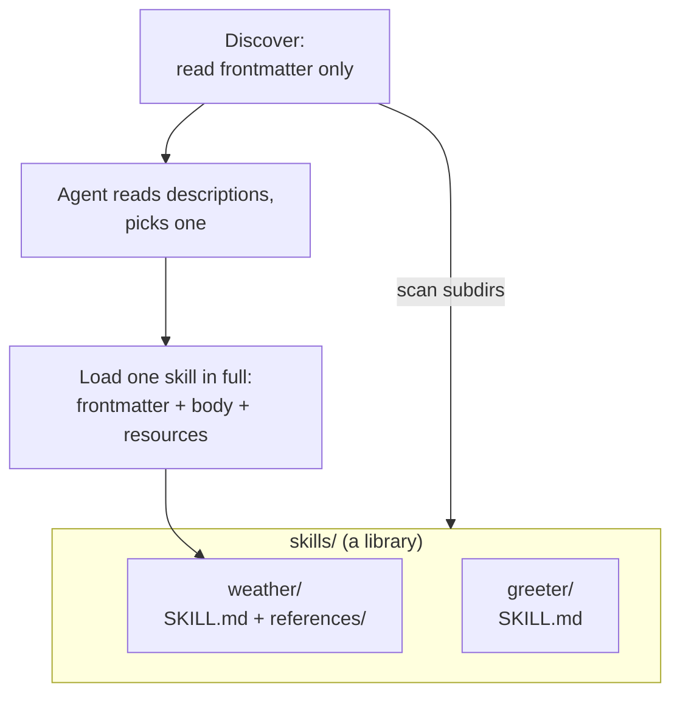

# Skills: Packaging Agent Capabilities as Reusable, Discoverable Bundles

*How ADK skills bundle instructions, tools, and resources into folders an agent can browse and load on demand.*

---

By now in this series you've built agents whose knowledge lives in code: instructions in a string, tools as functions, reference data hard-wired into prompts. That works until you want the *same* capability in three different agents, or your instructions grow to thousands of words that are only sometimes relevant. **Skills** solve both problems by packaging a capability as a self-contained directory that an agent can discover, evaluate cheaply, and pull in only when it's actually needed.

## What a skill is

A skill is a folder with a `SKILL.md` file — YAML **frontmatter** (at minimum `name` and `description`) followed by a Markdown **body** of instructions — plus optional bundled **resources** (reference docs, assets, scripts). That's it. The capability is a file tree, not code, which makes it inspectable, versionable, and portable across projects: drop the folder into a shared library and any agent pointed at that library can use it.

```
weather/
  SKILL.md                 # frontmatter + instruction body
  references/
    cities.txt             # a bundled resource
```

The `SKILL.md` itself:

```markdown
---
name: weather                          # must equal the directory name
description: Look up the weather for a city.
license: Apache-2.0                    # optional
metadata:                              # optional key/value tags
  category: demo
---
# Weather Skill

Use this skill to answer questions about the weather in a city.

## Steps
1. Read the supported cities from `references/cities.txt`.
2. If the requested city is listed, report its weather.
3. Otherwise, tell the user the city is not supported.
```

## The key idea: cheap discovery, on-demand load

The whole design turns on a two-step shape. Every skill's `description` is loaded **up front** so the model can survey what's available and choose. But the skill's full body and resources are read **only for the one it picks**. This keeps the prompt small even when the library holds dozens of skills — you pay for a one-line summary per skill, not the full instruction text of every skill you *might* use.



## Discover and load in Python

ADK's Python skills API is pure filesystem work — no model, no network. `list_skills_in_dir` scans the immediate subdirectories of a folder and returns a map of name to parsed frontmatter. `load_skill_from_dir` reads one skill in full.

```python
from pathlib import Path
from google.adk.skills import Skill, Frontmatter, list_skills_in_dir, load_skill_from_dir

SKILLS_DIR = Path("skills")

# 1. Discover — cheap: read only each skill's frontmatter.
catalog: dict[str, Frontmatter] = list_skills_in_dir(SKILLS_DIR)
for name, fm in sorted(catalog.items()):
    print(f"{name}: {fm.description}")

# 2. Load one skill in full — instructions + bundled resources.
skill: Skill = load_skill_from_dir(SKILLS_DIR / "weather")
print(skill.frontmatter.name, skill.frontmatter.license)
print(skill.instructions.splitlines()[0])       # the Markdown body
print(sorted(skill.resources.references))        # e.g. ['cities.txt']
```

A loaded `Skill` is a single value with everything eagerly read: `frontmatter` (metadata), `instructions` (the Markdown body), and `resources` — dicts of `references` / `assets` / `scripts` keyed by filename. You pass it around as one object.

## The same two operations in Go

Go models a skill library as a **`Source`** — an interface you read piece by piece, so you fetch exactly the part you need when you need it. `NewFileSystemSource` accepts any `fs.FS`, which means an `embed.FS` works as well as `os.DirFS("skills")`.

```go
import (
    "context"
    "google.golang.org/adk/v2/tool/skilltoolset/skill"
)

ctx := context.Background()
src := skill.NewFileSystemSource(os.DirFS("skills"))

// 1. Discover — frontmatter only.
fms, _ := src.ListFrontmatters(ctx)
for _, fm := range fms {
    fmt.Printf("%s: %s\n", fm.Name, fm.Description)
}

// 2. Load one skill in full — read each part explicitly.
fm, _ := src.LoadFrontmatter(ctx, "weather")
instructions, _ := src.LoadInstructions(ctx, "weather")
resources, _ := src.ListResources(ctx, "weather", ".")   // ["references/cities.txt"]

// 3. Read a bundled resource on demand.
rc, _ := src.LoadResource(ctx, "weather", "references/cities.txt")
defer rc.Close()
data, _ := io.ReadAll(rc)
```

The contrast is idiomatic. Python hands you one fully-populated `Skill` object; Go hands you a `Source` with `LoadFrontmatter`, `LoadInstructions`, `ListResources`, and `LoadResource`, so nothing is read until you ask. If you *want* Python-style eager loading in Go, wrap the source with `WithFrontmatterPreloadSource` or `WithCompletePreloadSource`.

Two small asymmetries worth knowing. Resource keys differ: Python's `resources.references` is keyed relative to the `references/` directory (`"cities.txt"`), while Go's `ListResources` returns paths relative to the skill root (`"references/cities.txt"`) — same file, different prefix. And Go's YAML parser rejects unknown top-level frontmatter keys and represents `allowed-tools` as a list rather than a string, so if you want one `SKILL.md` to load cleanly in both languages, stick to the documented fields.

## Attaching skills to a live agent

Discovery and loading are the deterministic core, but to let an agent actually *use* a library, both SDKs expose skills as a toolset. In Go you turn a `skill.Source` into a `skilltoolset` and hand it to an `llmagent`:

```go
import (
    "google.golang.org/adk/v2/tool/skilltoolset"
    "google.golang.org/adk/v2/tool/skilltoolset/skill"
)

src := skill.NewFileSystemSource(os.DirFS("skills"))
ts, _ := skilltoolset.New(ctx, skilltoolset.Config{Source: src})
// llmagent.New(llmagent.Config{..., Toolsets: []tool.Toolset{ts}})
```

Python backs the same lookup with a skill registry that you expose to an `LlmAgent`. Either way, the agent sees the frontmatter descriptions as choices and loads the full body only when it selects one.

## When to reach for a skill

**Mental model:** a function tool (from earlier in this series) is a single deterministic call the model *invokes*; a skill is a bundle of instructions and supporting files the model *reads and reasons over*. Prefer a plain tool when the capability is one clean operation. Reach for a skill when:

- You want to **share a capability** across agents or projects — package it once, drop the folder in a shared library.
- Your instructions are **large and only sometimes relevant** — keep them out of the base prompt and load on demand.
- You want capabilities that are **inspectable and versionable** as files rather than buried in code.

Both SDKs validate that the directory name matches the frontmatter `name` and enforce a lowercase-hyphenated name format; a malformed `SKILL.md` is a load-time error, not a silent skip. That strictness is what lets a folder-of-folders behave like a trustworthy capability catalog.

**Next in the series:** Code Execution — letting an agent run code as a tool.
