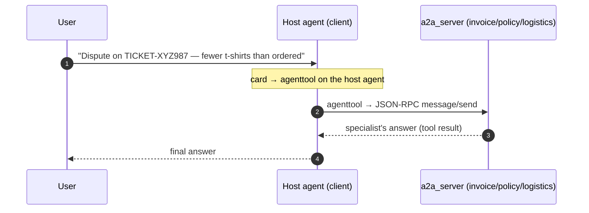

# Hosting and the Capstone App — MAF in Go

*Wrapping Go agents in A2A, MCP, and AG-UI transports, then a full client/server app that ties the whole series together.*

---

Everything so far was `go run` against one process. A real system is agents that reach each other over the network and UIs that stream their output. This finale covers **hosting** in Go — A2A, MCP, AG-UI — and then the **end-to-end capstone**: a coupled client/server pair where one host agent discovers remote specialists and uses them as tools.

## Three transports, one agent

The pattern across all three is the same: the agent is the plain `foundryprovider` agent from the earlier lessons — only the *transport* is new.

**MCP** lets an agent borrow tools that live in another service. Connect over streamable HTTP, list the catalog, hand it to the agent:

```go
session, _ := mcptool.Connect(ctx, &mcp.StreamableClientTransport{
    Endpoint: "https://learn.microsoft.com/api/mcp",
})
defer session.Close()
tools, _ := mcptool.ListTools(ctx, session)   // []tool.Tool — indistinguishable from local
```

From the agent's point of view, remote MCP tools are just `agent.Config.Tools`. The one networked step stays isolated so the offline test can build the identical agent with fake tools.

**AG-UI** exposes an agent over HTTP+SSE for a UI to drive. Wrapping is one call:

```go
mux := http.NewServeMux()
mux.Handle("/", aguiprovider.NewJSONHTTPHandler(a, aguiprovider.HandlerConfig{}))
http.ListenAndServe(":8888", mux)
```

`NewJSONHTTPHandler` turns each incoming POST into an agent run and streams the run's updates back as AG-UI events. The agent never knows it is being served over HTTP.

## A2A and the capstone: agents as tools

The capstone is the payoff — the Go port of the SDK's `05-end-to-end/a2a_client_server` sample. One or more **server** processes each host a specialized Foundry agent over A2A; one **client** process discovers them and uses them as tools from a local host agent.

Each server publishes two routes — the agent card (discovery) and the JSON-RPC endpoint:

```go
card.SupportedInterfaces = []*a2a.AgentInterface{
    a2a.NewAgentInterface(url, a2a.TransportProtocolJSONRPC),
}
handler := a2asrv.NewHandler(a2aprovider.NewExecutor(hostAgent, a2aprovider.ExecutorConfig{}),
    a2asrv.WithExtendedAgentCard(card))
mux.Handle("/", a2asrv.NewJSONRPCHandler(handler))
mux.Handle(a2asrv.WellKnownAgentCardPath, a2asrv.NewStaticAgentCardHandler(card))
```

The client resolves each card, builds an A2A client from it, and wraps the whole remote agent into a single tool:

```go
card, _ := agentcard.DefaultResolver.Resolve(ctx, url)
client, _ := a2aclient.NewFromCard(ctx, card)
remote := a2aprovider.NewAgent(client, a2aprovider.AgentConfig{
    Config: agent.Config{Name: card.Name, Description: card.Description},
})
tools = append(tools, agenttool.New(remote, agenttool.Config{}))
```

`agenttool.New(remoteAgent, …)` turns a whole remote agent into one callable tool. The host model decides *which* specialist to call — invoice, policy, or logistics — the same way it picks any function tool.



**The card is the contract.** The server sets the card's `Name`, `Skills`, and interface URL; the client reads exactly those fields back to name the tool and dial the endpoint. That agreement is why this is a *pair*, not two unrelated programs. Break it — hand `newMux` a different URL than the client expects — and the discovery test catches it.

```bash
# three servers, one per specialist
go run ./tutorial/05-end-to-end/a2a_client_server/a2a_server --agentType invoice   --port 5000
go run ./tutorial/05-end-to-end/a2a_client_server/a2a_server --agentType policy    --port 5001
go run ./tutorial/05-end-to-end/a2a_client_server/a2a_server --agentType logistics --port 5002
# then the client
go run ./tutorial/05-end-to-end/a2a_client_server/a2a_client
```

Only the servers own the hosted model; the client owns its own orchestrating host agent. The offline tests assert the wiring — cards, routes, `splitURLs` — with fake credentials and no port; the live paths gate behind `AF_LIVE=1`.

## The journey, in one line

That is the whole arc across both series: a provider + config became an agent; tools let it act; sessions let it remember; workflows and orchestration let several agents coordinate; and hosting turned the result into a networked service other agents call. The consistent discipline — factor construction out of `main`, take dependencies as parameters, test the wiring offline before the model — is exactly what let me port these samples faithfully and fix the bugs I hit upstream in `agent-framework-go`.

---

That is the whole framework, one lesson at a time. See [my upstream Microsoft Agent Framework Go contributions](/agent-framework/).
