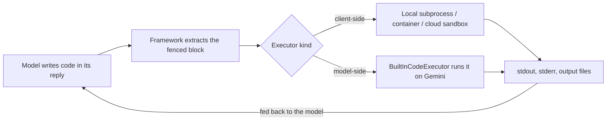

# Google ADK Code Execution: Let the Agent Run the Code, Not Guess the Answer

*How ADK closes the write-code, run-it, read-the-output loop — and why "unsafe" is a warning, not a typo.*

---

An LLM is very good at *writing* code and very bad at *running it in its head*. Ask it for `6 * 7` and it will usually guess right; ask it to sort a 10,000-row CSV, or compute a compound-interest schedule, and it will confidently hallucinate. A **code executor** fixes this: the model writes code, the framework pulls that code out of the reply, runs it in a sandbox, and feeds the *real* output back so the model keeps reasoning from facts instead of guesses. Google's [Agent Development Kit](https://google.github.io/adk-docs/) ships a family of executors that differ in exactly one dimension — *where the code runs* — and that dimension is the whole security story.

This is the twenty-second post in a series walking through ADK concept by concept.

## The loop

Every executor shares the same four-step shape. Only the sandbox in step three changes.



The first step — pulling the code the model wrote out of its prose reply — is pure text processing, identical in every language. The last step — actually running it and capturing stdout — is where the interesting design choices (and the risk) live.

## Two families of executor

You attach an executor to an agent with a single constructor argument, `code_executor=...`. Swapping executors never touches your agent logic.

| Executor | Where code runs | Use for |
|----------|-----------------|---------|
| `UnsafeLocalCodeExecutor` | a local, unsandboxed subprocess | quick demos, fully trusted code |
| `ContainerCodeExecutor` | a Docker container | isolated local sandboxing |
| `VertexAiCodeExecutor` / `GkeCodeExecutor` | a managed cloud sandbox | production, untrusted code |
| `BuiltInCodeExecutor` | the model provider (Gemini 2.0+) | let Gemini run code server-side |

The split that matters is **client-side vs. model-side**. With client-side executors (`UnsafeLocal`, `Container`, `VertexAi`, `Gke`), *you* run the code and *you* pick the sandbox — full control, full responsibility. With model-side (`BuiltInCodeExecutor`), the provider runs the code on its own infrastructure and returns the result inline; less to operate, but you inherit their sandbox and their supported languages, and today it is Gemini-2.0+-only.

## The offline path: run real code, no API key

Because `UnsafeLocalCodeExecutor` runs Python locally and never touches the model or a session, the entire loop runs offline. Here is the full round trip — extract the code from a reply, run it, read stdout back:

```python
from google.adk.code_executors import UnsafeLocalCodeExecutor
from google.adk.code_executors.code_execution_utils import CodeExecutionInput

def run_python(code: str) -> tuple[str, str]:
    executor = UnsafeLocalCodeExecutor()
    # The local executor ignores invocation_context, so we can pass None:
    # no session, no model, no key. Code runs in a spawned subprocess.
    result = executor.execute_code(None, CodeExecutionInput(code=code))
    return result.stdout, result.stderr

stdout, stderr = run_python("print(6 * 7)")
assert "42" in stdout  # real execution, real stdout
```

`execute_code(invocation_context, code_execution_input)` returns a `CodeExecutionResult(stdout, stderr, output_files)` — a plain dataclass. `output_files` is how a plot or a generated CSV flows back out. The `input_files` field on `CodeExecutionInput` is how data flows *in*. For the trivial case you only ever set `code`.

Before you can run anything, you have to *find* the code the model wrote. The model replies in prose with a fenced block, and you scan for it — the pre-execution step that every executor shares:

```python
_RUNNABLE = {"", "python", "py"}  # untagged fences are assumed Python

def first_runnable_code(text: str) -> str | None:
    for language, code in extract_code_blocks(text):  # (language, code) pairs
        if language in _RUNNABLE:
            return code
    return None
```

Feed a model reply like ``"...\n```python\nprint(6 * 7)\n```\n..."`` through `first_runnable_code`, hand the result to `run_python`, and you have the whole agent loop minus the model call — which is exactly why it makes such a clean offline test.

## The model-side path: let Gemini run it

Attaching `BuiltInCodeExecutor` is a one-liner and also offline (construction doesn't call anything). Its `execute_code` is a no-op; instead it works by injecting a code-execution *tool* into the model request, so Gemini runs the code server-side and returns the result inline:

```python
from google.adk.agents import LlmAgent
from google.adk.code_executors import BuiltInCodeExecutor

agent = LlmAgent(
    name="analyst",
    model="gemini-flash-latest",
    instruction="Write and run Python to answer math and data questions.",
    code_executor=BuiltInCodeExecutor(),  # swap for UnsafeLocal/Container without touching agent logic
)
```

Same agent, different executor: that swappability is the point. You develop against `UnsafeLocalCodeExecutor`, then move to a container or `BuiltInCodeExecutor` for production by changing one argument.

## The Go story: the road ends at extraction

ADK is dual-language, and the Go module `google.golang.org/adk/v2` mirrors most concepts — but **runtime code execution is Python-primary today**. The pinned `adk/v2 v2.0.0` ships *no* code-executor package: nothing under `tool/`, `model/`, or elsewhere in the module tree. So the honest Go form models the one step that *is* pure and language-independent — extracting the fenced block — and stops where the sandbox would begin:

```go
var runnable = map[string]bool{"": true, "python": true, "py": true}

// FirstRunnableCode returns the first Python (or untagged) block the model wrote.
func FirstRunnableCode(text string) (CodeBlock, bool) {
    for _, b := range ExtractCodeBlocks(text) { // stdlib-only, offline, tested
        if runnable[b.Language] {
            return b, true
        }
    }
    return CodeBlock{}, false
}
```

`ExtractCodeBlocks` scans for ```` ```python ```` and bare ```` ``` ```` fences exactly like the Python version. What Go lacks is everything *downstream* of that block: the subprocess, the isolation, the stdout capture. If you need agents that run code in Go right now, you own the sandbox yourself; the framework doesn't hand you one yet.

## The security tradeoff — "Unsafe" means it

`UnsafeLocalCodeExecutor` is not a typo. It runs whatever the model wrote in an **unsandboxed subprocess on your machine** — a child process with your full OS privileges, your filesystem, your environment variables, your network. That is perfect for learning and for code *you* authored. It is exactly wrong for untrusted model output. A model that's been prompt-injected can write `import os; os.system(...)`, read your secrets out of the process environment, or reach out over the network — and the local executor will run all of it.

**Mental model:** treat model-written code like any other untrusted input the moment it isn't fully under your control. The safe progression is: `UnsafeLocalCodeExecutor` for trusted local demos → `ContainerCodeExecutor` for local isolation → `VertexAiCodeExecutor` / `GkeCodeExecutor` (or `BuiltInCodeExecutor`) for anything facing real users. And apply the same discipline you'd apply to any sandbox: least privilege, no secrets in the executing process, no ambient network unless the task needs it, and **validate what comes back out** — stdout is attacker-influenced too. The sandbox contains the blast radius; it doesn't make the output trustworthy.

**Next in the series:** Planners and thinking — letting an agent plan its steps and reason before it acts.
