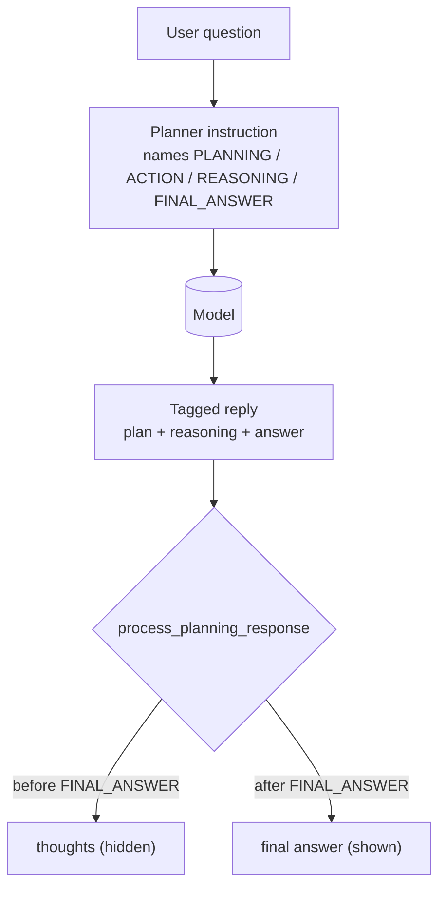

# Planners & Thinking: Making an ADK Agent Reason Before It Acts

*Post 23 of 26 in "Google ADK, Concept by Concept" — how a planner turns one-shot answers into inspectable plan-then-act reasoning.*

---

By default an agent answers in a single shot: prompt in, reply out. That works for lookups and one-tool calls, but it falls apart the moment a task needs several coordinated steps. A **planner** fixes this by making the model *think first* — lay out a plan, reason through it, then commit to a final answer. You get better multi-step behavior and, just as importantly, a reasoning trace you can inspect when something goes wrong.

ADK ships two planners in `google.adk.planners`, and they take opposite approaches to the same goal.

## Two planners, two philosophies

| Planner | How it plans | Works with | Needs a thinking model? |
|---------|--------------|------------|-------------------------|
| **`PlanReActPlanner`** | injects an instruction forcing a **plan → act → reason → answer** format, then parses the reply | any model | no |
| **`BuiltInPlanner`** | delegates to the model's **native thinking budget** (`types.ThinkingConfig`) | thinking models (Gemini 2.5) | yes |

The rule of thumb: reach for `BuiltInPlanner` when your model already thinks natively and you just want to tune how much it does. Reach for `PlanReActPlanner` when it doesn't — or when you want an explicit, structured plan regardless of the model underneath.

Attaching either is the same one-liner. You hand the planner to the agent's `planner` field:

```python
from google.adk.agents import LlmAgent
from google.adk.planners import BuiltInPlanner, PlanReActPlanner
from google.genai import types

# Model-agnostic: the instruction drives the format, so any model works.
planner_agent = LlmAgent(
    name="planner_agent",
    model="gemini-flash-latest",
    instruction="Answer the user's question. Reach for tools when they help.",
    planner=PlanReActPlanner(),
)

# Native thinking: cap reasoning at N tokens, and expose the thoughts.
thinking_agent = LlmAgent(
    name="thinking_agent",
    model="gemini-flash-latest",
    planner=BuiltInPlanner(
        thinking_config=types.ThinkingConfig(include_thoughts=True, thinking_budget=1024)
    ),
)
```

## How `PlanReActPlanner` actually works

`PlanReActPlanner` is, at heart, a **prompt-plus-parser** — no magic, no native model support required. Before the call, it prepends a system instruction naming five section tags. After the call, it splits the reply back apart. The plan and reasoning become private *thoughts*; only the text after the final-answer marker is shown to the user.

The five tags are `/*PLANNING*/`, `/*REPLANNING*/`, `/*REASONING*/`, `/*ACTION*/`, and `/*FINAL_ANSWER*/`. The model is asked to wrap each part of its reply in the right tag, and the planner splits on the **last** `/*FINAL_ANSWER*/`: everything before it is reasoning, everything after is the answer.



Two methods carry the whole mechanism. `build_planning_instruction(readonly_context, llm_request)` returns the fixed instruction — it ignores both of its context arguments, so you can produce it with no live model at all. `process_planning_response(callback_context, parts)` takes the reply parts and rewrites them, flagging reasoning as `thought=True`. Because neither needs a real model call, you can unit-test the plan/parse cycle entirely offline:

```python
from google.genai import types
from google.adk.planners import PlanReActPlanner
from google.adk.planners.plan_re_act_planner import (
    PLANNING_TAG, REASONING_TAG, FINAL_ANSWER_TAG,
)

planner = PlanReActPlanner()

# A synthetic model reply, exactly as the planner would receive it.
reply = [
    types.Part(text=PLANNING_TAG + "\n1. Look up the capital.\n2. Return it."),
    types.Part(text=REASONING_TAG + " France's capital is Paris."),
    types.Part(text="So the answer follows. " + FINAL_ANSWER_TAG + " Paris."),
]

processed = planner.process_planning_response(None, reply)
for p in processed:
    print(f"thought={bool(getattr(p, 'thought', False))!s:<5} {p.text!r}")
# thought=True  '/*PLANNING*/\n1. Look up the capital.\n2. Return it.'
# thought=True  '/*REASONING*/ France's capital is Paris.'
# thought=True  'So the answer follows. /*FINAL_ANSWER*/'
# thought=False ' Paris.'
```

The plan and reasoning are preserved but hidden; only ` Paris.` surfaces to the user. That split is the payoff — the model's scratch work is logged separately from what it says.

## `BuiltInPlanner` and native thinking

`BuiltInPlanner` does none of this rewriting. It hands off to the model's own thinking mechanism through `types.ThinkingConfig`. Two knobs matter: `include_thoughts=True` asks the model to expose its reasoning as thought parts, and `thinking_budget=N` caps that reasoning at `N` tokens. The model decides *how* to think within the budget; ADK just plumbs the config through. It's the lighter option when your model (Gemini 2.5, say) already reasons natively — no instruction, no reply parsing, no extra tags to parse wrong.

## The Go picture — an honest note

Planners are a **Python-only** feature today. The `adk/v2` `LlmAgent` config has no `planner` field, and there is no planner package to import. So in Go the concept doesn't exist as an SDK binding — but the core primitive, the Plan-Re-Act parser, ports cleanly to the standard library. Here's the same split-on-last-`FINAL_ANSWER` logic that `PlanReActPlanner` uses:

```go
const finalAnswerTag = "/*FINAL_ANSWER*/"

type Part struct {
    Text    string
    Thought bool
}

// ProcessPlanningResponse mirrors PlanReActPlanner: text before the last
// final-answer marker is a private thought; the tail becomes the visible answer.
func ProcessPlanningResponse(parts []Part) []Part {
    var out []Part
    for _, p := range parts {
        if i := strings.LastIndex(p.Text, finalAnswerTag); i >= 0 {
            if head := p.Text[:i+len(finalAnswerTag)]; head != "" {
                out = append(out, Part{Text: head, Thought: true})
            }
            if tail := p.Text[i+len(finalAnswerTag):]; tail != "" {
                out = append(out, Part{Text: tail})
            }
            continue
        }
        out = append(out, Part{Text: p.Text, Thought: startsWithThoughtTag(p.Text)})
    }
    return out
}
```

Same rule, no SDK: a part is split at the last final-answer marker, the reasoning ahead of it is flagged as a thought, and the tail is what the user sees. Seeing it as ~40 lines of string work makes clear that `PlanReActPlanner` is prompt engineering plus a parser — not a black box.

## When to use it

- **Multi-step tool use** — an explicit plan keeps a long tool chain on track and readable. Naive prompting drifts; a plan-then-act loop commits to the steps up front and reasons against them.
- **Debuggability** — thoughts are logged separately from the answer, so you can see *why* the agent did something, not just what it said.
- **Model without native thinking** — `PlanReActPlanner` gives you structured reasoning on any model; `BuiltInPlanner` is the lighter choice when the model already thinks.

Skip it for simple one-shot Q&A — the extra tokens and latency aren't worth it. A planner is for the tasks where "just ask the model" quietly stops being enough.

**Next in the series:** Context Caching — reusing a large, stable prompt prefix across calls to cut latency and cost.
