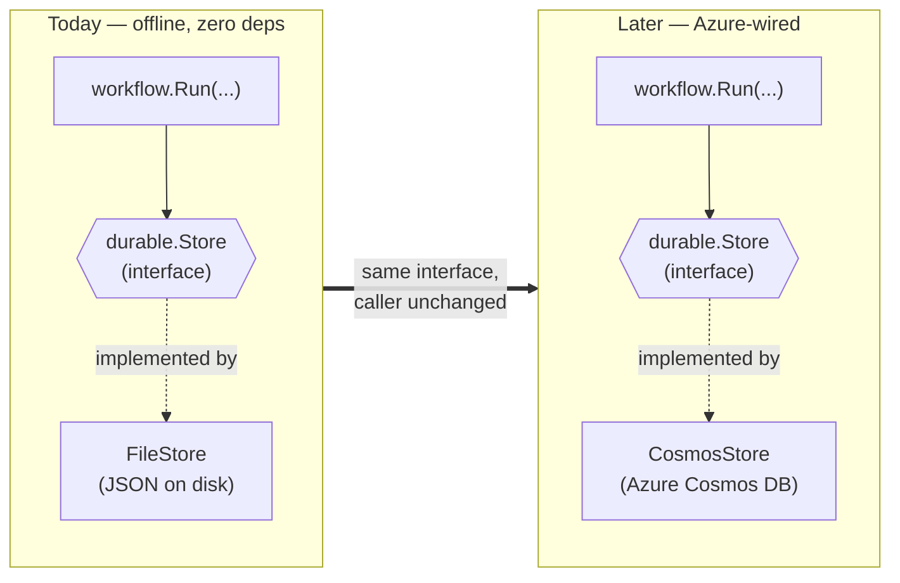
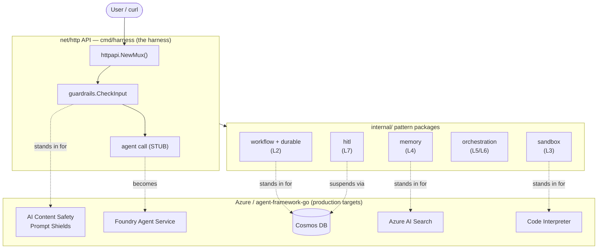
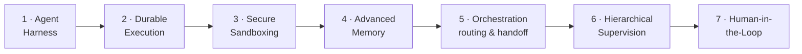

# Harness Engineering in Go: build the harness, then let Azure supply it

*Seven patterns that turn a bare model call into production agent infrastructure — each written first as offline Go behind an interface, so the leap to Azure is a swap, not a rewrite.*

---

## What "harness engineering" means

A language model, on its own, is a function: text in, text out. Everything that makes it behave like a dependable *agent* — the input checks, the retry-safe execution, the sandbox around tool code, the memory that survives a restart, the routing between specialists, the approval gate before it does something irreversible — lives *around* the model. That surrounding machinery is the **harness**.

The [Hendrixer/harness-engineering](https://github.com/Hendrixer/harness-engineering) course teaches you to build that harness by hand, in TypeScript, so you understand what it's made of. This series is the same seven patterns rewritten in **idiomatic Go**, targeting **Azure and the [Microsoft Agent Framework for Go](https://github.com/microsoft/agent-framework-go)** — but with a twist that shaped every design decision: I built each pattern to run **offline, with zero dependencies**, and I made the boundary to Azure explicit and honest.

That boundary is the whole point. So let me start there.

## The core idea: the seam

Every place my code touches a managed Azure service, I put a small Go **interface** — a *seam* — and behind it a local struct that does the job on my laptop. The caller talks to the interface. Swap the implementation, keep the caller.



`workflow.Run` doesn't know whether its checkpoints land in a JSON file or in Cosmos DB. It knows the `durable.Store` interface. That's it. When I wire the real Azure path, the call site doesn't move.

This is not a novel trick — it's dependency inversion, the thing Go interfaces are *for*. What's deliberate is applying it at **exactly** the managed-service boundaries, and naming each seam after the primitive it stands in for.

## State the leak

Here's the discipline that makes this more than a stub farm. Every local stand-in, in its doc comment, **names the Azure service it imitates and says exactly where it is weaker.** For example, the input guardrail:

```go
// injectionMarkers are common prompt-injection / jailbreak substrings. This list
// is a TEACHING stand-in only — it is trivially bypassed (unicode look-alikes,
// spacing tricks). Production defense is Azure Content Safety Prompt Shields,
// which is ML-based and evasion-resistant.
```

The local version is a substring blocklist. The real version is an ML classifier. The comment doesn't pretend otherwise — it *states the leak*. That honesty is the pedagogy: you learn the **shape** of the pattern from code you can run and read in five minutes, and you learn precisely what you're trading away by not using the managed service. When you later reach for Cosmos DB or Content Safety, you already know what problem it solves, because you felt the gap.

## The system, end to end

The thing you actually run is a thin `net/http` API — `cmd/harness`. In production it drives managed agents; today every box below the API line is a local stand-in.



Notice the agent call itself is a **stub** — it echoes your message. That's intentional for the whole series. The patterns *around* the model are the subject; the model call is a placeholder you replace once, at the end, with a real `foundryprovider` agent run. You can learn every harness pattern before you spend a cent on tokens.

## The seven patterns

Each lesson is one Go package (or two), each behind an interface naming its Azure target. Here is the map — and the rest of this series walks it in order, because each pattern builds on the ones before it.



| # | Pattern | What it adds to the harness | Go seam → local impl | Azure target |
|---|---------|-----------------------------|----------------------|--------------|
| 1 | Agent harness | guardrails as middleware around the model | policy fn; `net/http` handler | Content Safety Prompt Shields |
| 2 | Durable execution | checkpoint after each step; resume after a crash | `durable.Store` → `FileStore` | Cosmos DB |
| 3 | Secure sandboxing | run agent-written code with a hard timeout | `os/exec` + `context` deadline | Foundry Code Interpreter |
| 4 | Advanced memory | short-term thread + long-term retrieval + summarize | `ThreadStore`, `KnowledgeStore` | managed threads; Azure AI Search |
| 5 | Orchestration & handoff | route intent to the right specialist | keyword `Router` | triage-agent handoff |
| 6 | Hierarchical supervision | fan a task out to concurrent workers, fan results in | `Worker` + goroutines | Magentic / concurrent orchestration |
| 7 | Human-in-the-loop | pause for approval before a sensitive action | built on `durable.Store` | request/response executor |

Two things worth flagging now, because they recur:

**Lesson 2 is the spine.** Durable execution isn't just its own pattern — Lesson 7 (human-in-the-loop) is *literally* a durable checkpoint marked `awaiting_approval`. A paused approval request and a crashed workflow are the same problem: state that must survive the process. Build the store once, reuse it.

**Everything is at-least-once.** Because a crash can happen between a step finishing and its checkpoint landing, resuming re-runs that step. So step functions and approved actions must be **idempotent**. This is not a stand-in weakness — it's true of Cosmos DB too. The local version just makes you confront it early.

## Why offline-first was the right call

I could have wired Azure from day one. I didn't, and I'd make the same choice again:

- **You can run the whole thing in `go test ./...`** — including a real process-restart durability test that `os.Exit`s mid-run to prove checkpoints survive a crash. No cloud account, no flaky network, no cost.
- **The seams document the architecture.** Reading the interface list *is* reading the system design. Each interface is a one-paragraph spec of an Azure capability.
- **The swap is mechanical.** When `agent-framework-go` stabilizes (it's early/preview today), the first real integration is a single stub in `httpapi/api.go`. The seams mean I'm adding an implementation, not restructuring the code.

## What's next

The next post builds **Lesson 1 — the agent harness itself**: guardrails as middleware wrapped around the model call, why the reference policy is a *hard block* rather than flag-and-pass, and the `net/http` handler that ties it together and tests without a running server.

From there we go down the list: durable execution, sandboxing, memory, orchestration, supervision, and the human-in-the-loop approval gate — each one a runnable Go package, each one honest about its leak.

If you want to read ahead, the code is one `go build ./...` away — every lesson is a package under `internal/`, and none of them need Azure to run.
