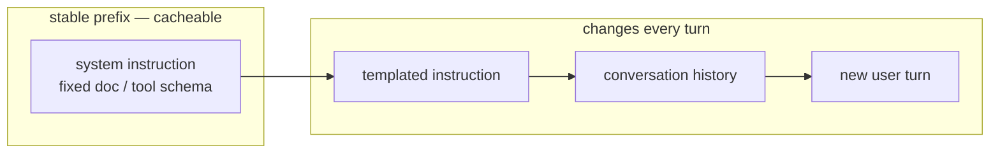

# Context Caching in ADK: Stop Paying for the Same Tokens Every Turn

*How caching a large, stable prompt prefix cuts latency and cost — and the ADK config that decides when it pays off.*

---

Every turn, a chat agent quietly re-sends the same material: a long system persona, a fixed reference document, a big tool schema. The model re-reads and re-bills all of it, even though not a single byte changed since the last turn. **Context caching** stores that stable *prefix* on the model side so subsequent turns re-process and re-charge only the *new* tokens. On long, repetitive prompts it is a straight cut to both cost and latency, and in Google's Agent Development Kit (ADK) it is one line of config.

## The mental model: a prompt has a head and a tail

Think of every request as two regions. The **head** is stable — the same system instruction and reference context on turn 1 and turn 50. The **tail** changes every turn — the templated instruction, history, the new user message. Caching is a lever on the head: reuse the identical prefix instead of re-sending it.



## When it pays off (and when it doesn't)

| Situation | Cache? | Why |
|-----------|--------|-----|
| Long, stable system prompt reused every turn | Yes | The prefix is identical across turns |
| A fixed document or large tool schema in context | Yes | Re-processing it each turn is wasted work |
| First turn of a session | No | There is no prior token count to cache against yet |
| Short, single-turn prompts | No | The prefix never reaches the model's minimum |
| Prefix that changes every turn | No | Nothing stable to reuse |

The pattern: caching wins when a **large, stable prefix dominates a multi-turn prompt**. Below the model's token floor the storage overhead outweighs the saving — which is exactly why ADK refuses to cache short prompts.

## The config

In Python ADK, caching is an **App-level** feature. You attach a `ContextCacheConfig` to the `App`, and every `LlmAgent` under it inherits the policy — you don't configure it per agent.

```python
from google.adk.apps import App
from google.adk.agents import LlmAgent
from google.adk.agents.context_cache_config import ContextCacheConfig

cfg = ContextCacheConfig(
    cache_intervals=5,     # how many invocations reuse one cache before refresh
    ttl_seconds=600,       # how long the cache lives
    min_tokens=2048,       # floor on the previous request's prompt tokens
)

agent = LlmAgent(
    name="cached_assistant",
    model="gemini-flash-latest",
    instruction="You are a helpful assistant with a long, stable system prompt.",
)

app = App(name="caching_demo", root_agent=agent, context_cache_config=cfg)
```

The defaults: `cache_intervals` is 10, `ttl_seconds` is 1800 (30 minutes), `min_tokens` is 0. Leaving `context_cache_config=None` — the default — disables caching entirely.

## The caching decision, per turn

Caching doesn't fire indiscriminately. ADK applies a rule with three facts baked in, and it's worth understanding because it explains every "why didn't my prompt cache?" surprise:

1. **No cache on turn 1.** Caching needs the *previous* request's token count, which doesn't exist yet on the first turn. Caching starts on the second turn at the earliest.
2. **A floor applies.** The prefix must clear both your `min_tokens` and Gemini's own model-specific minimum — **2048 tokens for Gemini 2.5, 4096 for Gemini 3** — whichever is larger.
3. **Caches expire.** A cache is reused up to `cache_intervals` invocations and up to `ttl_seconds` of wall-clock time before it is refreshed.

That rule is pure and testable. Expressed directly:

```python
def should_cache(cfg, model, turn, prev_prompt_tokens):
    if turn <= 1:
        return False, "first turn — no prior token count yet"
    floor = max(cfg.min_tokens, model_min_tokens(model))  # 2048 or 4096
    if prev_prompt_tokens < floor:
        return False, f"prefix {prev_prompt_tokens} tok below minimum {floor}"
    return True, "stable prefix reused from cache"
```

## Making the prefix genuinely stable: `static_instruction`

Caching only reuses what is *byte-for-byte identical* across turns, so it pays to keep the top of your prompt truly fixed. `LlmAgent.static_instruction` holds non-templated content — a persona, a policy, a reference document — that ADK sends **verbatim as the system instruction at the very start** of every request, with no `{placeholder}` substitution. That is precisely the region the cache can reuse. Setting it also relocates the ordinary, templated `instruction` to user content *after* the static prefix, so the cacheable region ends cleanly before anything varies per turn.

```python
agent = LlmAgent(
    name="prefixed_assistant",
    model="gemini-flash-latest",
    # Fixed and literal -> the stable cache PREFIX (system instruction, sent first).
    static_instruction="You are ACME Corp's support agent. Never disclose internal pricing.",
    # Templated, re-resolved each turn -> the CHANGING tail, placed after the prefix.
    instruction="Reply in a {tone} tone.",
)
```

One caveat: the Live API ignores `static_instruction` — it has its own cache mechanism.

## The Go picture (an honest note)

ADK is a dual-language framework, but this feature is asymmetric. `adk/v2 v2.0.0` has **no** first-class `ContextCacheConfig` and no `StaticInstruction` field — context caching lives on the Python side. On the Go side, adk-go only *observes* caching: it records `UsageMetadata.CachedContentTokenCount` in telemetry. To manage caches yourself in Go, the underlying `google.golang.org/genai` SDK exposes manual `CachedContent` create/get/delete.

The decision *rule*, though, is language-independent — it's just data plus a pure function. The same logic in Go:

```go
func ShouldCache(cfg CacheConfig, model string, turn, prevPromptTokens int) (bool, string) {
    if turn <= 1 {
        return false, "first turn — no prior token count yet"
    }
    floor := cfg.MinTokens
    if m := ModelMinTokens(model); m > floor { // 2048 for gemini-2.5, 4096 for gemini-3
        floor = m
    }
    if prevPromptTokens < floor {
        return false, fmt.Sprintf("prefix %d tok below minimum %d", prevPromptTokens, floor)
    }
    return true, "stable prefix reused from cache"
}
```

## A neighbour: context compaction

Caching reuses the stable **head** of the prompt. **Compaction** attacks the growing **tail**: as a session accumulates events, ADK can summarize old ones so the history keeps fitting the context window. It is a separate, App-level policy (experimental in current ADK), attached via `App(events_compaction_config=EventsCompactionConfig(...))` — a runtime rewrite of session events, not model-side token reuse. The two compose cleanly: caching cuts the cost of the stable prefix, compaction bounds the growing history.

You can read the field reference for both under `App` in the official ADK docs at [google.github.io/adk-docs](https://google.github.io/adk-docs/). The takeaway: reach for caching when a large, stable prefix dominates a multi-turn conversation — and let ADK's floor decide when it actually pays off.

*Next in the series: describing agents declaratively with Agent Config (YAML).*
