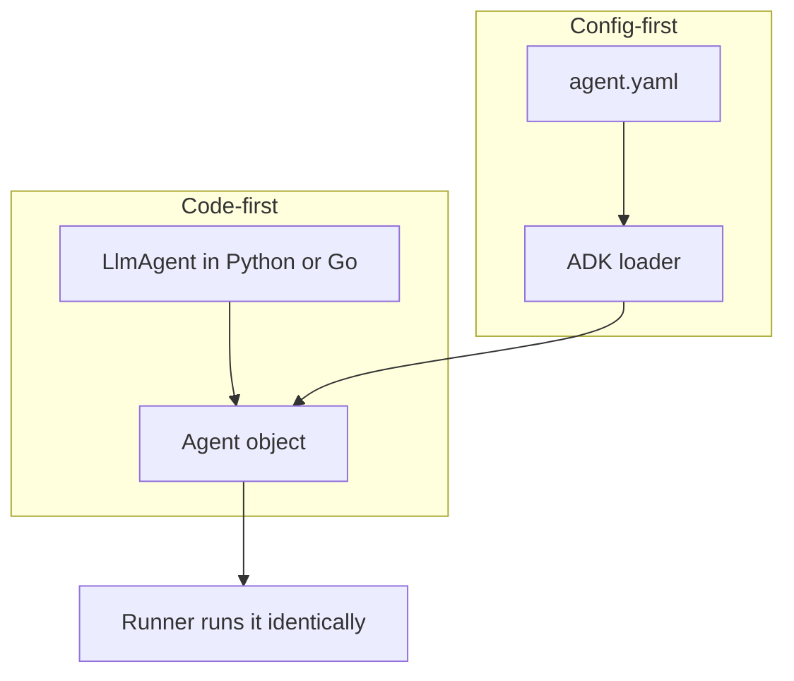

# Agent Config: Defining an ADK Agent in YAML, No Code Required

*How ADK's config loader turns a declarative YAML file into a fully-built agent — and why treating an agent as data changes who gets to edit it.*

---

Every agent in this series so far has been built in **code**: `LlmAgent(...)` in Python, `llmagent.New(...)` in Go. Google's Agent Development Kit (ADK) offers a second path — describe the agent in a **YAML file** and let ADK's loader construct it for you. Same agent, no code. This is **Agent Config**, and the shift it represents is subtle but real: the agent stops being a program and becomes a piece of *data*.

## The whole agent, as data

Here is a complete, runnable agent with zero Python or Go:

```yaml
# agent.yaml
agent_class: LlmAgent
name: haiku_bot
model: gemini-flash-latest
description: Writes a haiku about any topic the user names.
instruction: |
  You are a poet. Reply with a single haiku (three lines, 5-7-5 syllables)
  about the topic the user gives you. Output only the haiku.
```

That is the entire agent. The fields map one-to-one onto the constructor arguments you would otherwise pass in code:

| YAML key | Meaning | Required |
|----------|---------|----------|
| `agent_class` | which agent type to build, e.g. `LlmAgent` | yes |
| `name` | the agent's name — must be a valid identifier | yes |
| `model` | model id, e.g. `gemini-flash-latest` | (LlmAgent) |
| `instruction` | the system instruction / prompt | (LlmAgent) |
| `description` | one line describing the agent, used for delegation | no |
| `tools`, `sub_agents`, callbacks | reference code by name or point at other config files | no |

Note the ceiling: prompts, model, and wiring live comfortably in data, but the moment an agent needs *real logic* — a custom tool, a callback, a dynamic instruction — that logic stays in code and the YAML merely *references* it by name.

## Loading it: `from_config`

In Python, one function does the work. It is the same loader that `adk run` uses to load a `root_agent.yaml`:

```python
from google.adk.agents.config_agent_utils import from_config

agent = from_config("agent.yaml")   # -> a fully-built LlmAgent
```

The important thing about this call is what it does *not* do: **it never contacts the model.** Loading a config only parses and validates it. So you can build, inspect, and test a YAML-defined agent entirely offline, with no API key — the model call only happens later, when a `Runner` actually executes the agent.

Inside `from_config` is a three-step pipeline: **read** the YAML into a mapping; **resolve** `agent_class` to a concrete class (`LlmAgent`, `SequentialAgent`, …); **validate** the mapping against that class's config model, then call the class's own `from_config` to construct the object.

Because the fields map straight onto constructor arguments, you read them right back off the built agent — `type(agent).__name__` is `LlmAgent`, `agent.name` is `haiku_bot`, and so on.

**Honesty check on the Python status.** In the current `google-adk`, `from_config` (and the config models behind it) are marked *experimental* and emit deprecation warnings. Don't over-read that: the deprecation is about the *internal mechanism* moving — config is increasingly loaded via reflection, so a separate config class is no longer needed — **not** about the YAML feature going away. It still works, and it is still what the CLI calls.

## Why describe an agent as data?

The payoff is not that YAML is prettier than code. It's that data has different affordances than a program:

- **Non-engineers can edit it.** A product manager or prompt author can tune the `instruction` or swap the `model` without touching source or understanding an SDK.
- **Changes are reviewable.** An agent tweak becomes a small, obvious diff instead of a code change buried in a function.
- **It's toolable.** UIs and generators can read and write the schema. ADK's **Visual Builder** in the `adk web` Dev UI is exactly this: assemble instruction, tools, and sub-agents in a graph editor and it emits *this same YAML*, which you commit and run with the ordinary code-first `Runner`. Same config, two front ends.
- **It's portable.** The schema describes the agent identically across languages.



## The Go status, honestly

This is a case where the two-language symmetry breaks, and it's worth being straight about it. Agent Config is a **Python-first** feature today.

adk-go *does* implement a full YAML agent-config engine — there is an internal config struct whose tags are precisely `agent_class`, `name`, `model`, `description`, `instruction`, `tools`, `sub_agents`, mirroring the Python models. But it lives in an `internal/` package, and Go's toolchain forbids importing `internal/` from outside the owning module. So **there is no public Go equivalent of `from_config`** in the current release. The engine exists; it just isn't part of the public API yet.

The honest way to work with the config *data model* in Go, then, is to mirror it — parse the same file with `yaml.v3` into a struct whose tags match ADK's, and validate it yourself:

```go
type AgentConfig struct {
    AgentClass  string `yaml:"agent_class"`
    Name        string `yaml:"name"`
    Model       string `yaml:"model"`
    Description string `yaml:"description,omitempty"`
    Instruction string `yaml:"instruction"`
}

func (c AgentConfig) Validate() error {
    if c.AgentClass != "LlmAgent" {
        return fmt.Errorf("agent_class = %q, want LlmAgent", c.AgentClass)
    }
    if c.Name == "" || !isIdentifier(c.Name) {
        return fmt.Errorf("name %q must be a valid identifier", c.Name)
    }
    // ... model and instruction likewise required
    return nil
}
```

That `isIdentifier` check on `name` is not incidental — it's the same rule ADK enforces (Python's `name.isidentifier()`): a name must start with a letter or underscore and contain only letters, digits, and underscores. Mirroring the struct gives you the *shape* of Agent Config in Go and lets you round-trip the exact same `agent.yaml` a Python `from_config` reads. What you don't get, in the current release, is the loader that builds a live agent from it.

## Mental model

Think of Agent Config as **the serialized form of an agent's pure-configuration part**. `from_config` is the deserializer, and a `Runner` can't tell whether the agent it got came from a constructor call or a YAML file. Reach for it when the agent is mostly prompt + model + wiring and you want that editable by people who don't touch the source; reach for code the moment you need genuine logic. Today that door is fully open in Python and still behind an `internal/` wall in Go.

*This is the final concept in the series — the declarative capstone over everything from your first agent through tools, state, memory, multi-agent systems, evaluation, deployment, and observability.*
