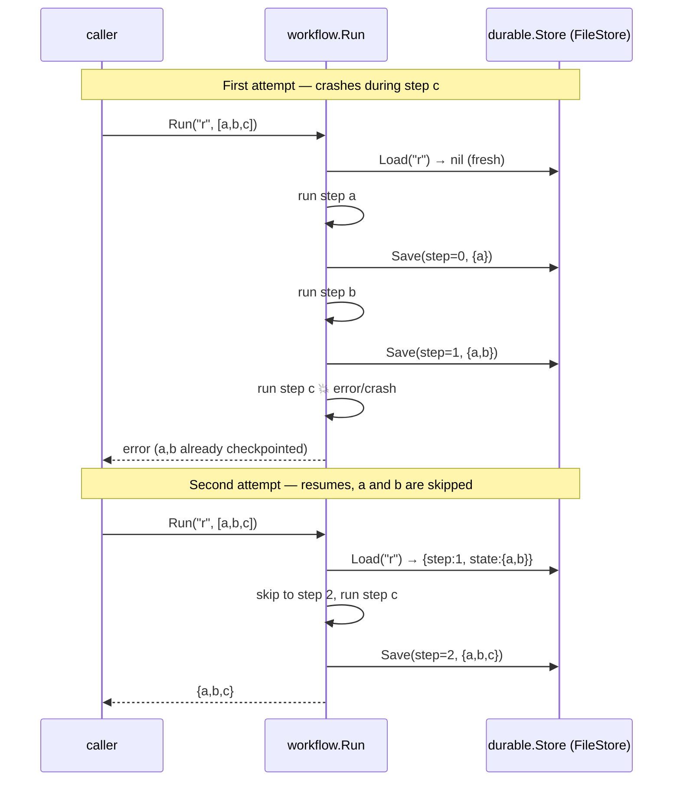
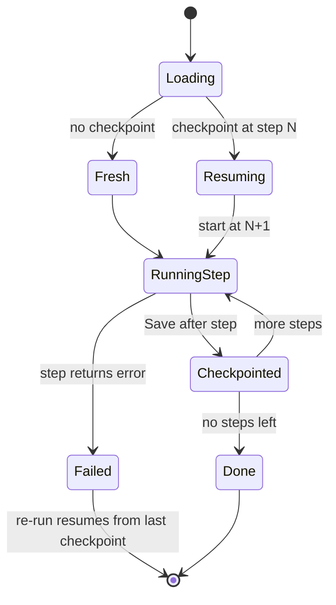

# Durable Execution: Checkpoint Every Step, Resume After a Crash

*Lesson 2 of Harness Engineering in Go — a workflow that saves its progress after each step and picks up exactly where it died, proven by a test that kills a real subprocess mid-run.*

---

This is the second pattern in the [Harness Engineering in Go](/blog/posts/harness-engineering-go-01-the-seam/) series. [Lesson 1](/blog/posts/harness-engineering-go-02-agent-harness-guardrails/) wrapped the model call in a guardrail and left the agent as a stub. That stub was fine while the agent did one thing. But real agent work is *multi-step* — retrieve, call a tool, summarize, write a result — and any of those steps can crash, time out, or get OOM-killed halfway. If a crash means starting over, you re-pay for every completed step, including the expensive model calls. Durable execution is the fix, and it's the **spine** of this series: the human-in-the-loop gate in Lesson 7 reuses this exact store.

## The pattern: named steps, checkpointed after each

The whole idea is one function. `workflow.Run` takes a `runID` and a list of named steps, executes them in order, and writes a checkpoint after each one lands. Re-run with the same `runID` and it loads the last checkpoint, skips everything already done, and resumes from the next step. That's the local, Azure-free equivalent of a **checkpointed Microsoft Agent Framework workflow** — where the framework persists workflow state to a pluggable backend so a crashed run resumes rather than restarts.

Here is the fresh-run-then-crash-and-resume sequence, straight from the reference project:



The state machine behind that is small enough to hold in your head:



## The runner, in full

The runner is 30-odd lines with no cleverness, and that's the point — durability comes from *discipline*, not machinery.

```go
// Run executes steps durably, resuming from the last checkpoint for runID.
//
// Execution is at-least-once: the checkpoint is written AFTER a step's function
// returns, so a crash between a step finishing and its checkpoint landing re-runs
// that step on resume. Step functions must therefore be idempotent.
func Run(runID string, steps []Step, store durable.Store) (durable.State, error) {
	cp, err := store.Load(runID)
	if err != nil {
		return nil, fmt.Errorf("workflow: load checkpoint: %w", err)
	}

	start := 0
	state := durable.State{}
	if cp != nil {
		start = cp.Step + 1 // resume after the last completed step
		state = cloneState(cp.State)
	}

	for i := start; i < len(steps); i++ {
		update, err := steps[i].Fn(state)
		if err != nil {
			return state, fmt.Errorf("workflow: step %d (%s): %w", i, steps[i].Name, err)
		}
		for k, v := range update {
			state[k] = v
		}
		if err := store.Save(durable.Checkpoint{RunID: runID, Step: i, State: state}); err != nil {
			return state, fmt.Errorf("workflow: save checkpoint: %w", err)
		}
	}
	return state, nil
}
```

Three decisions carry the whole design:

**`Load` returning `nil` is a fresh start, not an error.** A missing checkpoint means "never ran," so `start = 0` and the state begins empty. This is what makes the *same call* both start and resume a run — there is no separate "begin" and "resume" API, just `Run`. The caller doesn't need to know or track which case it's in.

**The checkpoint is written *after* the step's function returns**, carrying `Step: i` — the index of the last completed step. On resume, `start = cp.Step + 1`, so completed steps are skipped and never re-run under normal flow. A `Step` is just a `Name` and a `Fn func(state) (State, error)`; its returned map is merged into the accumulated state, which is a plain `map[string]any` so it round-trips through any JSON backend.

**The loaded state is cloned before the run mutates it.** `cloneState` copies the map the store handed back so the running copy never aliases stored data. Small thing, but it's the difference between a resume that's a clean re-entry and one that quietly corrupts the checkpoint you loaded from.

## The seam: `durable.Store`

The runner never touches a file. It talks to an interface:

```go
// Store persists at most one checkpoint per run_id.
//
// Load returns (nil, nil) when no checkpoint exists for run_id — a missing run is
// not an error, it is a fresh start. Save upserts, retaining only the latest
// checkpoint for a run.
type Store interface {
	Load(runID string) (*Checkpoint, error)
	Save(cp Checkpoint) error
}
```

Two methods. Behind it locally is `FileStore` — all runs in one JSON file, a `run_id → Checkpoint` map. In production that same interface is a **Cosmos DB** store: replicated, access-controlled, one item per run. The workflow code doesn't change a line. That's the seam this whole series is built on — name the Azure primitive, put an interface in front of it, keep the caller ignorant of which side it's on.

The one detail worth studying in `FileStore` is how it *writes*:

```go
// writeAll persists the map atomically: write a temp file in the same directory,
// then rename over the target. rename(2) is atomic on POSIX, so a reader (or a
// crash) never sees a half-written file.
func (s *FileStore) writeAll(all map[string]Checkpoint) error {
	data, err := json.MarshalIndent(all, "", "  ")
	// ... write to a temp file in the same dir ...
	if err := os.Rename(tmpName, s.path); err != nil {
		os.Remove(tmpName)
		return fmt.Errorf("durable: rename: %w", err)
	}
	return nil
}
```

It never writes the target file in place. It marshals to a temp file, then `os.Rename`s over the target. `rename(2)` is atomic on POSIX, so a crash mid-write leaves the *old* checkpoints intact — you never get a truncated, unparseable JSON file that poisons every future resume. Writing to a file rather than memory is the entire reason recovery survives a process restart, and the atomic rename is what makes that file safe to crash against.

## At-least-once, so steps must be idempotent

Read the runner's ordering again: the step function runs, *then* the checkpoint saves. There's a window between "step c finished its side effect" and "the checkpoint recording c has landed on disk." Crash in that window, and resume re-runs step c — its side effect already happened once, and now it happens again.

This is **at-least-once execution**, and it is not a bug to be fixed; it's the honest guarantee of any checkpoint-after model. The consequence is a hard rule on your step functions: **they must be idempotent.** Running a step twice with the same input must land the same result. Append a row keyed by `runID`, not "insert a new row." Set `status = done`, not "increment a counter." Use a deterministic ID for the tool call so a retry is a no-op. If you push the checkpoint *before* the step instead, you swap this problem for a worse one — at-most-once, where a crash silently *skips* work. At-least-once with idempotent steps is the combination that actually survives crashes.

## The test that proves it

Plenty of "durable" systems only prove durability against a simulated error — a step that returns `err` while the process stays alive. That tests the resume *logic*, but it never tests that state actually survived a dead process. The real test kills the process.

`TestCheckpointSurvivesProcessRestart` re-execs the test binary as a child. The child runs step `a` (which checkpoints), then step `b` calls `os.Exit(3)` — a genuine, unrecoverable process death mid-run, not a returned error:

```go
steps := []Step{
	{"a", func(s durable.State) (durable.State, error) { return durable.State{"a": 1}, nil }},
	{"b", func(s durable.State) (durable.State, error) { os.Exit(3); return nil, nil }},
}
_, _ = Run("r", steps, store)
```

The parent asserts the child exited with code 3, then constructs a *fresh* `FileStore` over the same file and calls `Run` again. Because `a`'s checkpoint is on disk, only `b` runs on the resume — the parent checks `ran == ["b"]` and the final state is `{a:1, b:2}`. That's the whole claim, proven end to end: a process died in the middle, and the work it finished was not lost. `os.Exit` can't be caught or deferred past, so there's no way the state could have been flushed on the way out — if it's on disk, the checkpoint put it there.

## State the leak

The `FileStore` doc comment says it plainly:

> `FileStore` is one JSON file, no replication or auth; Cosmos DB is a replicated, access-controlled, per-item store. Execution is **at-least-once** — a crash between a step finishing and its checkpoint landing re-runs that step, so step functions must be idempotent.

Two leaks, both real. First, **coarse whole-file locking**: `FileStore` rewrites the entire map on every `Save` under one mutex, so concurrent runs serialize on a single file. Cosmos DB writes one item per run with per-item concurrency and optimistic ETags — the file store's convenience is exactly its scaling ceiling. Second, **no replication or auth**: one disk, one copy, no access control. Lose the disk and you lose every checkpoint; anyone on the box can read or edit a run's state. Cosmos gives you geo-replication and RBAC for free. The at-least-once idempotency requirement, notably, is *not* a leak — it's true of the managed service too. The local store teaches you the shape of durable execution so that when you swap in Cosmos, you already know which properties you were relying on.

## What's next

Durable execution gives the agent a memory that survives crashes — but the next problem is the opposite kind of danger. When an agent writes code and you *run* it, you've handed an LLM a shell on your machine. Lesson 3 builds a secure sandbox: executing agent-written code behind a hard timeout and a locked-down environment, so a runaway or malicious snippet can't hang your process or reach past its box.

---

Next: [Secure Sandboxing: Running Agent-Written Code Behind a Timeout](/blog/posts/harness-engineering-go-04-secure-sandboxing.html)
