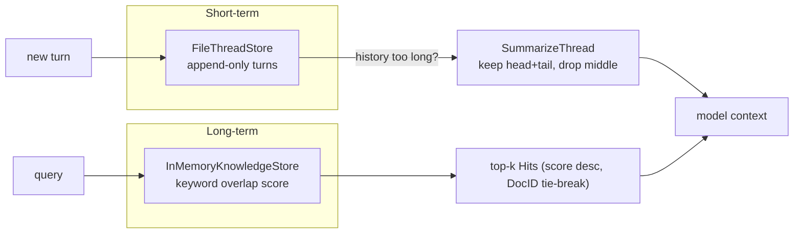
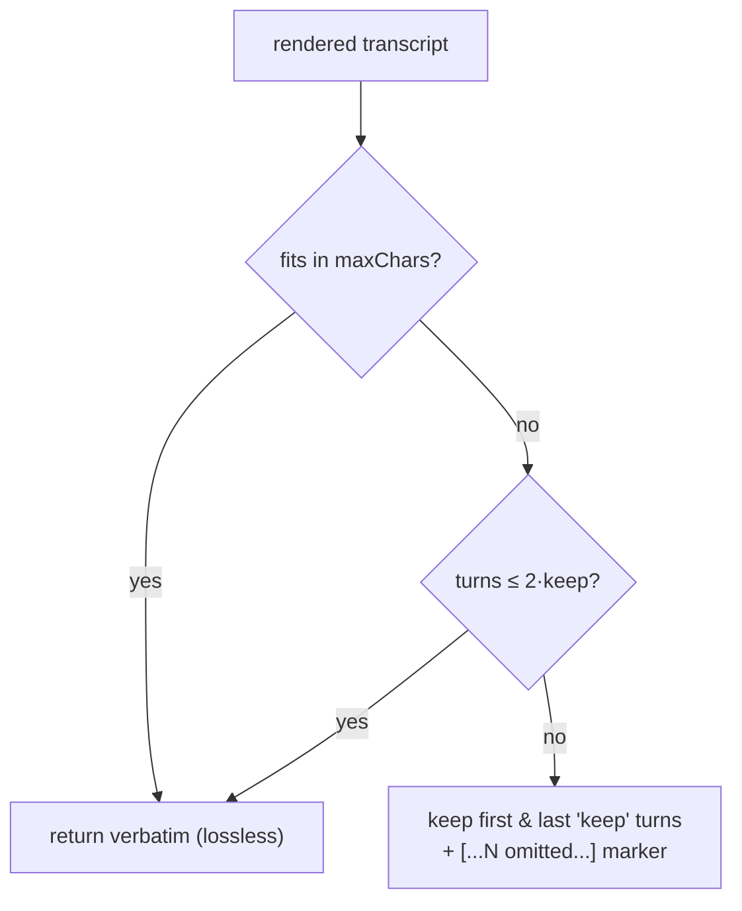

# Advanced Memory: Threads, Keyword Retrieval, and Lossy Summarization

*Lesson 4 of Harness Engineering in Go — three collaborating stores (a thread, a knowledge index, and a summarizer) behind interfaces, and an honest accounting of where each local stand-in leaks.*

---

This is Lesson 4 in the [Harness Engineering in Go](/blog/posts/harness-engineering-go-01-the-seam/) series. By now the pattern is familiar: every Azure dependency is a Go interface (the *seam*), a local struct sits behind it for offline dev and tests, and each lesson ends by naming exactly where the stand-in is weaker than the managed service. Memory is where that discipline pays off most, because "memory" is not one thing — it's three, and each maps to a different Azure primitive.

## Memory is three stores, not one

When people say an agent "remembers," they conflate three jobs:

- **Short-term** — the running transcript of *this* conversation. Append a turn, replay history. That's a **thread**.
- **Long-term** — facts and documents the agent can retrieve to ground an answer, across conversations. That's a **knowledge index**.
- **Compression** — when a thread outgrows the model's context window, roll it up so it still fits. That's a **summarizer**.

They collaborate but don't overlap, so I built them as three interfaces. Here's the whole `memory` package on one page:



Each box is a swap point. The thread stands in for Azure AI Agent Service **managed threads**; the index stands in for **Azure AI Search**; the summarizer stands in for an LLM recap call against **Azure OpenAI / Foundry**.

## The thread: append-only, replayed faithfully

Short-term memory is the smallest interface in the package. Two methods:

```go
// ThreadStore is the short-term memory seam: append a turn, replay history.
type ThreadStore interface {
	Append(threadID, role, content string) error
	History(threadID string) ([]Message, error)
}
```

The local implementation, `FileThreadStore`, keeps a JSON file of `map[threadID][]Message` and appends per thread. Two details I care about. First, writes go through a temp-file-and-`rename` so a crash mid-write never leaves a half-written thread — `os.Rename` on the same filesystem is atomic. Second, `History` hands back a *copy*, not the live slice:

```go
func (s *FileThreadStore) History(threadID string) ([]Message, error) {
	s.mu.Lock()
	defer s.mu.Unlock()
	all, err := s.readAll()
	if err != nil {
		return nil, err
	}
	// Return a copy so callers can't mutate our in-file slice via the returned one.
	out := make([]Message, len(all[threadID]))
	copy(out, all[threadID])
	return out, nil
}
```

The thread is append-only and never lossy. That's a deliberate invariant, and it's what makes the *lossy* summarizer safe later — the original turns are always there to fall back on.

## The knowledge index: keyword overlap, top-k

Long-term retrieval is the other seam. Add documents, search them, get back scored hits:

```go
// KnowledgeStore is the long-term retrieval seam: add documents, search them.
type KnowledgeStore interface {
	Add(docID, text string)
	Search(query string, k int) []Hit
}
```

`InMemoryKnowledgeStore` scores each document by the **fraction of distinct query terms it contains** — a stable 0.0–1.0 number — then returns the top *k*, ties broken by `DocID` so results are deterministic:

```go
hits = append(hits, Hit{
	DocID: docID,
	Text:  doc.text,
	Score: float64(overlap) / float64(len(qTerms)),
})
// ...
sort.Slice(hits, func(i, j int) bool {
	if hits[i].Score != hits[j].Score {
		return hits[i].Score > hits[j].Score
	}
	return hits[i].DocID < hits[j].DocID
})
```

The tokenizer is one regexp — `[a-z0-9]+` over a lowercased string — crude but dependency-free and reproducible. `Add` upserts (re-adding a `DocID` replaces it), which mirrors an AI Search index merge, so the *contract* matches even though the ranking doesn't. That "contract matches, quality doesn't" gap is the whole point of the leak note below.

## The summarizer: keep the ends, drop the middle

The third piece runs when a thread gets too long to replay in full. `SummarizeThread` renders the transcript, and if it already fits `maxChars` it returns it verbatim — lossless is always preferred. Only when it overflows does it compress, and it does so by keeping the first and last `keep` turns and dropping the middle behind a marker:

```go
head := lines[:keep]
tail := lines[len(lines)-keep:]
omitted := len(messages) - 2*keep
marker := fmt.Sprintf("[...%d earlier turns omitted...]", omitted)

out := make([]string, 0, len(head)+1+len(tail))
out = append(out, head...)
out = append(out, marker)
out = append(out, tail...)
```

There's a guard I want to call out: if there aren't enough turns to have a droppable middle (`len(messages) <= 2*keep`), it returns the full text rather than emit a marker that hides nothing. And `keep < 1` is clamped to `1`, because `keep=0` would slice the whole tail and silently keep everything. Small edge cases, but they're the difference between a summarizer you can reason about and one that surprises you.

The decision is a two-question flowchart:



First-and-last is a defensible heuristic: the opening turns carry the task framing and the closing turns carry the current state, and the sagging middle is usually the most compressible part of a conversation. But it is a heuristic, not comprehension — which is exactly the leak.

## State the leak

The README states it in one sentence, and both halves matter:

> **State the leak:** knowledge search is pure **keyword overlap**, not semantic — "car" won't match "automobile". Summarization is **lossy** first-and-last-turns, not an LLM recap; the raw thread is always retained so a bad summary is recoverable.

**The index leaks on meaning.** Scoring counts *shared literal tokens*. Search for "car" and a document that only ever says "automobile" scores `0.0` — no overlap, not a hit. There are no vectors, no synonyms, no stemming, and word order is ignored entirely. A document that a human would rank as the perfect answer can score zero here, and a keyword-stuffed irrelevant one can score high. That's not a bug to patch; *patching it is Azure AI Search*, whose vector and semantic (and hybrid) ranking embeds text so "car" and "automobile" land near each other in vector space. The local store teaches the **shape** of retrieval — add, search, scored top-k — so that when you swap in AI Search, the caller doesn't change.

**The summarizer leaks on fidelity.** A real LLM summarizer reads the whole transcript and writes a faithful prose recap; this one keeps the ends verbatim and throws the middle away. If the decisive detail was said in a dropped turn, the summary loses it. What keeps this *safe* rather than reckless is the design decision from the top of the post: the summarizer never mutates the thread. The raw turns stay in the `FileThreadStore`, so a bad summary is always recoverable by replaying the original. Lossy compression is fine precisely because the lossless source of truth is still on disk.

That pairing — a lossy roll-up over a lossless append-only log — is the pattern worth taking to production even after the summarizer becomes a real LLM call. Never let the compression own the only copy.

## What's next

Memory gives the agent a past and a set of facts; it still doesn't tell the agent *which agent should handle a request*. When a single agent grows enough responsibilities that a monolithic prompt starts to blur, you split it — a router reads intent and hands off to a specialist. That's the next seam: local intent classification standing in for a managed multi-agent orchestrator, with the same honest note about where keyword routing falls short of a model that actually understands the request.

---

Next: [Orchestration and Handoff: Routing Intent to a Specialist](/blog/posts/harness-engineering-go-06-orchestration-handoff.html)
