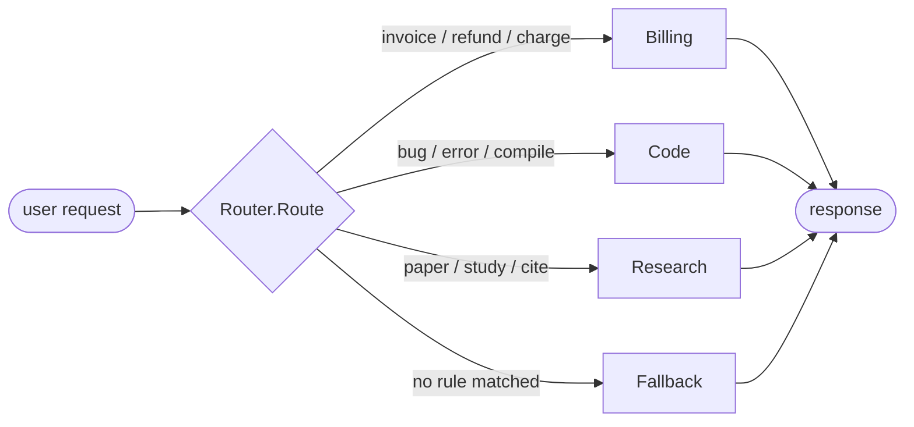

# Orchestration and Handoff: Routing Intent to a Specialist

*Lesson 5 of Harness Engineering in Go — a triage step that first-matches a keyword and hands the request to a specialist, and the exact place a substring table stops being able to think.*

---

This is Lesson 5 of the [Harness Engineering in Go](/blog/posts/harness-engineering-go-01-the-seam/) series. The earlier lessons built one agent's harness — a guardrail on the door, durable execution behind it, memory and retrieval feeding it context. That's a single agent doing a single job. Real systems have *several* specialists, and a request that lands at the front door has to be sent to the right one. That first decision — **triage** — is what this lesson wires up.

The pattern is small on purpose: a `Router` that reads a request, scans a table of trigger keywords, and returns the first specialist whose keyword appears in the message. Billing, Code, Research, or a Fallback when nothing matches. It's a pure function, it runs offline, and every routing decision is a table-driven test. That's exactly what you want while you're building the *wiring* — and, as always, I'll be honest about where the local stand-in stops short of what the managed service does.

## The pattern: first-match keyword triage

Here's the whole decision, straight from the repo README:



In the Microsoft Agent Framework, this box is a **triage agent** using **handoff orchestration**: an LLM classifies the incoming message and hands the whole thread — full conversation context intact — to the specialist agent best suited to continue. That's the seam. My `Router.Route` stands in for that triage agent. The caller doesn't know or care whether it's talking to a substring table or a Foundry-hosted classifier; it gets back a decision and dispatches on it. Swap the implementation later, keep the caller.

## The code: a slice, not a map

The router is about forty lines. The types first:

```go
// Specialist is an agent a request can be handed off to.
type Specialist string

const (
	Billing  Specialist = "billing"
	Code     Specialist = "code"
	Research Specialist = "research"
	Fallback Specialist = "fallback" // no rule matched — a human/general agent takes it
)

// RouteDecision is the outcome of routing: which specialist, and the keyword
// that fired (empty on fallback).
type RouteDecision struct {
	Specialist    Specialist
	MatchedIntent string
}
```

`RouteDecision` carries the matched keyword, not just the destination. That extra field is what makes routing *auditable* — when a request lands in Billing you can see it was the word "refund" that sent it there, which is the difference between a router you can debug and a black box.

The trigger table is a **slice**, and the doc comment is emphatic about why:

```go
// rule pairs a trigger keyword with its specialist. A slice (not a map) is used
// so match order is deterministic — the first keyword that appears in the
// request wins, and Go map iteration order is randomized.
type rule struct {
	keyword    string
	specialist Specialist
}

var defaultRules = []rule{
	{"invoice", Billing},
	{"refund", Billing},
	{"charge", Billing},
	{"bug", Code},
	{"error", Code},
	{"stack trace", Code},
	{"compile", Code},
	{"paper", Research},
	{"study", Research},
	{"cite", Research},
	{"research", Research},
}
```

This is the detail that bit me the first time I wrote a router like this with a `map[string]Specialist`. It worked in every manual test and then flaked in CI. The cause: Go deliberately randomizes map iteration order, so when a message contained *two* trigger words — "I got an **error** on my **invoice**" — the winner changed run to run. A map has no first. A slice does. If routing is going to be first-match, the table has to be an ordered structure, and the type comment now says so in one sentence so the next person doesn't relearn it in a failing pipeline.

`Route` itself is the loop you'd expect:

```go
// Route returns the specialist for request, or Fallback if nothing matches.
// Case-insensitive substring match; the first keyword (in table order) that
// appears in the request wins. There is no scoring or tie-breaking — a real
// triage agent would weigh the whole message instead of stopping at the first hit.
func (r *Router) Route(request string) RouteDecision {
	lowered := strings.ToLower(request)
	for _, rl := range r.rules {
		if strings.Contains(lowered, rl.keyword) {
			return RouteDecision{Specialist: rl.specialist, MatchedIntent: rl.keyword}
		}
	}
	return RouteDecision{Specialist: Fallback, MatchedIntent: ""}
}
```

Lowercase once, scan in order, return on the first hit, and fall through to `Fallback` if nothing fires. `Fallback` is not an error state — it's the general agent (or a human) taking a request that triage couldn't confidently place. A router that *had* to match would either mis-route or throw; giving "I'm not sure" a first-class destination is what keeps the front door honest.

`NewRouter(nil)` copies the default slice so a caller can't mutate package state, and `NewRouter(map[string]Specialist{...})` lets you extend the vocabulary for your own domain — with the caveat, spelled out in the code, that a map-built router loses the deterministic cross-specialist ordering the default slice guarantees.

## The test that proves it

Every lesson ships a test that exercises the contract, and routing is unusually clean to test because it's a pure function — request in, decision out, no clock, no network:

```go
func TestRouteMatchesKeyword(t *testing.T) {
	got := NewRouter(nil).Route("I need a refund for my order")
	if got.Specialist != Billing {
		t.Fatalf("specialist = %s, want billing", got.Specialist)
	}
	if got.MatchedIntent != "refund" {
		t.Fatalf("matched = %q, want refund", got.MatchedIntent)
	}
}

func TestRouteIsCaseInsensitive(t *testing.T) {
	if got := NewRouter(nil).Route("My CODE won't COMPILE"); got.Specialist != Code {
		t.Fatalf("specialist = %s, want code", got.Specialist)
	}
}
```

One assertion per behavior: a keyword routes and reports what fired, the match is case-insensitive, and — in the fallback test — an off-topic message lands at `Fallback` with an empty `MatchedIntent`. Sub-millisecond, no setup, runs anywhere `go test ./...` runs. That testability is the entire point of the local stand-in.

## State the leak

The doc comment on `Router` states it as plainly as I can:

> **State the leak:** a substring table has no notion of meaning — it misses synonyms it was never given and carries no thread context. A real triage **agent** weighs the whole message and can ask a clarifying question. Virtue: fast, offline, fully testable.

Watch `TestRouteIsCaseInsensitive` and then look at the gap. "My CODE won't COMPILE" routes to Code because the literal token `compile` is in the table. But **"it won't build"** — same intent, a phrasing any human would triage in half a second — matches *nothing* and falls straight through to Fallback, because "build" was never in the table. The substring matcher only knows the exact strings I gave it; it has no concept that "build" and "compile" mean the same thing. It also reads one message in isolation: it can't remember that two turns ago you said "the invoice from last month," so a follow-up of "and the charge on it?" only routes correctly by luck of a leftover keyword.

Neither gap is a bug to patch. Patching them *is* the managed service. A real Foundry triage agent classifies on **meaning**, so synonyms it was never explicitly taught still land correctly; it sees the **whole thread**, so context from earlier turns informs the handoff; and when the intent is genuinely ambiguous, it can **ask a clarifying question** instead of silently guessing or dumping to Fallback. Rebuilding any of that locally would mean shipping a classifier, which would defeat the purpose. The local router teaches you the *shape* of triage — where the decision sits, what it returns, how it names the specialist and the reason — so that when you wire the real handoff orchestration, you know exactly which job the LLM is doing and exactly which failures it's there to fix.

## What's next

One triage router hands off to one specialist. But a specialist often has to break a request into several independent subtasks, run them at once, and reassemble the answer — and one of those subtasks failing shouldn't take the whole request down. That's **Lesson 6 — hierarchical supervision**: a `Supervisor` that fans out to concurrent workers, fans their results back in *in task order* despite a completion race, and isolates one worker's failure from the rest. It's the same orchestration family as this router, one level up, and the tests get genuinely interesting once goroutines and error isolation enter the picture.

---

Next: [Hierarchical Supervision: Fan-Out, Fan-In, Fault Isolation](/blog/posts/harness-engineering-go-07-hierarchical-supervision.html)
