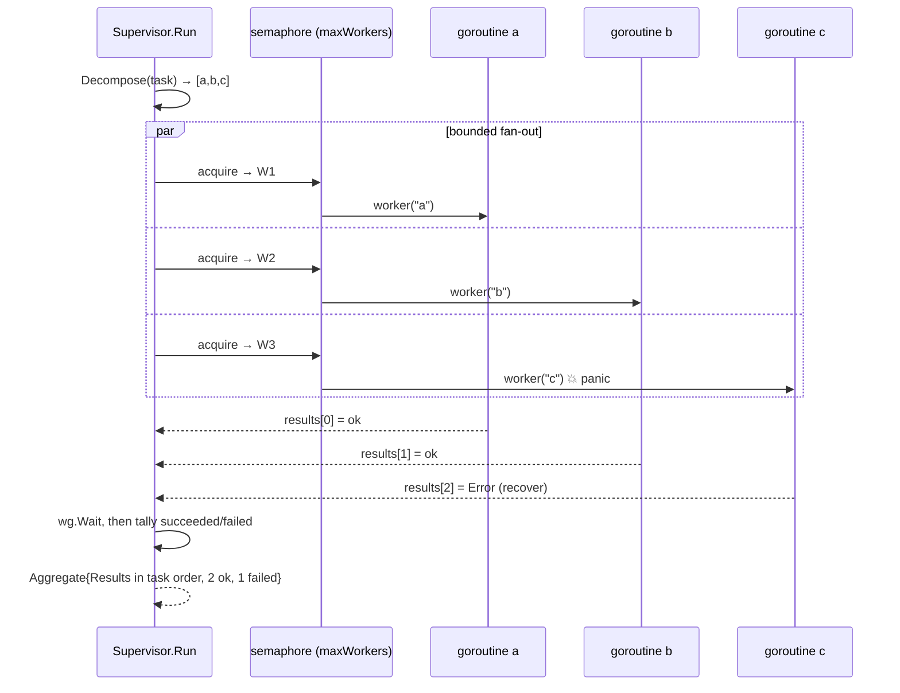

# Hierarchical Supervision: Bounded Fan-Out, Ordered Fan-In, Fault Isolation

*Lesson 6 of Harness Engineering in Go — a supervisor splits a task, fans out to concurrent workers behind a semaphore, and fans the results back in decomposition order, with each worker's failure (or panic) isolated to one result.*

---

This is Lesson 6 in the [Harness Engineering in Go](/blog/posts/harness-engineering-go-01-the-seam/) series. Every lesson so far has been one model call wrapped in some piece of infrastructure — a guardrail, a durable workflow, a sandbox, memory. This one is different: it's about running *many* model calls at once and getting a clean, ordered answer back even when one of them explodes.

## The pattern: decompose, fan out, fan in

A **supervisor** takes a task, breaks it into subtasks, runs each subtask on a **worker** (a sub-agent), and merges the outputs. The Microsoft Agent Framework calls this **Magentic** / concurrent orchestration: a manager agent that plans work and dispatches it to specialist sub-agents. The local `Supervisor` models the *concurrency contract* underneath that — bounded fan-out, ordered fan-in, per-worker fault isolation — and stubs the planning.

The `Worker` is the seam. In production it's a real LLM sub-agent invocation; in tests it's a plain function.

```go
// Worker is the seam for a sub-agent: inject a real LLM sub-agent call in
// production, or a plain function in tests. Returning an error reports a handled
// sub-agent failure; a panic is also contained (see Run).
type Worker func(subtask string) (string, error)
```



## The contract, stated as a struct

The whole point of this lesson lives in three types. `Aggregate` promises the results come back in **decomposition order, not completion order** — the doc comment says so out loud, because that promise is the thing the tests pin down.

```go
// SubResult is one sub-agent's outcome. Exactly one of Output / Error is
// meaningful: Error is empty on success, Output is empty when the worker failed.
type SubResult struct {
	Subtask string
	Output  string
	Error   string // isolated failure text, empty on success
}

// Aggregate is the fanned-in result of a supervised run, in decomposition order
// (NOT completion order).
type Aggregate struct {
	Results   []SubResult
	Succeeded int
	Failed    int
}
```

`Decompose` is deliberately dumb — split on `;` and newlines, trim, drop empties, and if nothing splits, treat the whole string as one subtask. Keeping it pure is what makes the concurrency behaviour the thing under test rather than an LLM planner's whims.

## The engine: bounded fan-out, ordered fan-in

Here is `Run`, the heart of the lesson. Read it once, then I'll pull apart the three moves that make it correct.

```go
func (s *Supervisor) Run(task string) Aggregate {
	subtasks := s.Decompose(task)
	results := make([]SubResult, len(subtasks))

	sem := make(chan struct{}, s.maxWorkers)
	var wg sync.WaitGroup

	for i, subtask := range subtasks {
		wg.Add(1)
		sem <- struct{}{} // acquire a slot (blocks past maxWorkers in flight)
		go func(index int, sub string) {
			defer wg.Done()
			defer func() { <-sem }() // release the slot

			output, err := s.callWorker(sub)
			if err != nil {
				results[index] = SubResult{Subtask: sub, Error: err.Error()}
				return
			}
			results[index] = SubResult{Subtask: sub, Output: output}
		}(i, subtask)
	}
	wg.Wait()

	succeeded := 0
	for _, r := range results {
		if r.Error == "" {
			succeeded++
		}
	}
	return Aggregate{Results: results, Succeeded: succeeded, Failed: len(results) - succeeded}
}
```

**Bounded fan-out.** `sem` is a buffered channel of `maxWorkers` slots. The send `sem <- struct{}{}` *before* launching a goroutine is the throttle: once `maxWorkers` are in flight, the loop itself blocks on the send until a running worker releases a slot. That's a semaphore in eight bytes of Go — no worker pool, no library. A real orchestrator bounds concurrent sub-agent invocations the same way, to keep from stampeding the model endpoint. (`maxWorkers < 1` is clamped to 1 in `NewSupervisor`, so a bad config degrades to serial execution instead of deadlocking on a zero-capacity channel.)

**Ordered fan-in.** `results` is *pre-sized* to `len(subtasks)`, and each goroutine writes to `results[index]` — its own original slot. No append, no mutex, no ordering by whoever finishes first. Two goroutines never touch the same index, so the writes are race-free without a lock, and the output slice is in decomposition order by construction. Completion order simply cannot leak into result order, because nothing about *when* a worker finishes affects *where* its result lands.

**Fault isolation.** Each subtask runs on its own goroutine, and a failing one writes an `Error` into its slot and returns. It never touches its siblings. One bad sub-agent produces one failed `SubResult`; the rest succeed.

## The part that bit me: a panic sinks the whole process

Here's the trap. In Go, a panic in a goroutine that nobody recovers doesn't return an error — it **crashes the entire program**. A `defer/recover` in the *parent* can't catch it, because recover only works on the same goroutine that's unwinding. So if a sub-agent panics (nil map, index out of range, a bad type assertion deep in some SDK), one flaky worker takes down every other in-flight subtask *and* the supervisor *and* the HTTP server. That is exactly the failure isolation is supposed to prevent.

The fix is one wrapper that recovers *inside* the worker's own goroutine and converts the panic into an ordinary error, so a panicking sub-agent is contained exactly like one that returned an error:

```go
// callWorker runs the worker and converts a panic into an error, so a sub-agent
// that panics is contained exactly like one that returns an error.
func (s *Supervisor) callWorker(subtask string) (output string, err error) {
	defer func() {
		if r := recover(); r != nil {
			err = fmt.Errorf("worker panicked: %v", r)
		}
	}()
	return s.worker(subtask)
}
```

The named return `err` is load-bearing: the deferred closure assigns to it *after* the `return` statement has run, so a recovered panic still leaves the function with a non-nil error. `Run` never distinguishes a returned error from a recovered panic — both are just `SubResult.Error`.

## The tests that prove the contract

Two tests are the whole argument. The first makes the fastest subtask finish last, and asserts the results still come back in task order:

```go
func TestSupervisorPreservesOrderDespiteCompletionRace(t *testing.T) {
	// First subtask sleeps longest, so completion order is the reverse of
	// decomposition order — the result must still come back in task order.
	worker := func(sub string) (string, error) {
		switch sub {
		case "a":
			time.Sleep(60 * time.Millisecond)
		case "b":
			time.Sleep(30 * time.Millisecond)
		}
		return "done:" + sub, nil
	}
	agg := NewSupervisor(worker, 4).Run("a; b; c")
	// ... asserts Results[0..2].Subtask == a, b, c
}
```

The second panics one worker and asserts the siblings survive: `Run("fine; panic")` comes back with `Failed == 1`, `Results[1].Error` mentions "panicked", and `Results[0]` is a clean success. One worker exploding does not sink the batch — the property the whole lesson exists to guarantee.

## State the leak

The doc comment on `Supervisor` is blunt about what this *isn't*:

> Real supervision is adaptive — the Magentic manager re-plans on sub-agent output, retries, and reasons about partial failure. This is a one-shot static fan-out: `Decompose` is a dumb string split with no re-planning.

Two honest gaps:

- **Static, not adaptive.** `Decompose` splits once and never looks at what came back. A real Magentic manager reads a sub-agent's output and *replans* — spawns follow-up subtasks, retries a failure, reroutes. There is no feedback loop here; the plan is fixed before the first worker runs.
- **Isolation covers faults, not liveness.** A worker that *returns* or *panics* is contained. A worker that **hangs forever** blocks its slot and, once every slot is stuck, blocks the whole batch — `wg.Wait()` never returns. There is no per-worker timeout or cancellation. That's deliberate: `context` cancellation is a real orchestrator's job, and faking it locally would obscure the one thing this lesson does teach well — that completion order must never leak into result order, and one failure must never sink its siblings.

When you wire the real Magentic orchestrator, you're adding the two things the stand-in leaves out — adaptive replanning and cancellation — onto a fan-out/fan-in skeleton whose shape you already trust.

## What's next

A supervisor can run a hundred sub-agents unattended. Some decisions shouldn't be unattended — a refund over a threshold, a destructive action, anything a human has to sign off on. The finale builds an approval gate that pauses a durable workflow, persists the pending state, and resumes only after a human says yes — combining Lesson 2's durability with a real human in the loop.

---

Next: [Human-in-the-Loop: An Approval Gate on Durable State](/blog/posts/harness-engineering-go-08-human-in-the-loop.html)
