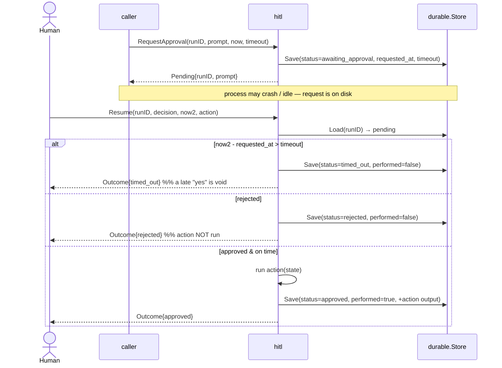
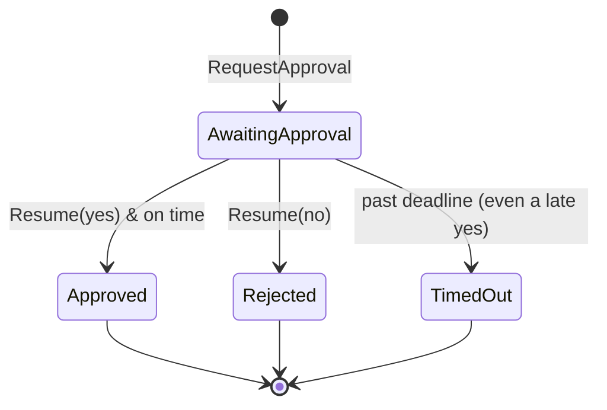

# Human-in-the-Loop: An Approval Gate on Durable State

*Lesson 7 of Harness Engineering in Go — a sensitive action pauses for a human decision, and the whole suspension is nothing more than a Lesson 2 checkpoint marked awaiting_approval.*

---

This is the finale of the [Harness Engineering in Go](/blog/posts/harness-engineering-go-01-the-seam/) series. Seven lessons in, the pattern I keep coming back to is that the interesting mechanics live *around* the model, never inside it. The last one is the most human of the seven: some actions are too consequential to run on the model's say-so. Issue a refund. Delete a table. Deploy to prod. Before those, the workflow should stop and ask a person.

The Microsoft Agent Framework calls this the **request/response executor** — an executor that *suspends* a workflow, emits a request to an external approver, and resumes when the reply arrives. My local `hitl` package is a stand-in for exactly that. And the thing that makes it click is that I didn't build a new durability mechanism for the "paused" state. The pause **is** a [Lesson 2](/blog/posts/harness-engineering-go-03-durable-execution.html) checkpoint. That's why Lesson 2 was the spine.

## Suspension is just a checkpoint

`RequestApproval` does one thing: it writes an "awaiting approval" checkpoint to the same `durable.Store` from Lesson 2, and returns *without touching the action*. The prompt, the requested-at instant, and the deadline all live inside the checkpoint's `state`.

```go
func RequestApproval(runID, prompt string, store durable.Store, now time.Time, timeout time.Duration) (Pending, error) {
	if timeout <= 0 {
		timeout = DefaultTimeout
	}
	err := store.Save(durable.Checkpoint{
		RunID: runID,
		Step:  0, // the gate; the caller has finished any pre-action work
		State: durable.State{
			"status":          statusAwaiting,
			"prompt":          prompt,
			"requested_at":    now.Format(timeFormat),
			"timeout_seconds": timeout.Seconds(),
			"performed":       false,
		},
	})
	if err != nil {
		return Pending{}, fmt.Errorf("hitl: park request: %w", err)
	}
	return Pending{RunID: runID, Prompt: prompt}, nil
}
```

Because the pending request is a checkpoint on disk, the process may crash, restart, or idle for a week — a resume loses nothing. That's the whole payoff. A human decision runs on human time, which is to say: unbounded and unreliable. If the "waiting" lived only in memory, a deploy or a crash between the ask and the answer would silently drop the request. Here it just sits in `checkpoints.json` (or Cosmos DB in production) until someone shows up.



## Resume: deadline first, then decision

`Resume` loads the pending checkpoint and resolves it. The order of checks is the important part.

```go
func Resume(runID string, decision bool, store durable.Store, now time.Time, action Action) (Outcome, error) {
	cp, err := loadPending(runID, store)
	if err != nil {
		return Outcome{}, err
	}

	requestedAt, _ := time.Parse(timeFormat, asString(cp.State["requested_at"]))
	timeout := time.Duration(asFloat(cp.State["timeout_seconds"]) * float64(time.Second))

	if overdue := now.Sub(requestedAt); overdue > timeout {
		// deadline is checked FIRST — a late "yes" is void
		return resolveTimeout(cp, store, now, overdue, timeout)
	}
	if !decision {
		// rejected — the action is NEVER run
		return resolveRejected(cp, store, now)
	}
	// approved & on time — run the action, record performed=true
	...
}
```

Three outcomes, and the discipline is in the sequencing:

- **Past the deadline → `timed_out`.** The deadline is checked *first*, against the injected `now`. If the approval window has closed, the action does not run — **even if the decision was yes**. A late approval is void, not "better late than never." Think about why: a refund approved a week after the customer already disputed the charge, or a deploy approved after the release it targeted was rolled back, is worse than no approval at all.
- **Rejected → `rejected`.** The action is not performed. Obvious, but it has to be enforced structurally, not by trusting the caller.
- **Approved and on time → run the action**, then save `performed=true` plus whatever the action returned, merged back into the checkpoint. "The action ran" is itself durable — you can reload the run later and see that it happened.



## Injected clock, deterministic deadlines

Notice that every function takes `now time.Time` as an argument and never reads the wall clock. That is the single design decision that makes deadline behavior *testable*. The test file pins a fixed instant and moves it by hand:

```go
var base = time.Date(2026, 7, 11, 12, 0, 0, 0, time.UTC)

func TestLateApprovalTimesOut(t *testing.T) {
	store := newStore(t)
	_, _ = RequestApproval("r3", "deploy to prod?", store, base, time.Hour)

	ran := false
	action := func(s durable.State) (durable.State, error) { ran = true; return nil, nil }
	// A "yes" that arrives two hours after a one-hour window is void.
	out, _ := Resume("r3", true, store, base.Add(2*time.Hour), action)
	if out.Status != "timed_out" {
		t.Fatalf("status = %s, want timed_out", out.Status)
	}
	if ran {
		t.Fatal("a late yes must NOT run the action")
	}
}
```

No `time.Sleep`, no flaky "wait an hour" test. `base.Add(2*time.Hour)` is a value, not a wait. The companion tests cover the other branches with the same trick: approve-on-time runs the action and merges its output; reject never runs it; a nil action still resolves to `approved`; and resuming an already-resolved run errors, because the gate is no longer `awaiting_approval`.

## State the leak

This is where honesty matters most, because approvals are exactly where a naive stand-in feels most complete and is most incomplete.

> **State the leak:** a real request/response executor also **routes** the request to a person (a Teams card, an email, a web form), authenticates *who* may approve, and correlates their reply back to the right run. This stand-in does none of that — the "approver" is simply whoever calls `Resume`, with no identity, notification, or auth.

Read that carefully. My gate teaches the *suspend / resume / deadline* shape — the durable state machine. It does not teach the human plumbing, and that plumbing is most of the real work: who gets pinged, whether they're allowed to say yes, and how a "yes" typed into a Teams card finds its way back to run `r3`. In production, the Agent Framework executor and your identity provider own that; the Cosmos DB suspension is the only piece my `durable.Store` genuinely mirrors.

There's a second, quieter leak carried over from Lesson 2: **execution is at-least-once, not exactly-once.** On approval the order is `load → action() → save-terminal-checkpoint`. A crash *after* the action runs but *before* the terminal checkpoint is written leaves the run still `awaiting_approval` — so a re-`Resume` runs the action **again**. The injected `action` must therefore be idempotent, which is doubly important here because it's sensitive by definition. Issuing a refund twice is not a rounding error. In practice you make the action idempotent with an idempotency key (`refund_id: rf_123`) so the payment provider dedupes the retry.

## The seven-pattern arc

Stepping back, the series built one harness, one seam at a time:

1. **Guardrails** — a hard block wrapping the model call.
2. **Durable execution** — checkpoint each step, resume after a crash. *The spine.*
3. **Retries** — bounded, jittered backoff around flaky calls.
4. **Memory** — an append-only thread of turns.
5. **Structured output** — validate the model's JSON against a schema, or reject it.
6. **Routing** — pick a tool/sub-agent by intent.
7. **Human-in-the-loop** — this post: a durable approval gate, built on lesson 2.

Every one of them is the same move: an Azure primitive (Content Safety, Cosmos DB, Foundry, AI Search, a request/response executor) named explicitly, then stood in for by a small Go struct behind an interface, with the leak stated out loud. The caller never learns which side of the seam it's on.

## What's next

There is exactly one seam left un-swapped, and it's the one I stubbed on purpose in Lesson 1: the agent call itself. Every lesson routes around a `// --- agent call (STUB) ---` that echoes the input back. The remaining step — the real one — is to replace that stub with a `foundryprovider` run from microsoft/agent-framework-go, so the guardrails guard a real model, the durable workflow checkpoints real tool calls, and this approval gate pauses a genuinely consequential action. Everything around it already tests offline, runs deterministically, and states where it's weaker than the managed service. That was the whole point: build the harness first, drop the model in last, and never be surprised by the seam.

---

Next: [My upstream Microsoft Agent Framework Go contributions](/agent-framework/)
