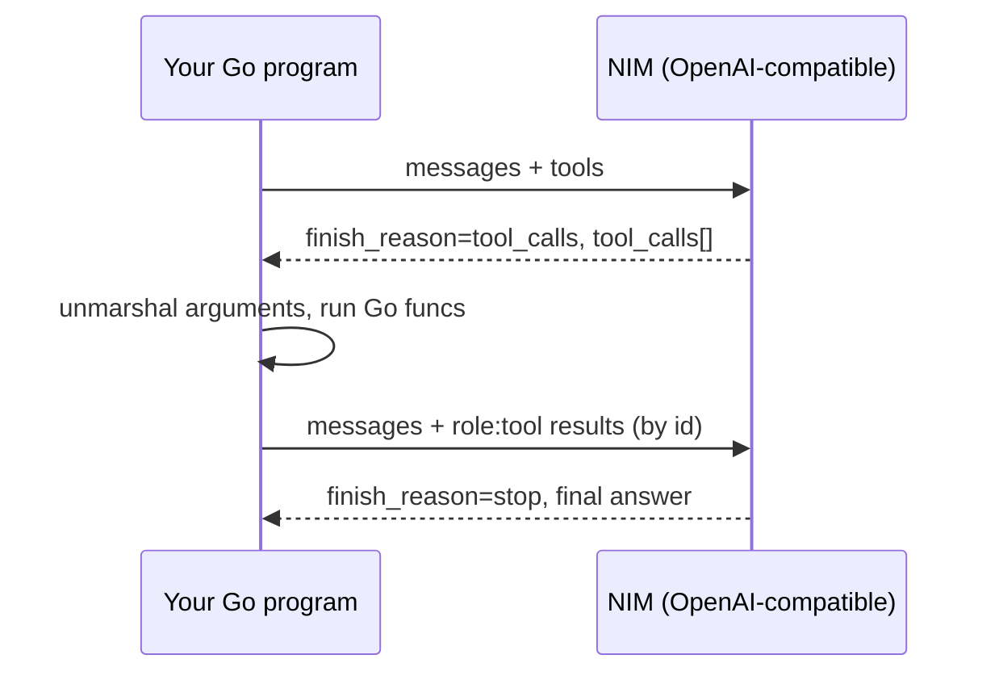

# Tool Calling with NIM

*How to drive function calling against NVIDIA NIM models from plain Go, building the full request-execute-respond round-trip over the OpenAI-compatible REST API with net/http.*

---

A chat model can describe how to check the weather, but it cannot open a socket and go read a thermometer. **Tool calling** — also called function calling — is the protocol that closes that gap: you tell the model which functions exist and what arguments they take, the model decides when one is needed and hands you a structured call, *you* run the real code, and you feed the result back so the model can finish its answer in natural language.

NVIDIA NIM (NVIDIA Inference Microservices) exposes chat completions over an **OpenAI-compatible REST API**. There is no NVIDIA Go SDK — and you don't need one. In [post 2](/blog/) we built a small typed client around `net/http` that talks to `https://integrate.api.nvidia.com/v1` (or a self-hosted NIM endpoint) with a `Bearer nvapi-...` key. This post extends that same client to support the full tool-calling loop. Because the wire format is the OpenAI shape, everything you learn here transfers to any other OpenAI-compatible provider with only a base-URL and key change.

One honest caveat up front: **not every model in the catalog supports tool calling.** It is a per-model capability. Check the model card on [build.nvidia.com](https://build.nvidia.com/) before you rely on it — a model that doesn't support tools will simply ignore the `tools` array and answer in prose, which is a bug you want to catch by inspecting `finish_reason`, not by staring at empty output.

---

## The shape of the round-trip

Tool calling is a conversation, not a single call. The flow is always the same:

1. You send the message history **plus** a list of tool definitions (name, description, JSON-schema parameters).
2. The model either answers normally, or responds with `finish_reason: "tool_calls"` and a list of calls it wants made — each with an `id`, a function `name`, and an `arguments` **JSON string**.
3. For each requested call, you decode the arguments, run the corresponding Go function, and append a message with `role: "tool"`, the matching `tool_call_id`, and the result as its `content`.
4. You send the whole history again. The model may answer, or ask for more tools. You loop until it answers.

That loop — with a hard iteration cap — is the heart of this post.



---

## Extending the post-2 types

The client from post 2 already had `ChatRequest`, `Message`, and `ChatResponse`. Tool calling adds three things: a `Tools` field on the request, a `ToolCalls` slice on the response message, and a couple of new fields on `Message` so we can send tool results back. Everything is still plain structs with `encoding/json` tags.

```go
package nim

// Tool is one function the model is allowed to call.
type Tool struct {
	Type     string   `json:"type"` // always "function" today
	Function Function `json:"function"`
}

// Function describes a callable: its name, a natural-language
// description the model reads, and a JSON-schema parameters object.
type Function struct {
	Name        string         `json:"name"`
	Description string         `json:"description"`
	Parameters  map[string]any `json:"parameters"`
}

// ToolCall is what the model sends back when it wants a function run.
type ToolCall struct {
	ID       string `json:"id"`
	Type     string `json:"type"` // "function"
	Function struct {
		Name string `json:"name"`
		// Arguments is a JSON *string*, not a nested object.
		Arguments string `json:"arguments"`
	} `json:"function"`
}

// Message covers user, assistant, system, and tool roles.
type Message struct {
	Role    string `json:"role"`
	Content string `json:"content,omitempty"`
	// Set on assistant messages that request tools.
	ToolCalls []ToolCall `json:"tool_calls,omitempty"`
	// Set on role:"tool" messages you send back.
	ToolCallID string `json:"tool_call_id,omitempty"`
}

type ChatRequest struct {
	Model    string    `json:"model"`
	Messages []Message `json:"messages"`
	Tools    []Tool    `json:"tools,omitempty"`
}

type ChatResponse struct {
	Choices []struct {
		FinishReason string  `json:"finish_reason"`
		Message      Message `json:"message"`
	} `json:"choices"`
}
```

The `omitempty` tags matter. When there are no tools, the `tools` key vanishes from the request body, so the same struct serves both plain and tool-enabled calls. When an assistant message is a plain answer, `tool_calls` is absent; when it's a tool request, `content` is usually empty and `tool_calls` is populated.

**The gotcha:** `tool_calls[].function.arguments` is a **JSON string**, not a nested JSON object. The wire literally contains something like `"arguments": "{\"city\":\"Pune\"}"` — a string whose contents you must `json.Unmarshal` a *second* time. Model that field as `string` in Go (as above). If you type it as `map[string]any`, decoding the response will fail outright. Decode the inner string into a typed struct per tool; don't index a raw map and hope the key exists.

---

## Declaring a tool: build the schema in Go

The `parameters` field is a JSON Schema object. You can write it as a Go `map[string]any` literal — no external schema library needed. Here is a weather tool and a calculator tool, each paired with the real Go function that implements it.

```go
// weatherArgs is the typed shape we expect inside the arguments string.
type weatherArgs struct {
	City string `json:"city"`
	Unit string `json:"unit"` // "celsius" or "fahrenheit"
}

var weatherTool = Tool{
	Type: "function",
	Function: Function{
		Name:        "get_current_weather",
		Description: "Get the current weather for a city. Returns temperature and conditions.",
		Parameters: map[string]any{
			"type": "object",
			"properties": map[string]any{
				"city": map[string]any{
					"type":        "string",
					"description": "City name, e.g. 'Pune' or 'Munich'.",
				},
				"unit": map[string]any{
					"type":        "string",
					"enum":        []string{"celsius", "fahrenheit"},
					"description": "Temperature unit. Defaults to celsius.",
				},
			},
			"required": []string{"city"},
		},
	},
}

// getCurrentWeather is the real function. In production this would hit a
// weather API; here it returns a deterministic stub so the loop is clear.
func getCurrentWeather(a weatherArgs) (string, error) {
	unit := a.Unit
	if unit == "" {
		unit = "celsius"
	}
	temp := 24
	if unit == "fahrenheit" {
		temp = 75
	}
	out := map[string]any{
		"city":       a.City,
		"unit":       unit,
		"temp":       temp,
		"conditions": "clear",
	}
	b, err := json.Marshal(out)
	return string(b), err
}
```

Two design notes carried straight from the schema. The `description` on both the function and each property is not decoration — it is the *only* thing the model reads to decide which tool to call and how to fill the arguments. Invest in it. And `required` lists the properties the model must supply; leave `unit` out of `required` and give it an `enum`, and the model will either omit it or pick a valid value.

A second tool follows the same mould. The calculator shows a different argument shape and an operation the model genuinely cannot do reliably on its own:

```go
type calcArgs struct {
	Op string  `json:"op"` // add, sub, mul, div
	A  float64 `json:"a"`
	B  float64 `json:"b"`
}

var calcTool = Tool{
	Type: "function",
	Function: Function{
		Name:        "calculate",
		Description: "Perform exact arithmetic on two numbers.",
		Parameters: map[string]any{
			"type": "object",
			"properties": map[string]any{
				"op": map[string]any{
					"type": "string",
					"enum": []string{"add", "sub", "mul", "div"},
				},
				"a": map[string]any{"type": "number"},
				"b": map[string]any{"type": "number"},
			},
			"required": []string{"op", "a", "b"},
		},
	},
}

func calculate(a calcArgs) (string, error) {
	var r float64
	switch a.Op {
	case "add":
		r = a.A + a.B
	case "sub":
		r = a.A - a.B
	case "mul":
		r = a.A * a.B
	case "div":
		if a.B == 0 {
			return "", errors.New("division by zero")
		}
		r = a.A / a.B
	default:
		return "", fmt.Errorf("unknown op %q", a.Op)
	}
	return fmt.Sprintf("%g", r), nil
}
```

---

## Dispatching a tool call defensively

Between "the model asked for `calculate`" and "run the Go function" sits the decode step, and it is where most bugs live. Route by name, unmarshal the arguments string into the *right* typed struct, and always produce a `role: "tool"` message that echoes the call's `id` — even on error, so the model can recover.

```go
// runToolCall executes one requested call and returns the tool-role reply.
func runToolCall(tc ToolCall) Message {
	reply := Message{Role: "tool", ToolCallID: tc.ID}

	var result string
	var err error
	switch tc.Function.Name {
	case "get_current_weather":
		var a weatherArgs
		if err = json.Unmarshal([]byte(tc.Function.Arguments), &a); err == nil {
			result, err = getCurrentWeather(a)
		}
	case "calculate":
		var a calcArgs
		if err = json.Unmarshal([]byte(tc.Function.Arguments), &a); err == nil {
			result, err = calculate(a)
		}
	default:
		err = fmt.Errorf("model requested unknown tool %q", tc.Function.Name)
	}

	if err != nil {
		// Report the error as the tool result. The model can read it,
		// apologise, or try different arguments on the next turn.
		reply.Content = fmt.Sprintf(`{"error": %q}`, err.Error())
		return reply
	}
	reply.Content = result
	return reply
}
```

**The gotcha:** every tool result **must** carry the exact `tool_call_id` from the call it answers. The API pairs each `role:"tool"` message to the assistant's pending call by that id; if you drop it, swap two ids, or send fewer results than there were calls, the next request is malformed and the model can't continue. Return one tool message per tool call, each with its own id — never merge multiple results into one message.

---

## The loop, with a cap

Now assemble the pieces. Seed the conversation, then loop: call the API, and if the finish reason is `tool_calls`, run every requested call, append the assistant's request message *and* all the tool replies, and go around again. Stop when the model answers normally — or when you hit the iteration cap.

```go
func RunConversation(ctx context.Context, c *Client, model, userPrompt string) (string, error) {
	messages := []Message{
		{Role: "system", Content: "You are a helpful assistant. Use tools when they help."},
		{Role: "user", Content: userPrompt},
	}
	tools := []Tool{weatherTool, calcTool}

	const maxIters = 6 // hard cap so a misbehaving model can't loop forever
	for i := 0; i < maxIters; i++ {
		resp, err := c.CreateChatCompletion(ctx, ChatRequest{
			Model:    model,
			Messages: messages,
			Tools:    tools,
		})
		if err != nil {
			return "", fmt.Errorf("iteration %d: %w", i, err)
		}
		if len(resp.Choices) == 0 {
			return "", errors.New("no choices in response")
		}

		choice := resp.Choices[0]

		// Normal answer: we're done.
		if choice.FinishReason != "tool_calls" {
			return choice.Message.Content, nil
		}

		// Tool round: append the assistant's request, then every result.
		messages = append(messages, choice.Message)
		for _, tc := range choice.Message.ToolCalls {
			messages = append(messages, runToolCall(tc))
		}
	}
	return "", fmt.Errorf("gave up after %d tool iterations", maxIters)
}
```

`CreateChatCompletion` is the post-2 method: it marshals the `ChatRequest`, POSTs to `{baseURL}/chat/completions` with the `Authorization: Bearer nvapi-...` header and `Content-Type: application/json`, checks the status code, and decodes the body into `ChatResponse`. Nothing about it changes for tool calling — the new fields ride along in the same JSON body.

Note the ordering inside the tool round. You append the **assistant's own message** (the one containing `tool_calls`) first, then the tool replies. The history the model sees must read: user asked → assistant requested tools → tools returned results. Skip the assistant message and the tool replies dangle with no call to attach to.

---

## Handling multiple tool calls in one turn

A capable model may ask for several tools at once — "what's the weather in Pune and Munich, and what's 19% of 4200?" can come back as three entries in a single `tool_calls` array. The loop above already handles this: the inner `for _, tc := range choice.Message.ToolCalls` runs each one and appends its own tool-role message. The key is that all of them must be answered **before** the next API call, each keyed to its own id.

On the wire, one such assistant turn looks like this:

```json
{
  "choices": [{
    "finish_reason": "tool_calls",
    "message": {
      "role": "assistant",
      "content": null,
      "tool_calls": [
        {"id": "call_a1", "type": "function",
         "function": {"name": "get_current_weather",
                      "arguments": "{\"city\": \"Pune\"}"}},
        {"id": "call_b2", "type": "function",
         "function": {"name": "calculate",
                      "arguments": "{\"op\": \"mul\", \"a\": 4200, \"b\": 0.19}"}}
      ]
    }
  }]
}
```

You reply with two messages, `{"role":"tool","tool_call_id":"call_a1", ...}` and `{"role":"tool","tool_call_id":"call_b2", ...}`, and send the lot back. If the tools are independent and slow, run them in goroutines and collect the results — just make sure you preserve the id pairing when you assemble the messages.

---

## When a model ignores your tools

Because tool support varies by model, you should treat "the model answered in prose" as a normal branch, not a failure. If `finish_reason` is anything other than `"tool_calls"` — `"stop"`, `"length"`, or a content filter — the model chose not to call a tool, and `choice.Message.Content` holds its answer. That is exactly what the loop returns.

**The gotcha:** a model that doesn't support tools won't error — it just never emits `tool_calls`, so it answers from its own knowledge (and may be wrong about your weather or your arithmetic). The only signal is behavioural. Branch on `finish_reason`, and if you *require* a tool to have run, verify it explicitly rather than assuming the array will be there. Check the model card on the NVIDIA API catalog before depending on tool calling in production.

---

## Same shape everywhere

| Piece | Field / value | Notes |
|---|---|---|
| Endpoint | `POST {baseURL}/chat/completions` | `https://integrate.api.nvidia.com/v1` or self-hosted |
| Auth | `Authorization: Bearer nvapi-...` | same key as plain chat |
| Declare tools | `tools: [{type:"function", function:{...}}]` | `parameters` is a JSON Schema object |
| Model wants a call | `finish_reason == "tool_calls"` | plus `message.tool_calls[]` |
| Arguments | `tool_calls[].function.arguments` | a **JSON string** — unmarshal it |
| Send result | `{role:"tool", tool_call_id, content}` | one per call, id must match |
| Terminate | any other `finish_reason` | model's prose answer is final |

None of this is NVIDIA-specific in structure — it is the OpenAI tool-calling contract, which NIM implements. Point the same `Client` at another OpenAI-compatible endpoint by swapping the base URL and key, and the `Tool`, `ToolCall`, and loop code work unchanged. That portability is the whole reason to build against the wire format directly in Go instead of waiting for a vendor SDK that doesn't exist.

---

## Key takeaways

- **NIM speaks the OpenAI tool-calling shape over REST.** No Go SDK is needed; extend the post-2 `net/http` client with `Tools`, `ToolCalls`, and a `role:"tool"` message and you have everything.
- **`arguments` is a JSON string, decoded twice.** Model it as `string`, then `json.Unmarshal` it into a typed struct per tool. Never index a raw map blindly.
- **Every tool result must echo its `tool_call_id`.** One message per call; a missing or mismatched id makes the next turn malformed.
- **Always loop with a hard cap.** The model may call tools several times; a bad prompt can loop forever, so bound the iterations and fail loudly.
- **Branch on `finish_reason`.** Tool support is per-model — a model that ignores tools just answers in prose. Check the model card, and verify a tool ran if your logic depends on it.

---

## Further reading

- [NVIDIA NIM for LLMs — Function Calling](https://docs.nvidia.com/nim/large-language-models/latest/function-calling.html) — the official NIM function-calling reference and per-model support notes.
- [NVIDIA API Catalog (build.nvidia.com)](https://build.nvidia.com/) — model cards; check each model's tool-calling support before you rely on it.
- [OpenAI function calling guide](https://platform.openai.com/docs/guides/function-calling) — the reference for the tool-calling wire shape NIM implements.
- [Go `encoding/json` package](https://pkg.go.dev/encoding/json) — marshalling, `omitempty`, and decoding the nested arguments string.
