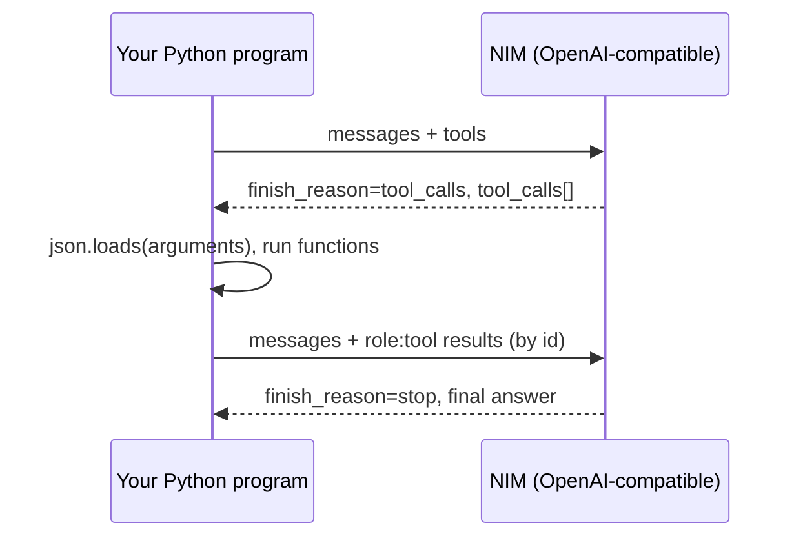

# Tool Calling with NIM

*Driving function calling against NVIDIA NIM models from Python — the full request-execute-respond loop with the plain `openai` client, then the same thing automated by `ChatNVIDIA.bind_tools`.*

---

A chat model can tell you, in fluent prose, exactly how to look up today's weather. What it cannot do is open a socket, hit a weather API, and read back a real number. **Tool calling** — function calling, if you prefer that name — is the protocol that bridges that gap. You describe the functions that exist and the arguments they take; the model decides when one is needed and hands you a structured request; *you* run the actual Python; and you feed the result back so the model can finish its answer with real data in hand.

NVIDIA NIM (NVIDIA Inference Microservices) serves chat completions over an **OpenAI-compatible API**. In [post 2](/blog/) we called NIM two ways: the plain `openai` Python client pointed at `https://integrate.api.nvidia.com/v1` with an `nvapi-...` key, and LangChain's `ChatNVIDIA`. Both carry straight over to tool calling, and this post builds the round-trip on each. Because the wire format is the OpenAI shape, everything here transfers to any other OpenAI-compatible endpoint with only a base URL and key change.

One honest caveat before we start: **not every model in the catalog supports tool calling.** It is a per-model capability. Check the model card on [build.nvidia.com](https://build.nvidia.com/) before you depend on it — a model that doesn't support tools will simply ignore your `tools` array and answer in prose, which is a failure mode you catch by inspecting `finish_reason`, not by staring at empty output.

---

## The shape of the round-trip

Tool calling is a conversation, not a single request. The flow is always the same four beats:

1. You send the message history **plus** a list of tool definitions (each a name, a description, and a JSON-schema `parameters` object).
2. The model either answers normally, or comes back with `finish_reason == "tool_calls"` and a list of calls it wants made — each with an `id`, a function `name`, and an `arguments` field that is a **JSON string**.
3. For each requested call you decode the arguments, run the matching Python function, and append a message with `role: "tool"`, the exact `tool_call_id`, and the result as its `content`.
4. You send the whole history again. The model answers, or asks for more tools. You loop until it answers.

That loop — with a hard iteration cap — is the heart of this post.



---

## The raw path: the `openai` client

Start from the client we built in post 2. The `openai` package works unchanged against NIM — you only change the `base_url` and pass your NVIDIA key.

```python
import os
from openai import OpenAI

client = OpenAI(
    base_url="https://integrate.api.nvidia.com/v1",
    api_key=os.environ["NVIDIA_API_KEY"],  # an nvapi-... key
)

MODEL = "meta/llama-3.1-70b-instruct"  # a tool-capable model; check the card
```

### Declaring a tool as a schema dict

A tool declaration is a plain Python dict — no schema library required. The `type` is always `"function"` today, and `parameters` is a JSON Schema object describing the arguments. Here are two tools: a weather lookup and a calculator, each paired with the real function that backs it.

```python
tools = [
    {
        "type": "function",
        "function": {
            "name": "get_current_weather",
            "description": (
                "Get the current weather for a city. "
                "Returns temperature and conditions."
            ),
            "parameters": {
                "type": "object",
                "properties": {
                    "city": {
                        "type": "string",
                        "description": "City name, e.g. 'Pune' or 'Munich'.",
                    },
                    "unit": {
                        "type": "string",
                        "enum": ["celsius", "fahrenheit"],
                        "description": "Temperature unit. Defaults to celsius.",
                    },
                },
                "required": ["city"],
            },
        },
    },
    {
        "type": "function",
        "function": {
            "name": "calculate",
            "description": "Perform exact arithmetic on two numbers.",
            "parameters": {
                "type": "object",
                "properties": {
                    "op": {"type": "string", "enum": ["add", "sub", "mul", "div"]},
                    "a": {"type": "number"},
                    "b": {"type": "number"},
                },
                "required": ["op", "a", "b"],
            },
        },
    },
]
```

Two design notes sit right there in the schema. The `description` on the function *and* on each property is not decoration — it is the only text the model reads to decide which tool to call and how to fill the arguments. Invest in it. And `required` lists the properties the model must supply; because `unit` is left out of `required` and given an `enum`, the model will either omit it or pick a valid value.

Now the real functions. In production `get_current_weather` would hit a weather API; here it returns a deterministic stub so the loop stays legible. Both return a JSON string, which is the most robust thing to hand back as tool `content`.

```python
import json

def get_current_weather(city: str, unit: str = "celsius") -> str:
    temp = 75 if unit == "fahrenheit" else 24
    return json.dumps(
        {"city": city, "unit": unit, "temp": temp, "conditions": "clear"}
    )

def calculate(op: str, a: float, b: float) -> str:
    if op == "add":
        r = a + b
    elif op == "sub":
        r = a - b
    elif op == "mul":
        r = a * b
    elif op == "div":
        if b == 0:
            raise ValueError("division by zero")
        r = a / b
    else:
        raise ValueError(f"unknown op {op!r}")
    return json.dumps({"result": r})

DISPATCH = {"get_current_weather": get_current_weather, "calculate": calculate}
```

### Dispatching a tool call defensively

Between "the model asked for `calculate`" and "the function ran" sits the decode step, and that is where most bugs live. The model returns `tool_call.function.arguments` as a **string** containing JSON — you must parse it before you can call anything.

```python
def run_tool_call(tool_call) -> dict:
    """Execute one requested call, return a role:'tool' message dict."""
    name = tool_call.function.name
    fn = DISPATCH.get(name)

    try:
        # arguments is a JSON *string* — parse it into a dict of kwargs.
        args = json.loads(tool_call.function.arguments or "{}")
    except json.JSONDecodeError as exc:
        content = json.dumps({"error": f"could not parse arguments: {exc}"})
        return {"role": "tool", "tool_call_id": tool_call.id, "content": content}

    if fn is None:
        content = json.dumps({"error": f"unknown tool {name!r}"})
    else:
        try:
            content = fn(**args)
        except Exception as exc:  # surface tool errors to the model, don't crash
            content = json.dumps({"error": str(exc)})

    return {"role": "tool", "tool_call_id": tool_call.id, "content": content}
```

**The gotcha:** `tool_call.function.arguments` is a **JSON string**, not a parsed dict. The wire literally contains something like `"arguments": "{\"city\": \"Pune\"}"` — a string you must `json.loads` a second time before you can use it. If you call `fn(**tool_call.function.arguments)` directly you'll splat a string, not keyword arguments, and get a `TypeError`. Parse first, and wrap the parse in its own `try/except`: a model can emit malformed or truncated JSON, and you'd rather report that back as a tool error than crash the loop.

**The gotcha:** every tool result **must** echo the exact `tool_call_id` from the call it answers. NIM pairs each `role:"tool"` message to the assistant's pending call by that id. Drop it, swap two ids, or send fewer results than there were calls, and the next request is malformed — the model can't continue. Return one tool message per tool call, each with its own id; never merge several results into a single message.

### The loop, with a cap

Now assemble it. Seed the conversation, then loop: call the API, and if the finish reason is `"tool_calls"`, append the assistant's message, run every requested call, append each result, and go around again. Stop when the model answers normally — or when you hit the cap.

```python
def run_conversation(user_prompt: str, max_iters: int = 6) -> str:
    messages = [
        {"role": "system", "content": "You are a helpful assistant. Use tools when they help."},
        {"role": "user", "content": user_prompt},
    ]

    for _ in range(max_iters):
        resp = client.chat.completions.create(
            model=MODEL,
            messages=messages,
            tools=tools,
        )
        choice = resp.choices[0]

        # Normal answer: we're done.
        if choice.finish_reason != "tool_calls":
            return choice.message.content

        # Tool round: append the assistant's request, then every result.
        # model_dump() turns the SDK object into a plain dict for the history.
        messages.append(choice.message.model_dump(exclude_none=True))
        for tool_call in choice.message.tool_calls:
            messages.append(run_tool_call(tool_call))

    raise RuntimeError(f"gave up after {max_iters} tool iterations")
```

**The gotcha:** always bound the loop. The model may legitimately call tools several times in a row, but a bad prompt, a confusing tool description, or a model that keeps re-asking for the same call can loop forever and burn tokens. A hard `max_iters` cap that fails loudly is cheap insurance.

Note the ordering inside the tool round. You append the **assistant's own message** (the one carrying `tool_calls`) *first*, then the tool replies. The history the model sees must read: user asked → assistant requested tools → tools returned results. Skip the assistant message and the tool replies dangle with no call to attach to, and the next request is rejected. Using `choice.message.model_dump(exclude_none=True)` preserves the `tool_calls` structure exactly as the model sent it — don't hand-rebuild that message, or you risk dropping a field the API expects.

---

## Handling multiple tool calls in one turn

A capable model can ask for several tools at once. "What's the weather in Pune and Munich, and what's 19% of 4200?" may come back as three entries in a single `tool_calls` array. The loop above already handles this — the inner `for tool_call in choice.message.tool_calls` runs each one and appends its own `role:"tool"` message. The rule is that *all* of them must be answered before the next API call, each keyed to its own id.

On the wire, one such assistant turn looks like this:

```json
{
  "choices": [{
    "finish_reason": "tool_calls",
    "message": {
      "role": "assistant",
      "content": null,
      "tool_calls": [
        {"id": "call_a1", "type": "function",
         "function": {"name": "get_current_weather",
                      "arguments": "{\"city\": \"Pune\"}"}},
        {"id": "call_b2", "type": "function",
         "function": {"name": "calculate",
                      "arguments": "{\"op\": \"mul\", \"a\": 4200, \"b\": 0.19}"}}
      ]
    }
  }]
}
```

You reply with two messages — `{"role": "tool", "tool_call_id": "call_a1", ...}` and `{"role": "tool", "tool_call_id": "call_b2", ...}` — and send the lot back. Notice `content` on the assistant message is `null`; that is normal for a pure tool request. If the tools are independent and slow, run them concurrently (a `ThreadPoolExecutor`, or `asyncio` with `AsyncOpenAI`) and collect the results — just preserve the id pairing when you assemble the messages, because order in the list doesn't rescue a wrong id.

---

## The LangChain path: `ChatNVIDIA.bind_tools`

The raw loop shows exactly what's happening on the wire, but LangChain automates most of the plumbing. With `langchain-nvidia-ai-endpoints`, you decorate a Python function with `@tool`, `bind_tools` it onto `ChatNVIDIA`, and the framework builds the JSON schema from your signature and docstring for you.

```python
from langchain_core.tools import tool
from langchain_core.messages import HumanMessage, ToolMessage
from langchain_nvidia_ai_endpoints import ChatNVIDIA

@tool
def get_current_weather(city: str, unit: str = "celsius") -> str:
    """Get the current weather for a city. Returns temperature and conditions."""
    temp = 75 if unit == "fahrenheit" else 24
    return json.dumps({"city": city, "unit": unit, "temp": temp, "conditions": "clear"})

@tool
def calculate(op: str, a: float, b: float) -> str:
    """Perform exact arithmetic (add, sub, mul, div) on two numbers."""
    ops = {"add": a + b, "sub": a - b, "mul": a * b}
    if op == "div":
        if b == 0:
            raise ValueError("division by zero")
        return json.dumps({"result": a / b})
    if op not in ops:
        raise ValueError(f"unknown op {op!r}")
    return json.dumps({"result": ops[op]})

llm = ChatNVIDIA(model="meta/llama-3.1-70b-instruct")
llm_with_tools = llm.bind_tools([get_current_weather, calculate])
```

The `@tool` decorator reads the function's type hints to build the `parameters` schema and its **docstring** to build the description — the same two fields you wrote by hand above, now derived automatically. The loop is the same shape, but you work with message objects instead of dicts:

```python
tool_registry = {"get_current_weather": get_current_weather, "calculate": calculate}

def run_conversation_lc(user_prompt: str, max_iters: int = 6) -> str:
    messages = [HumanMessage(user_prompt)]

    for _ in range(max_iters):
        ai_msg = llm_with_tools.invoke(messages)
        messages.append(ai_msg)

        if not ai_msg.tool_calls:  # no calls requested -> final answer
            return ai_msg.content

        for call in ai_msg.tool_calls:
            # LangChain already parsed the arguments into a dict for you.
            selected = tool_registry[call["name"]]
            result = selected.invoke(call["args"])
            messages.append(ToolMessage(result, tool_call_id=call["id"]))

    raise RuntimeError(f"gave up after {max_iters} tool iterations")
```

**The gotcha:** LangChain parses `arguments` for you — `call["args"]` is already a dict, so there is no `json.loads` step and no double-decode. That's the main convenience `bind_tools` buys. But the id discipline is identical under the hood: `ToolMessage(..., tool_call_id=call["id"])` must echo the id LangChain surfaced, and you still append the `AIMessage` before the `ToolMessage`s. The framework hides the JSON string; it does not remove the pairing rule.

---

## When a model ignores your tools

Because tool support varies by model, treat "the model answered in prose" as a normal branch, not an error. With the raw client, any `finish_reason` other than `"tool_calls"` — `"stop"`, `"length"`, a content filter — means the model chose to answer directly, and `choice.message.content` holds that answer. With LangChain, an empty `ai_msg.tool_calls` list means the same thing. Both loops above return in exactly that case.

**The gotcha:** a model that *doesn't support* tool calling won't raise an error. It just never emits `tool_calls` and answers from its own knowledge — which may be confidently wrong about your weather or your arithmetic. The only signal is behavioural: no tool call arrives. Branch on `finish_reason` (or the empty `tool_calls` list), and if your logic *requires* a tool to have run, verify it explicitly rather than assuming the array will be populated. Confirm the model card lists function-calling support before you depend on it in production.

---

## Same shape everywhere

| Piece | Raw `openai` client | LangChain `ChatNVIDIA` |
|---|---|---|
| Declare tools | `tools=[{"type":"function", ...}]` dicts | `@tool` functions + `bind_tools([...])` |
| Model wants a call | `finish_reason == "tool_calls"` | non-empty `ai_msg.tool_calls` |
| Arguments | `tool_call.function.arguments` — JSON **string**, `json.loads` it | `call["args"]` — already a dict |
| Send result | `{"role":"tool", "tool_call_id", "content"}` | `ToolMessage(result, tool_call_id=...)` |
| Terminate | any other `finish_reason` | empty `tool_calls` |
| Loop safety | hard `max_iters` cap | hard `max_iters` cap |

None of this is NVIDIA-specific in structure — it is the OpenAI tool-calling contract, which NIM implements. Point the same `OpenAI` client (or the same LangChain code, swapping the chat model) at another OpenAI-compatible endpoint and the tools, the loop, and the id rules work unchanged. That portability is the payoff of building against the wire format directly.

---

## Key takeaways

- **NIM speaks the OpenAI tool-calling shape.** Send `tools=[{"type":"function", "function":{...}}]`, watch for `finish_reason == "tool_calls"`, answer with `role:"tool"` messages — nothing NVIDIA-specific in the mechanics.
- **`arguments` is a JSON string, decoded twice.** With the raw client, `json.loads` it into kwargs and wrap the parse in `try/except`. LangChain hands you a parsed dict, which is the main convenience `bind_tools` buys.
- **Every tool result must echo its `tool_call_id`.** One message per call; a missing or mismatched id makes the next turn malformed. Append the assistant's message before the tool replies.
- **Always loop with a hard cap.** The model may call tools several times, and a bad prompt can loop forever — bound the iterations and fail loudly.
- **Branch on `finish_reason`.** Tool support is per-model; a model that ignores tools just answers in prose. Check the model card, and verify a tool actually ran if your logic depends on it.

---

## Further reading

- [NVIDIA NIM for LLMs — Function Calling](https://docs.nvidia.com/nim/large-language-models/latest/function-calling.html) — the official NIM function-calling reference, including per-model support notes.
- [NVIDIA API Catalog (build.nvidia.com)](https://build.nvidia.com/) — model cards; confirm a model's tool-calling support before relying on it.
- [OpenAI Python library — function calling](https://github.com/openai/openai-python) — the client whose `chat.completions.create` tool interface NIM implements.
- [langchain-nvidia-ai-endpoints on PyPI](https://pypi.org/project/langchain-nvidia-ai-endpoints/) — `ChatNVIDIA` and its `bind_tools` interface.
- [LangChain — how to use chat models to call tools](https://python.langchain.com/docs/how_to/tool_calling/) — the `bind_tools` / `@tool` round-trip in depth.
