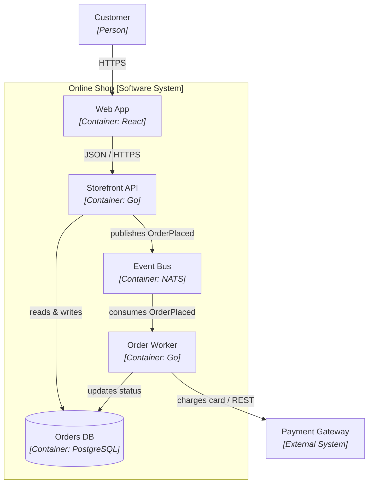

# Documenting Architecture

*How to communicate an architecture so it survives contact with a real team — a few living, versioned diagrams and decision records instead of a dead 200-page tome nobody opens twice.*

---

An architecture that lives only in your head is a liability. The moment you go on holiday, change teams, or simply forget why you split that service in two, the design starts to erode. **Documentation is how architecture escapes the architect** — it turns private intent into a shared, durable artifact the team can reason about, argue with, and extend. Yet most attempts fail in one of two ways: nothing gets written down, or someone produces a heavyweight document that is stale the day it ships and read by no one after.

This post is about the pragmatic middle. The goal is not "complete" documentation — that is a fantasy that rots. The goal is *just enough*, kept *close to the code*, aimed at *the reader who actually needs it*. Three tools get you most of the way: a common diagram notation with a few levels of zoom (the C4 model), diagrams stored as code so they can't drift, and short decision records that capture the *why*. Let's build the case for each.

---

## Why document at all

It helps to name the jobs documentation actually does, because each one implies a different reader and a different artifact.

- **Onboarding.** A new engineer should be able to build a mental map of the system in an afternoon, not a month. "Where does a request enter? What talks to the database? Which service owns payments?" — these are context questions, and context is exactly what tribal knowledge answers slowly and badly.
- **Alignment.** When five people picture the system differently, every design discussion restarts from scratch. A shared diagram is a shared vocabulary; it lets a meeting argue about the *decision* instead of re-litigating what the boxes mean.
- **Decision context.** Six months from now someone will look at a strange choice — a message queue where a direct call would do — and want to rip it out. If the reason (a downstream system that can't handle bursts) isn't written down, they'll either preserve it out of superstition or remove it and reintroduce the original bug.
- **The bus factor.** If exactly one person understands the auth flow, the system has a single point of failure that no amount of redundancy in the *infrastructure* can fix. Documentation is how you raise the bus factor above one.

Notice that none of these jobs requires *completeness*. They require the right slice, findable and current.

**The gotcha:** the classic failure isn't "we wrote too little" or "we wrote too much" — it's writing the wrong *kind*. A 200-page document that exhaustively describes every class is simultaneously too much (nobody reads it) and too little (it never explains *why* anything is the way it is). Optimize for the questions readers actually ask, and most of those questions are about *context* and *rationale*, not exhaustive detail.

---

## The two failure modes

Almost every real-world documentation problem collapses into one of two shapes, and they fail for opposite reasons.

```text
  NO DOCS                          THE DEAD TOME
  -------                          -------------
  "It's all in the code"           200 pages, one template
  onboarding by osmosis            written once, at project start
  decisions lost to Slack          instantly stale, trusted anyway
  bus factor = 1                   nobody reads past page 10
       |                                   |
       +---------------> both fail <-------+
                        the same way:
              the team can't get a correct
              answer to a real question fast
```

The empty case fails because knowledge stays locked in people. The heavyweight case fails because the effort goes into *volume* rather than *freshness and findability* — and a document that is confidently wrong is worse than no document, because people trust it. A new hire who reads that the "OrderService calls the WarehouseAPI directly," builds on that assumption, and only later discovers a queue was inserted last quarter has been actively misled.

The escape from both is the same principle: **treat documentation like code.** Small, versioned, reviewed, and living next to the thing it describes. Everything below is a way to apply that principle.

---

## The C4 model: a common notation and a few zoom levels

The single most useful idea for architecture diagrams is embarrassingly simple: **pick a notation, and offer a few levels of zoom.** The C4 model (created by Simon Brown) packages exactly this. Instead of ad-hoc boxes-and-lines where every diagram invents its own visual language, C4 gives you four nested levels, each answering one audience's questions.

Think of it like a map application. You start at country level, zoom to a city, then to a street. Each zoom shows *more detail about less area*, and the notation stays consistent as you go.

- **Level 1 — System Context.** The highest zoom-out. One box for your system, surrounded by the users and the external systems it talks to. It answers: "What is this thing, who uses it, and what does it depend on?" This is the diagram you show a product manager or a new hire on day one. No internal detail at all.
- **Level 2 — Containers.** Zoom in one step. A *container* here means a separately deployable/runnable thing — a web app, an API service, a database, a mobile app, a message broker — not a Docker container specifically (though it often is one). This level shows the major building blocks, the technology each uses, and how they communicate. This is the workhorse diagram; most teams need this one the most.
- **Level 3 — Components.** Zoom into a single container and show its major internal parts — the groupings of code with clear responsibilities (a controller, a domain service, a repository) and how they collaborate. Useful for the team that owns that container; rarely needed for the whole system.
- **Level 4 — Code.** The deepest zoom: class diagrams or similar. In practice this level is almost always skipped — the IDE and the source already are this view, and hand-drawn code diagrams rot fastest of all.

The value isn't the specific four levels; it's the *discipline*. A common notation means an arrow always means the same thing, a box always means the same category of thing, and a reader who learns to read one diagram can read them all. And because each level targets one audience, you never hand a product manager a class diagram or make a new engineer reverse-engineer the whole system from a single overloaded picture.

**The gotcha:** ad-hoc diagrams are ambiguous in ways their author never notices. What does *this* arrow mean — a synchronous HTTP call, an async event, a data dependency, "sort of related"? Is *that* box a service, a library, a server, a team? Without a convention, every reader fills the gaps differently, and the diagram quietly means something different to each of them. Adopting C4 (or any consistent notation) is less about the four levels and more about making a box and an arrow *mean one thing*.

---

## A container diagram, rendered

Here is a small C4-style container view of a modest e-commerce system, written in a way this site renders directly. Read it as Level 2: a customer, the deployable pieces, and the technology on each edge.



Every box carries its *kind* and its *technology*; every arrow carries its *purpose and protocol*. That is the whole trick — a reader can answer "how does an order get charged?" without opening a single file. Note also what is *absent*: no class names, no function signatures, no field lists. Those belong to a lower zoom level, or to the code itself.

---

## Diagrams as code: so they can't rot

A diagram drawn in a slide deck or a whiteboard photo has one fatal property — it is disconnected from the system it describes. When the code changes, nothing forces the picture to change with it. So it drifts, silently, until it is a confident lie.

**Diagrams-as-code** fixes this by making the diagram a *text file in the repository*. You describe the diagram in a plain-text notation and a tool renders it. Three common choices:

- **Mermaid** — text diagrams that render inline in Markdown, GitHub, and many static sites (including this one, as above). Lowest friction; great for embedding a diagram right next to prose.
- **PlantUML** — a mature, expressive text-to-diagram language with a dedicated C4 macro library, so you get proper C4 shapes and styling from text.
- **Structurizr** — Simon Brown's own tool, built specifically around C4. You describe the *model* (people, systems, containers, relationships) once, and it generates every level's diagram from that single definition — so the levels can't contradict each other.

The payoff is mechanical but decisive. Because the diagram is text:

- it lives in version control, so its history is the system's history;
- it changes in the *same pull request* as the code it reflects, so a reviewer sees the picture drift and the code drift together;
- diffs are readable ("added an arrow from api to cache"), unlike a binary image;
- and it is impossible to have a "final version" trapped on someone's laptop.

```text
   whiteboard / slide            diagrams-as-code
   ------------------            ----------------
   image on a laptop     -->     .mmd / .puml in the repo
   drifts silently       -->     changes in the same PR as code
   binary, no diff       -->     line-by-line diff in review
   "who has the source?" -->     git log is the source of truth
```

**The gotcha:** a beautiful architecture diagram drawn once, in a slide deck, is stale the day after it's presented — and it *lies to every new hire* who trusts it, because it looks authoritative and nobody remembers when it was last true. The fix is not "draw it more carefully." The fix is to put the diagram source in version control next to the code, so the only way it goes stale is if a pull request changes the system *and* leaves the diagram wrong — something a reviewer can see and block.

---

## "Just enough": README + C4 + ADRs

Put the pieces together and a lightweight, durable documentation set for most systems looks like this:

1. **A README** that states what the system is, how to run it locally, and where the other docs live. The front door.
2. **A couple of C4 diagrams** — almost always a System Context and a Container diagram, stored as diagram-as-code. Component diagrams only for the containers complex enough to earn one.
3. **A set of ADRs** — Architecture Decision Records — capturing the *why* behind significant choices.

ADRs deserve emphasis because diagrams show *what* the architecture is but rarely *why*. An ADR is a short, dated, immutable note in the repo — typically context, the decision, and its consequences — written when a significant call is made. (We covered ADRs in depth in the earlier post on architecture decisions; here they are simply the "why" layer of your living docs.) When someone later questions a design, they read the ADR instead of guessing. When a decision is genuinely reversed, you don't edit the old record — you write a new ADR that supersedes it, preserving the trail.

This trio is deliberately small. It fits in the repository, it's reviewed like code, and a new engineer can consume all of it in an afternoon and come away with an accurate map plus the reasoning behind the tricky parts.

**The gotcha:** the instinct to "document everything" backfires — the more you write, the more there is to keep current, so it rots faster, and its very volume ensures nobody reads it. Document *just enough*: the context and container views for *what*, and ADRs for *why*. If a section of documentation isn't answering a question someone actually asks, it is not an asset — it's maintenance debt wearing a useful costume.

---

## Multiple views for multiple audiences

A single diagram cannot serve everyone, because different stakeholders ask different questions. The 4+1 view model (introduced by Philippe Kruchten) captures this cleanly: describe an architecture through several concurrent *views*, each aimed at a set of concerns, all tied together by scenarios.

In plain terms, the views are:

- **Logical view** — the functional structure: the key domain concepts and how responsibilities are divided. Aimed at people reasoning about *what the system does*.
- **Development (implementation) view** — how the software is organized for the people building it: modules, layers, packages, build units. Aimed at developers.
- **Process view** — the runtime and dynamic behavior: processes, threads, concurrency, how things communicate under load. Aimed at those concerned with performance and scalability.
- **Physical (deployment) view** — how the software maps onto hardware and infrastructure: servers, nodes, networks, regions. Aimed at operations.
- **The "+1" — scenarios** — a handful of concrete use cases that walk through the other four views, both illustrating and validating them.

You do not need all five for every project — that would violate "just enough." The point is a *diagnostic*: when a diagram feels cluttered or an argument goes in circles, it's often because two audiences with different concerns are being served by one picture. Split it by view.

There's a neat correspondence worth noticing: C4 is largely a structural (logical/development) decomposition, while the deployment view maps onto C4 with a separate *deployment diagram*. The two ideas complement rather than compete — C4 gives you the zoom levels, 4+1 reminds you which *concern* each diagram addresses.

**The gotcha:** trying to make one diagram serve every audience produces a picture that serves none — the operations engineer wants regions and failover, the developer wants modules and dependencies, and cramming both into one canvas leaves an unreadable mess that satisfies neither. Pick the view *and* the zoom level for the specific reader in front of you, and make a second diagram rather than overloading the first.

---

## arc42: a template if you want one

Some teams want more scaffolding than "README + diagrams + ADRs," especially for larger or more regulated systems. **arc42** is a well-known open template for architecture documentation. It offers roughly a dozen numbered sections — things like goals and constraints, the solution strategy, building-block view, runtime view, deployment view, crosscutting concepts, architecture decisions, quality requirements, and known risks.

Two things make arc42 worth knowing. First, it is a *checklist of concerns*, not a mandate to fill every box — you keep the sections that carry weight for your system and drop the rest. Second, it composes naturally with everything above: the building-block sections are a good home for C4 diagrams, the decisions section is where ADRs go (or are referenced), and the whole thing can live as Markdown or AsciiDoc in the repo so it stays diffable and reviewable.

Treat arc42 as a menu, not a form. The failure mode is filling in all twelve sections dutifully at project start and never touching them again — which is just the dead tome with a nicer table of contents. Keep the sections that answer real questions, and let the rest stay empty.

---

## Keeping documentation current

None of this matters if the docs drift. Freshness is the property that separates a useful document from a dangerous one, and you buy it with process and automation, not willpower.

- **Generate what you can.** API references from code annotations, dependency graphs from build metadata, deployment topology from infrastructure-as-code. Anything derived mechanically from a source of truth can't drift from it.
- **Review docs in the pull request.** The single highest-leverage habit: when a change alters the architecture, the same PR must update the affected diagram or ADR, and the reviewer checks it. This makes staleness *visible at review time* instead of discoverable months later by a confused new hire.
- **Keep the source next to the code.** Diagrams-as-code and Markdown ADRs in the same repository mean documentation moves at the speed of the code, not on a separate, forgotten schedule.
- **Prefer small and current over large and stale.** A three-diagram set that is always right beats a comprehensive manual that is usually wrong. When in doubt, delete a section rather than let it lie.

| Practice | What it prevents |
|---|---|
| Diagrams-as-code in the repo | Whiteboard photos and slide decks that drift silently |
| C4 (or any) consistent notation | Ambiguous boxes and arrows that mean different things to different readers |
| README + C4 + ADRs | The 200-page tome nobody reads and can't keep current |
| ADRs for the *why* | Superstitious preservation or blind removal of past decisions |
| One view/zoom per audience | Overloaded diagrams that serve no one |
| Review docs in the PR | Documentation quietly going stale after every change |

---

## Key takeaways

- **Document for the reader's question, not for completeness.** Onboarding, alignment, decision context, and bus factor are the jobs — most are answered by *context* and *why*, not exhaustive detail.
- **Both failure modes lose the same way.** No docs and the dead 200-page tome both fail to give the team a fast, correct answer. The cure for both is treating docs like code: small, versioned, reviewed, living.
- **A common notation plus a few zoom levels beats ad-hoc boxes.** C4's Context and Container levels carry most systems; a box and an arrow should each mean exactly one thing.
- **Store diagrams as code.** Mermaid, PlantUML, or Structurizr put the diagram in version control so it changes in the same PR as the code and can't quietly rot.
- **Pick the view and zoom for the audience.** The 4+1 model is a reminder that operations, developers, and product each need a different picture — split rather than overload.
- **A few living diagrams plus ADRs beat a heavyweight template.** arc42 is a useful menu, not a form; freshness — enforced in code review and by generation — is what makes any of it trustworthy.

---

## Further reading

- [The C4 model for visualising software architecture](https://c4model.com/) — Simon Brown's own site; the definitive description of Context, Container, Component, and Code levels.
- [arc42 documentation template](https://arc42.org/) — the open template, section by section, with examples and downloads.
- [Architectural Blueprints — The "4+1" View Model](https://www.cs.ubc.ca/~gregor/teaching/papers/4+1view-architecture.pdf) — Philippe Kruchten's original 1995 paper (PDF).
- [Structurizr](https://structurizr.com/) — tooling built around C4, generating every diagram level from one model definition.
- [PlantUML](https://plantuml.com/) and its [C4-PlantUML macros](https://github.com/plantuml-stdlib/C4-PlantUML) — text-to-diagram with first-class C4 shapes.
- [Mermaid](https://mermaid.js.org/) — diagrams-as-code that render inline in Markdown and on this site.
